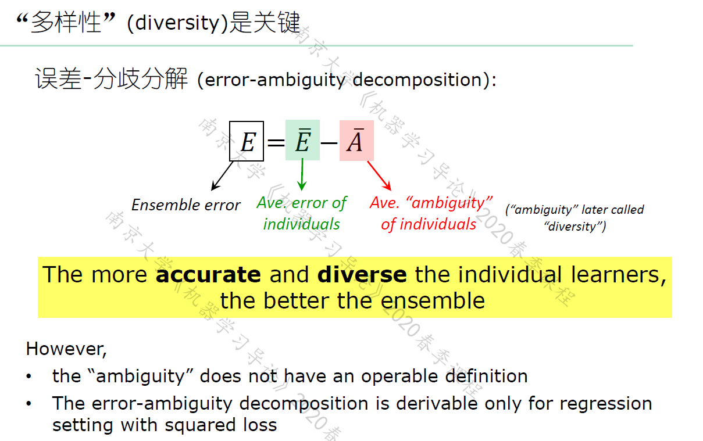
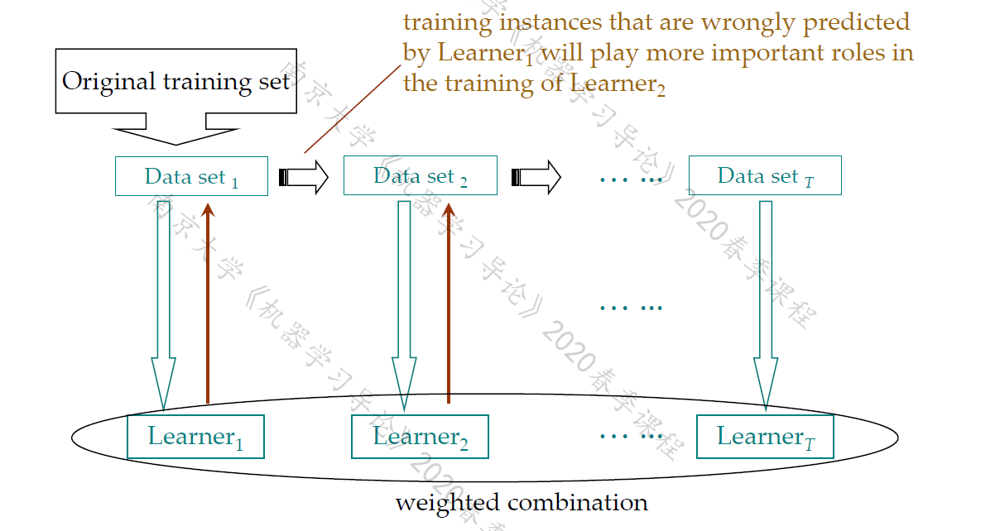
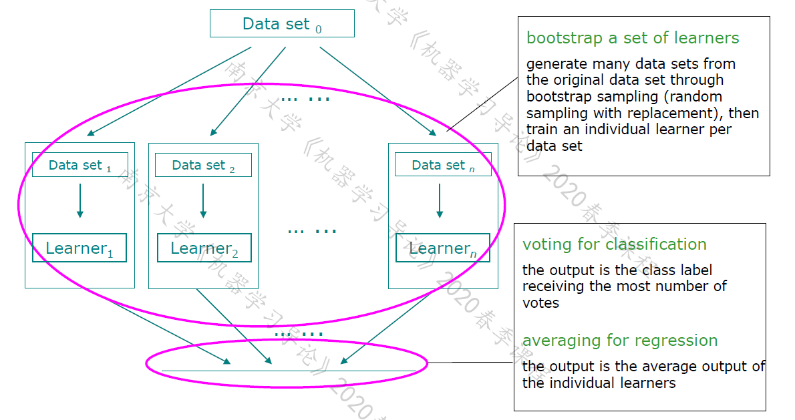
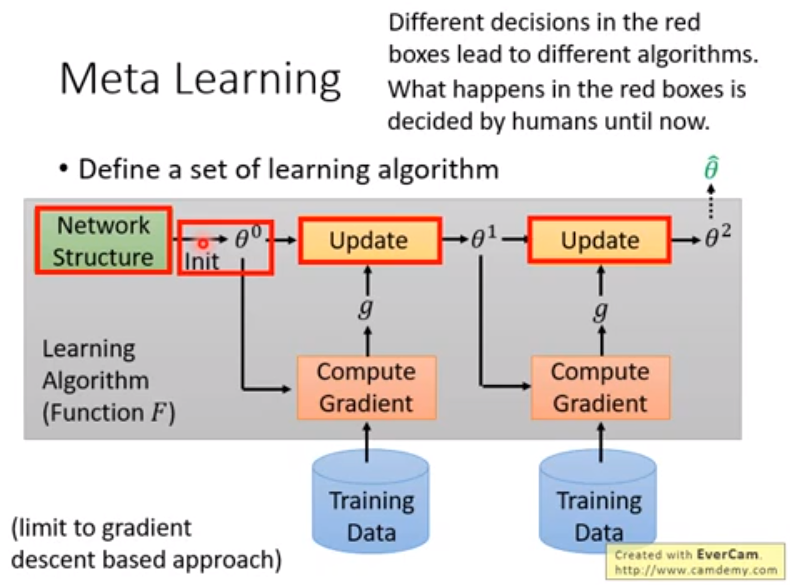
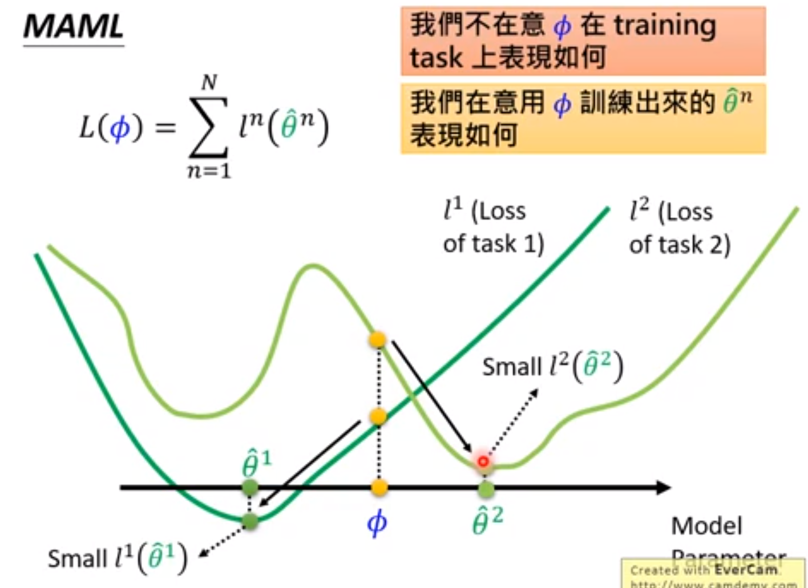
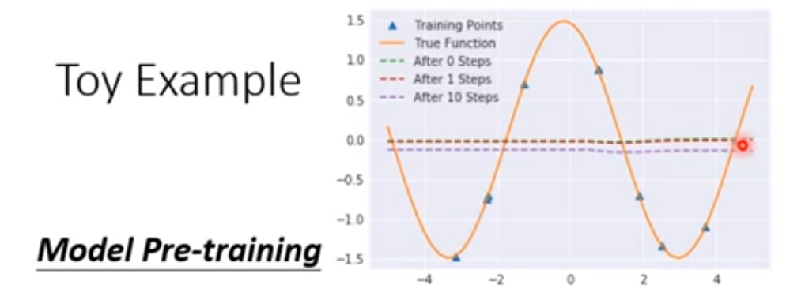

# AI notes

简要知识点.

[TOC]

## 模型评估与选择

#### 留出法 (hold-out)

直接将$D$划分为两个互斥的集合, 用一个训练出模型, 用一个测试误差. 要采用若干次随机划分, 重复进行实验, 取平均值.

#### 交叉验证

##### 留一法(leave-one-out LOO)

多少个样本就划分成多少个子集, 所以测试集都是1个样本, 训练集比全部数据集少1. 但是开销较大.

#### 自助法

有放回地采样. 样本在 $m$ 次采样中不被采到的概率 $(1-\frac{1}{m})^m$. 

PR-曲线: x轴是recall, y轴是precision. $F_1 = \frac{2 P \times R}{P + R}$

ROC 曲线: x轴是假正例率, y轴是真正例率. 根据学习器预测结果对样例进行排序, 然后把分类阈值设置为最大, 然后依次设置成每个样例的预测的那个. 如果是真正例, 就y轴往上走.

#### Friedman 检验

可以是多个数据集上对多个算法 求平均序值来检验.

#### Nemenyi 后续检验

如果两个算法的平均序值之差超出了临界值域CD, 则以相应的置信度拒绝"两个算法性能相同"这一假设.

#### 偏差-方差分解

$\mathbb{E}_D[(f(x; D) - y_D)^2]$

泛化误差可分为偏差, 方差, 噪声之和.

## 线性模型

直观表达各属性的重要程度, 有很好的可解释性.

#### 线性回归

基于均方误差最小化进行模型求解的方法叫做"最小二乘法", 所有样本到直线上的欧式距离最小.

直接分别求导, 得到闭式解. 闭式解中$X^T X$的逆不一定存在, 则引入正则化项.

对数线性回归: y = exp(原来的 w^Tx + b) (来取得输入空间到输出空间的非线性映射) 广义线性模型.

对数几率回归(分类): y = sigmoid(原来的 w^Tx + b).

##### 对数几率回归

几率(odds), 对数几率(logit).

最大化**对数似然**, $l = \sum ln \left( y \cdot P_1 + (1 - y) \cdot P_0  \right)$, $P_1$ 就是 sigmoid 作用于w^T x + b 也就是分类为正类的概率.

上述对数似然最大化是高阶可导的连续凸函数, 可以用梯度下降, 牛顿法求解.

#### LDA 线性判别分析

思想: 投影之后同类样本尽可能接近, 异类样本尽可能远离. 用LDA分类时, 将其投影到这条直线上并由此判断类别.

类内散度矩阵, 类间散度矩阵, 一大一小, 放成分子分母的形式. 优化目标就是广义瑞利商.

求解: 广义瑞利商化简, 分母等于1就行, 然后用拉格朗日乘子法. 需要一些技巧.

#### 多分类学习

One vs One: $C_n^2$ 个分类器, 每个分类器都是 $n$ 个类中其中两个.

One vs rest: $n$ 个分类器, 每个分类器是其中一个类和其他所有类.

MvM (多对多): ECOC方法, 每个分类器都是 分类 部分类别 和 部分类别.

1. 编码: 总共 $n$ 个类别做 $M$ 次划分, 每一个划分训练一个分类器.
2. 解码: $M$ 个分类器预测后的结果, 与每一个分类器的编码进行比较, 距离最小的就是.

ECOC编码越长, 所需训练的分类器也越多, 但是纠错能力也越强.

#### 类别不平衡问题

再缩放: 改变预测值的阈值, 用训练集的正反例比例调整. 但是有时未必能有效基于训练集观测几率推断出真实几率.

+ 欠采样, 过采样.
+ 直接将阈值嵌入到决策过程中去学习, 阈值移动.

## 决策树

目的: 产生一棵泛化能力强的决策树.

#### 构建

+ (递归) 算法过程 (传入训练集 $D$, 属性集 $A$)

  + 递归返回: 标记为叶结点

    1. $D$ 全属于同一类别, 无需划分.
    2. $A$ 为空, 或者是 所有样本在所有属性上取值相同, 无法划分. **设定为该结点所含样本最多的类别**.
    3. $D$ 为空, 不能划分. **设定为父结点所含样本最多的类别**. (注意此情况在下面判断)

    

  + 从 $A$ 中选择最优的划分属性.

  + 最优的划分属性的取值, 就是分支.

    + 如果最优划分属性的某个取值上为空, 就是上面递归返回的条件3. 直接根据$D$中含样本最多的类标记为叶结点即可.
    + 否则继续递归.

+ 如何选择最优划分属性:

  + 信息熵: $p_k$ 是第$k$类样本所占比例
    $$
    Ent(D) = - \sum_{k = 1}^{|\mathcal Y|} p_k \ log_2 p_k
    $$
    上式值越小, $D$ 的纯度越高.

  + 信息增益: 样本数越多的分支结点的影响越大, $D^v$是属于 属性某个取值 的样本集合.
    $$
    Gain(D, a) = Ent(D) - \sum_{v = 1}^V \frac{|D^v|}{|D|} Ent(D^v)
    $$
    ID3 决策树即用信息增益作为划分准则.

    信息增益越大, 意味着利用属性$a$来划分的纯度提升越大.

    信息增益对可取值数目较多的属性有所偏好.

    所以增益率(C4.5决策树)

  + 增益率:
    $$
    Gain_ratio(D, a) = \frac{Gain(D, a)}{IV(a)}
    $$
    其中 $IV(a)$ 固有值:
    $$
    \mathrm{IV}(a)=-\sum_{v=1}^{V} \frac{\left|D^{v}\right|}{|D|} \log _{2} \frac{\left|D^{v}\right|}{|D|}
    $$
    C4.5: 先选信息增益高于平均的, 再从中选择增益率最高的.

    

#### 剪枝

降低过拟合风险. 是否剪枝看验证集精度会不会下降.

+ 预剪枝: 

  在结点划分前估计.

  基于贪心本质. 同时降低了训练时间开销和测试时间开销.

+ 后剪枝:

  完整的决策树自底向上地对非叶结点进行考察.

后剪枝策略通常比预剪枝保留了更多的分支. 一般情况下后剪枝泛化性能优于预剪枝. 但训练时间开销大.

#### 连续值处理

+ 连续属性离散化: C4.5. 采用二分法:

  连续属性取值有$n$个, 那么对应了$n - 1$个划分点:
  $$
  T_{a}=\left\{\frac{a^{i}+a^{i+1}}{2} \ | \ 1 \leqslant i \leqslant n-1\right\}
  $$
  若当前结点划分属性为连续属性, 该属性 还可以作为其后代结点的划分属性.

#### 缺失值处理

+ 如何在属性值缺失下进行划分属性选择?

  + 推广信息增益的计算公式, 关注 1. 无缺失值样本比例 $\rho$, 2. 无缺失值样本第 $k$ 类比例 $\tilde{p}_{k}$, 3. 无缺失值样本在属性 $a$ 上取值比例 $\tilde{r}_{v}$, 如下:
    $$
    \begin{aligned}
    \rho &=\frac{\sum_{\boldsymbol{x} \in \tilde{D}} w_{\boldsymbol{x}}}{\sum_{\boldsymbol{x} \in D} w_{\boldsymbol{x}}} \\
    \tilde{p}_{k} &=\frac{\sum_{\boldsymbol{x} \in \tilde{D}_{k}} w_{\boldsymbol{x}}}{\sum_{\boldsymbol{x} \in \tilde{D}} w_{\boldsymbol{x}}} \quad(1 \leqslant k \leqslant|\mathcal{Y}|) \\
    \tilde{r}_{v} &=\frac{\sum_{\boldsymbol{x} \in \tilde{D}^{v}} w_{\boldsymbol{x}}}{\sum_{\boldsymbol{x} \in \tilde{D}} w_{\boldsymbol{x}}} \quad(1 \leqslant v \leqslant V)
    \end{aligned}
    $$
    推广的信息增益:
    $$
    \begin{aligned}
    \operatorname{Gain}(D, a) &=\rho \times \operatorname{Gain}(\tilde{D}, a) \\
    &=\rho \times\left(\operatorname{Ent}(\tilde{D})-\sum_{v=1}^{V} \tilde{r}_{v} \operatorname{Ent}\left(\tilde{D}^{v}\right)\right)
    \end{aligned}
    $$
    

+ 给定划分属性, 若样本在该属性上的值缺失, 如果对样本进行划分(分到哪个分支)?

  + 将 $x$ 划入所有子节点, 且样本权值 在与 属性值$a^v$对应的子结点中调整为 $\tilde{r}_v \cdot w_x$

    即让同一个样本 以不同的概率划入不同的子结点中去.

#### 多变量决策树

每个属性 视为坐标空间中的一个坐标轴. $d$ 个属性对应 $d$ 维空间的一个数据点. 划分即在这个坐标空间中寻找分类边界.

分类边界与轴平行, 最后分段组成.

##### 斜决策树

斜的划分边界, 非叶结点对属性的线性组合进行测试. (操作的是连续属性)

## 神经网络

+ MP神经元模型, 神经元接收到的总输入值 与 神经元的**阈值**进行作差, 然后通过激活函数.
+ sigmoid函数形式, 求导.
+ 感知机: **两层**神经元组成. 只能处理线性可分.
+ 多层前馈神经网络: 与下一层神经元相连, 不存在同层/跨层连接.
+ 误差逆传播算法, 反向传播算法, BP算法, 以目标的负梯度方向对参数进行调整. 运用链式法则. 累积误差你传播算法: 最小化训练集上的累积误差.
+ 一轮的学习: epoch.
+ 由于强大的表示能力, 常 过拟合, 解决方法: 1. early stopping, 当训练集误差降低但验证集升高时. 2. 正则化: 在loss函数中增加描述网络复杂度的部分.
+ 跳出局部极小(大多启发式算法, 理论上缺乏保障): 
  + 不同参数初始化, 从多个不同的初始点开始. 
  + 模拟退火, 在每一步以一定概率接受比当前更差的结果. 接受次优解的概率逐渐降低.
  + 使用随机梯度下降, 即便陷入局部极小点, 计算出的梯度也可能不为零从而跳出局部极小.

## 支持向量机

找到好的划分超平面:

+ 训练角度: 对训练样本局部扰动的"容忍"最好.
+ 对未见样本的泛化能力最强.

$$
\boldsymbol w^T \boldsymbol x + b = 0
$$

在超平面上的数据点满足上式, 数据到超平面距离:
$$
r = \frac{|\boldsymbol w^T \boldsymbol x + b|}{\|\boldsymbol w\| }
$$

1. 调整 $\boldsymbol w^T, \ \boldsymbol b$, 分类 $\Rightarrow \ \geq +1, \ \leq -1$.
2. 代入 $r = \frac{1}{\|\boldsymbol w\|}$, 两边(不同类)的支持向量到超平面距离之和, 所以乘二.
3. 调转分母, 得到 $\frac{1}{2} \| \boldsymbol w \|^2$ (SVM 原始形式, 注意约束条件).

## 贝叶斯分类器

贝叶斯决策论: 选择那个使**条件风险**最小的类别标记.

在样本上的**条件风险**: 分到其他类的损失 乘 分到其他类的后验概率.

总体风险(贝叶斯风险): $R(h^*) = \mathbb{E}_x[R( \ h^*(x) | x \ )]$, ($1 - $总体风险) 反映了分类器所能达到的最好性能.

#### 朴素贝叶斯分类器

+ 后验概率: $P(c | x)$
+ 类先验概率: $P(c)$
+ 类条件概率/似然: $P(x | c)$

主要困难在估计类条件概率.

条件独立性假设.

##### 拉普拉斯修正

避免其他属性携带的信息被训练集中未出现的属性"抹去", 在估计概率值时使用拉普拉斯修正, 分子加一, 分母加上属性可能的取值个数.

条件互信息, 在训练集上对符合条件的样本进行计数的过程. 考虑属性间的高阶依赖.

#### 贝叶斯网

有向无环图 + 条件概率表.

贝叶斯网假定 每个属性与其非后裔属性独立.

同父, 顺序 结构: 条件独立性, V型结构: 边际独立性.

有向分离(D-Separation), 有向图转变为道德图. V型结构父节点直接连接.

道德图上x和y能被z分入两个连通分支, 那么就是 x 垂直 y | z.

#### EM 算法

$log \sum$ 这种不好求解.

E 步: 基于 $\Theta^t$ 推断隐变量 $Z^t$ 的期望.

M 步: 基于已观测变量 $X$ 和 $Z^t$ 对 $\Theta$ 做极大似然估计, 记为 $\Theta^{t+1}$

#### 变分推断

推断和学习任务主要是由观察变量$x$来估计隐变量$z$和分布参数$\theta$, 即求解$p(z | x, \theta), \theta$.

用EM算法最大化对数似然.

## 集成学习

+ 同质集成: 其中个体学习器称为"基学习器", 集成中只包含同种类型的个体学习器.
+ 异质集成: 其中个体学习器称为"组件学习器", 个体学习器由不同的学习算法生成.
+ 集成学习获得比单一学习器显著优越的**泛化性能**.
+ 弱学习器: 泛化性能略优于随机猜测的学习器.
+ 个体学习器应 "好而不同", 要有一定的准确性, 学习器之间又要有差异.
+ Boosting: 个体学习器之间存在强依赖关系, 必须串行生成的序列化方法.
+ Bagging和随机森林: 不存在强依赖关系, 可同时生成的并行化方法.

#### AdaBoosting

+ 先训练出一个基学习器, 做错的样本在之后会受到更多的关注, 基于调整后的样本分布 来训练下一个基学习器, 一个基学习器的权重就是它错误率的一个函数(loss求偏导可证), 最后结果是这些基学习器的线性组合.

+ P174 图8.3 伪代码:

  

+ 标准AdaBoost只能用于二分类任务.

#### Boosting

基学习器能对特定的数据分布进行学习, 在训练的每一轮中, 根据样本分布为每个训练样本重新赋予一个权重.

+ 无法接受带权样本的基学习算法: "重采样法", 在每一轮学习中根据样本分布重新进行采样.
+ 算法在训练的每一轮都要检查基学习器是否比随机猜测好. 否则抛弃.
+ 从偏置-方差分解的角度: Boosting 关注的是降低偏置.

#### Bagging与随机森林

基学习器训练数据的考虑采样是相互有交叠的.

##### Bagging

自助采样法: $m$ 个样本的数据集, 随机取出一个放入采样集中, 之后仍然会放回初始数据集, 这样下次采样时仍可能被选中. 不被采样到的概率: $(1-\frac{1}{m})^m$, 取极限 所以每个基学习器只使用了初始训练集中约63.2%的数据.

+ 采样出 $T$ 个含 $m$ 个训练样本的采样集.
+ 这 $T$ 个基学习器结合, Bagging 常用简单投票法(分类任务), 简单平均法(回归任务). 

+ 优点: 1. 能用于回归, 多分类任务, 2. 由上63.2%, 剩下的数据可以作验证集(泛化性能的"包外估计")

+ 从偏置-方差分解角度, Bagging关注降低方差.

##### 随机森林

基决策树的每个结点, 都是先从该结点的属性集合中随机选择一个包含$k$个属性的子集, 然后从这个子集里选择一个最优属性进行划分. 推荐$k = log_2 d$.

自助法采样, 有些样本没有被当做训练集过, 就可做 包外估计, 做测试集或者用来剪枝都可以.

#### 结合策略

学习器结合带来的好处:

+ 学习任务假设空间大, 多个假设在训练集上达到同样性能, 若使用单学习器可能导致选到泛化性能差假设, 但是结合多个学习器可以减小这个风险.
+ 降低陷入局部极小的风险.
+ 从表示角度, 如果学习任务的真实假设不在当前学习算法考虑的假设空间中, 学习器结合可以带来更宽泛的表示.

结合策略:

+ 平均法: 个体学习器性能相近时.
+ 加权平均法: 集成学习研究的出发点, 通过不同方式来确定加权平均中的权重. 个体学习器性能差异较大时.
+ 投票法: 分类问题, 请注意还有加权投票法.
  + 个体学习器输出类标记时: 硬投票.
  + 个体学习器输出类概率时: 软投票.

##### 学习法

通过另一个学习器进行结合, 用于结合的是次级学习器或元学习器.

## 聚类

聚类结果簇内相似度度高, 簇间相似度低, 有一些指标度量.

距离度量: 1. 非负性, 2. 同一性, 3. 对称性 4. 三角不等式.
闵可夫斯基距离: 有序属性(定义了序关系).

无序属性: 采用VDM, 一个属性取值转化成一个分布的形式. 混合属性就两种评估一起上.

聚类的好坏不存在绝对标准.

+ 原型聚类: 找出一些原型, 代表数据的某些性质. k 均值距离, LVQ, 高斯混合聚类 都是.
+ 密度聚类: 考察样本之间的连通性, DBSCAN
+ 层次聚类.

#### LVQ 学习向量量化

K-means用于图像有损压缩, 人眼对于黑和较黑的像素是分不清的. 聚类后就用中心来代替这个类. 压缩更有损, 就是k的值较小.

试图找到一组原型向量来刻画聚类结构. 但假设数据带有类别标记. (图像的有损压缩). 在监督学习下给每个类别学到一个原型向量. 使用了在线学习的方法(和感知机近乎一致), 希望这个原型向量能代表同类的样本. 最小化原型向量到当前类的距离. 减去数据点到这个原型向量距离上的梯度. 往那个方向靠拢. 在标签的指导下.

#### GMM 高斯混合聚类

单个高斯分布: 做极大似然估计即可.

这里是多个高斯: 加权产生, 根据先验分布选择高斯混合成分. 然后根据被选择的混合成分对概率密度进行采样, 从而生成相应的样本. 用EM视角考虑, 有隐变量.

EM: E步: 计算每个样本属于高斯分布的后验概率(贝叶斯定律). M步: 更新模型参数(类似Kmeans更新簇中心).

与Kmeans的显著区别: 1. GMM不但刻画了原型, 还刻画了原型周围的分布. 2. GMM对于每个样本有个软分配, Kmeans就是强行分配只属于一个簇. 但是GMM可以表出属于某个簇的概率(程度)(就是E步的后验概率).

PCA 用于图片压缩: 多张图片, 特征值, 特征脸. 找到重新表示的一组基.

相似性度量未必满足距离的三角不等式: 比如马, 人, 人马的那个例子.

## 降维与度量学习 k近邻 PCA

懒惰学习(lazy learning)的代表, 基本思想: 近朱者赤近墨者黑.

最近邻分类器的泛化错误率不会超过贝叶斯最优分类器的两倍.

kNN是在密采样(数据点是聚点, 在任意邻域内都有数据点)下效果就比较好, 但是特别是高维, 距离就很大(立方体里面球体的例子), 计算内积都会变难.

降维: 高维空间中的一个低维嵌入. 分为线性降维和非线性降维.

##### **线性降维: PCA** 

考虑最小重构代价和最大投影方差角度考虑. 最小重构代价: 由投影后的重构为原始的, 他们之间的距离最小, 化简后由拉格朗日乘子法可以知道就是减掉最小的那些特征值, 中心化->协方差矩阵求特征值特征向量->进行投影, 方差分析后方差就是对应的特征值.

##### **非线性降维: KPCA**

映射到高维空间, 类似SVM核技巧, 优化过程非常类似. 直接降维效果不好. 最后结果就是核矩阵(内积组成的)的特征分解.

### MDS

高维和低维之间距离是不变的, 距离, 内积, 保距.

构建距离矩阵, 其中每个元素表示原始空间中的距离, 现在要把这个距离矩阵 **转换** 为相似度(内积)矩阵. 降维后的距离与原始距离尽可能接近.

然后把相似度矩阵当做KPCA里面的kernel矩阵, 然后就可以进行特征值分解.

和原始PCA不同的是 这里是低维和高维距离近似一致, PCA是特征值一致.

##### **非线性降维: 流形学习**

一类借鉴了拓扑流形的概念. "流形"是在局部与欧式空间同胚的空间, 局部具有欧式空间的性质, 能用欧式距离来进行距离计算.

##### Isomap 等度量映射

直接在高维空间中计算直线距离是错误的, 不能脱离曲面, 所以用局部上是可计算欧式距离的, 在高维空间中计算近邻连接图(k近邻图, $\epsilon$近邻图), 然后在近邻连接图上计算最短路(Dijkstra, Floyd), 然后用MDS方法来获得样本点在低维空间中的坐标.

##### LLE 局部线性嵌入

试图保持邻域内样本之间的线性关系, 先找到每个样本的近邻点集合, 计算线性重构(被近邻线性表出)的权重(系数)(这是可以写出闭式解的), 然后保持这些权值/系数不变, 把近邻代换成低维空间坐标, 有点像重构代价最小去计算低维空间坐标, 解特征值.

#### 度量学习

欧式距离每个维度加上一个权重, 这个权重矩阵是半正定的, 因为要保持距离非负. 还是对称的, 要保持距离度量对称. 这种加权重的距离可以称为马氏距离, 加权重的矩阵是度量矩阵, **近邻成分分析**

这里马氏距离中间的矩阵是半正定的, 因为凸优化中正定不好优化, 所以不满足自反性.

##### 近邻成分分析 NCA (结合上面度量学习)

近邻分类器是用多数投票, NCA是**概率投票**, 任意样本b对样本a的分类影响概率为: 这个样本b到a的马氏距离, 和其他所有到样本a的马氏距离, 做一个类似softmax的. 优化目标就是把所有加起来.

其实还可以某些样本相似的, 作为"必连"的集合, 优化目标变为: 相似样本间的距离尽量小, 并且在不相似样本间距大于一个值的条件下.

### Meta Learning

#### 定义

学习如何去学习, learn to learn.

一般的机器学习, 有一个Learning Algorithm(我们设计的), 从一堆训练集中学习参数, 遇到测试集可以做出判断. Meta Learning不只是学到了特征等, 还学到了如何学习, 这样就会学得更快.

Meta Learning 就是找到Learning Algorithm $F$, 这个 $F$ 的能力是可以找到最优预测函数 $f^{\star}$.
$$
F(D_{train}) = f^{\star}
$$
Meta Learning 就是找到最好的 Learning Algorithm, 同样也可以有$loss$.

#### Learning Algorithm Set

+ $F$ 的例子: 根据梯度下降 网络找到最优的$\hat{\theta}$ 这个过程:

  不同的网络结构, 不同的$\theta^0$, 都可以看做不同的Learning Algorithm. 红框里面的需要Meta Learning.

  上面这些构成了Learning Algorithm Set

#### Learning Algorithm 的评估

$F$ 在第 $i$ 个Task上训练出了一个预测函数 $f^i$, 测试集上的loss为$l^i$, 那么 $F$ 的loss为 ($N$ 个任务):
$$
L(F) = \sum_{i = 1}^{N} l^i
$$
训练Task是很多的. 训练 Task 和 测试 Task.

### Few-Shot Learning

Training Set 是 Support Set, Test Set 是 Query Set.

+ $\star$ N-ways K-shot classification:

  在 Training 和 Test Tasks 里, 有 N 个类别, 每个类别有 K 个用例.

有一种说法: 训练集里面没有Test样本的类别, 为此给Support Set. 本质的学到一个函数处理相似度:

+ Training Set 很大, 是让Model知道图片之间的区别 哪些很像. 
+ 而Support Set每个类对应的样本很少, 让Model知道每个是什么, 来了一个Test Set, 一张张和Support Set对比, 像的就是那个类了.

数据集:

#### MAML: Model-Agnostic Meta-Learning for Fast Adaptation of Deep Network

以前的Initialization是从一个分布中采样, 现在就要学习一个Initialization.

各变量解释看上图. 每一个小任务都是训练的过程.

+ 如何优化 Gradient Descent:
  $$
  \boldsymbol{X_{ij}}^{\star}= \left\{ \begin{aligned}  &\boldsymbol{X_{ij}}+\epsilon \cdot \operatorname{sign}\left(\nabla_{\boldsymbol{X_{ij}}} \mathcal{L}\right)  ,  & \boldsymbol{X_{ij}} \in range \\ & \boldsymbol{X_{ij}} & others \end{aligned} \right.
  $$
  
  $\phi$ 训练到 $\hat{\theta}$

+ 与 Model Pre-training 的区别:

  Model Pre-training 损失函数的自变量是超参数(这里就是$\phi$), 但是MAML的损失函数自变量是 经过 $F$ 学习得到的 $f$ 的最优参数在test set上的损失.

  Model Pre-training 关注的是即刻的 $\phi$ 给进去loss如何, 而 MAML 关注的是经过训练后怎么样.

  MAML 并不在意Initialization: $\phi$ 在 training Task(set) 上的表现, 而是经过 $\phi$ 训练出来的 $f^{\star}$/$\hat{\theta}$ 的表现. $|$ 即对于学习器的loss(上面有): $l^i(\phi)$ 可能不是很好, 但是经过这个 $\phi$ 训练过后的 $\hat{\theta}$ 也就是 $l^i(\hat{\theta})$ 可能很好. 不同Task的$\hat{\theta}$当然不同:

  

  
  
+ 训练细节:

  在训练的时候希望 Gradient Update 一次就到最优, 但是测试时可以Update多次.

  Few-Shot Learning 就希望只Update一次.

  

+ Toy Example:

  有一个 $y$, 一个Task就是从 $y$ 采样出不同的 $x$, 通过这些采样的来估测$y$的形式.
  $$
  y = a \sin (x+ b)
  $$
  不同的Task: 选不同的 $a, \ b$ 即可.

  + Model Pre-training 的结果:

    

    因为拿 $\phi$ 要在所有 $y$ 上都表现好, 所有 $y$ 综合就是上图.

    

  + 

    

---

## 算法

### 红黑树

黑色深度: 仅计算黑色结点的深度.

红黑树外部结点都是黑色, 红色不能连续出现, 根是黑色, **所有外部结点黑色深度相同**

树的平衡性和维护开销的一种tradeoff. 上述限制了红黑树的不平衡性: 用数学归纳法易证 一棵含n个结点的红黑树 普通高度 不超过 $2log(n+1)$.

### 最小生成树

#### Prim

局部最小生成树 与 剩下点的集合 之间相连的边, 贪心选择最小的.

#### Kruskal

非常简单的贪心准则: 所有边权值从小到大选择, 并查集保证不成环.

### 最短路

#### Dijkstra

最短路径树, 每次选择的边是到源点路径最小的.

#### Floyd

`kij`遍历, $O(n^3)$, 用中继节点.

#### 贪心

任务调度, 贪心: 以最短结束时间.

哈夫曼编码.

