# Math

数学笔记

[TOC]

+ 数域: $P$是由一些复数组成的集合, 其中包括0与1, 如果$P$中任意两个数(这两个数也可以相同), 的和 差 积 商(除数不为零)仍然是$P$中的数, 那么$P$就称为一个数域.

## 第二章 行列式

### § 1 ~ 3 行列式基础

+ 自然顺序: `12...n`是一个$n$级排列, 递增 $\Rightarrow$ 自然顺序.
+ 逆序: 一对 数前后位置与大小顺序相反.
+ 逆序数: 一个排列中逆序的总数. 记为$\tau(j_1 \cdots j_n)$
  + $\tau(n \cdots 1) = \frac{n (n - 1)}{2}$, 在"反过来"的对角阵时可以用.
+ 偶排列: 逆序数为偶数.

> 对换改变排列的奇偶性.
>
> 证明: 从相邻的入手, 不相邻的对换可以通过一组相邻的对换解决.
>
> 

> 全部$n$级排列中, 奇偶排列个数相等.
>
> 证明: 奇排列可以通过某两个位置对换来得到偶排列, 所以奇排列个数 $\leq$ 偶排列个数, 反之同理.

+ 主对角线: 左上到右下.

+ $n$级行列式可以表成$n$个元素乘积的代数和, 在前一个下标有自然排序的情况下, 符号为$(-1)^{\tau (j_1 \cdots j_n)}$. 请注意是$n$个元素的乘积.

  + 行列式中的项如果是(乘积): $a_{i_1 j_1} \cdots a_{i_n j_n}$

    那么符号为$(-1)^{\tau(i_1 \cdots i_n) + \tau(j_1 \cdots j_n)}$

    证明: 

  + 

+ 

  由上行/列地位平等的性质.

  所以转置行列式 值不变.

+ 行列式交换行/列:

  注意上述性质, 之后前后下标同时互换时符号才不变, 当互换两行时:
  $$
  a_{21}a_{32}a_{14}a_{43} \rightarrow a_{11}a_{32}a_{24}a_{43}
  $$
  对于这一项来说, 符号是改变的, 实际上对于全体都是.

  

### § 4 $n$级行列式的性质

+ 

  证明: 就是行列式定义, 展成一些$n$个元素的乘积和之后, 把$k$提出去.

  + 推论: 行列式中一行为零, 行列式为零.

  

+ 

  证明: 同上用定义, 展开后对$(b_i + c_i)$使用乘法分配率分出来.

  

+ 

  $\star$ 证明: 展开, 写出$n$元素乘积的通项进行对比. 找出那些符号相反绝对值相同的项(可以两两相消).

  

+ 

  证明: 由上性质易证.

  

+ 

  

+ 

  证明: 通过行之间的变换 和 上述性质易证.

  

+ $\star$ [例] 奇数阶反称行列式等于0.

  证明: 

  做转置, 提-1.

### § 5 行列式的计算

+ 数域$P$上的矩阵: 一个矩阵的元素全是某一数域$P$中的数时.

+ 数域$P$上矩阵的初等行变换:
  + 数域$P$中一个非零的数乘矩阵的某一行;
  + 矩阵某一行的$c$ ($P$中的一个数) 倍加到另一行.
  + 互换矩阵中两行的位置.
+ 初等行变换和列变换统称为 初等变换: 可以用来计算行列式, 注意计算时值可能是有影响的(比如交换两行要变号).

+ 阶梯形矩阵:

  

  + 一个矩阵经过一些列初等行变换总能变成阶梯形矩阵.

### § 6 行列式按一行(列)展开

+ $\star$ $M_{ij}$ 余子式:

  

  

  eg:

  

  

$$
A_{i j}=(-1)^{i+j} M_{i j}
$$

+ $\star$ $A_{ij}$ 代数余子式:

  

以上证明需要拆开来.

+ 行列式中一行的元素与另一行相应元素的代数余子式的乘积之和为零. 即:

  

  证明: 在3级行列式下有很好的几何意义.

  这在某一行/列只有一个非零元素的时候好用.

  

+ $\star$ 范德蒙德(Vandermonde)行列式:

  

  证明: 归纳法 + 初等变换 + 上述代数余子式展开.

+ 分块矩阵行列式:

  

  归纳法证明.

### § 7 克拉默法则

 

+ 方程组有解
+ 解唯一
+ 解可以由上式给出.

+ 增广矩阵的秩 是线性方程组化为阶梯形矩阵后留下的方程个数.

+ 齐次线性方程组: 常数项全为0. 我们此时关心非零解.

  

  应用克拉默法则, $|A| \neq 0$, 那么只有唯一解, 就是零解.

  注意这里可以用后面行秩 $r < n$ 推得

克拉默法则给出了解与系数的明显关系.

### § 8 拉普拉斯(Laplace)定理 $\cdot$ 行列式的乘法规则

eg:

比如上面[例2]里面, $M$ (注意$M$是由原来$D$的哪些行和列构成的) 的代数余子式 (注意这里是$k$级子式的):
$$
(-1)^{(1+2+4)+(2+3+5)} M=-M
$$

两个行列式的乘积等于另一个行列式: 行列式的乘法定理.

## 第三章 线性方程组

### § 1 消元法

+ 线性方程组的初等变换:
  1. 非零数乘某一方程
  2. 一个方程的倍数加到另一个方程
  3. 互换两个方程的位置
+ 初等变换总是把方程组变成同解的方程组. 一步一步做下去直到得到一个阶梯形方程组.

$\star$ 讨论两种方程组情况:

1. 

   

2. 

   一般解: 是通过$x_{r + 1}, \cdots , x_n$ (自由未知量) 表出的.

   有无穷多个解.

   

3. $r > n$, 要不是无解, 要不就是有冗余的方程.

总结: 消元法 1. 初等变换 化为 阶梯形方程组, 2. 最后一个等式如果是零等于非零, 则无解, 否则按照上述两种$r, n$情况讨论.

+ $\star$ 联合克拉默法则记忆: 齐次线性方程组:

  

  证明: 抓住$r \leq s < n$.

### § 2 $n$维向量空间

+ $n$维向量: $(a_1, \cdots , a_n)$, 其中$a_i$称为向量的分量.
+ 向量的各种运算操作.

+ 数域$P$上的 $n$维向量空间: 以数域$P$中的数作为分量的$n$维向量的全体, 同时考虑到定义在它们上面的加法和数量乘法.

### § 3 线性相关性

+ $\star$ $\alpha$ 可以经向量组 $\beta_1, \cdots, \beta_s$ 线性表出: 如果有数域$P$中的数: $k_1, \cdots , k_s$, 使向量$\alpha = k_1 \beta_1 + \cdots + k_s \beta_s$, 则向量$\alpha$称为向量组$\beta_1, \cdots, \beta_s$的一个线性组合.

+ 零向量是任一向量组的线性组合.

+ 两个向量组等价:

  

+ 向量组之间的等价有如下性质:

  + 自反性: 每一个向量组和其自身等价.
  + 对称性: 组A和组B等价, 那么组B也和组A等价.
  + 传递性: 

  注意线性表出的定义就很好理解.

+ $\star$ 向量组的线性相关:

  1. 如果向量组$\alpha_1, \cdots , \alpha_s$中有一个向量可以由其余的向量线性表出. ($s \geq 2$)

  + (此时不一定其余所有向量都可以由 其他向量 线性表出, 比如存在零向量时)

  

  2. 如果有数域$P$中不全为零的数$k_1, \cdots , k_s$ 使 $k_1 \alpha_1 + \cdots k_s \alpha_s = 0$ 成立. ($s \geq 1$)

     所以向量组的一部分线性相关, 那么这个向量组就线性相关.

  

  以上两个定义在$s \geq 2$时是一致的.

  $s = 1$时即 $k \alpha_1 = 0 \Rightarrow \alpha_1 = 0$ 零向量.

  

+ $\star$ 向量组的线性无关:

  

  类比上述部分向量组线性相关的结论:

  如果向量组线性无关, 那么它的任何一个非空部分组也线性无关.

+ 判断线性相关/无关:

  

  拆开来去解系数.

+ $\star \ \star$ 重要:

  证明: $\alpha_i$ 线性相关, 即带系数相加等于0, 再套可以用$\beta$表出.

  记忆: 被一个比自己弱小的(数量严格更少的)线性表出, 那么自己线性相关.

+ 

+ 

  证明: 因为可以被单位向量们线性表出.

+ 

+ 一向量组的部分组 极大线性无关组: 如果这个部分组本身是线性无关的, 并且从这向量组中任意添加一个组内其他向量, 所得的部分组都线性相关. (有点像基的概念: 任意组内其他向量都可以被极大线性无关组表出, 所以有:
+ 任意一个极大线性无关组都与向量组本身等价.
+ 极大线性无关组不唯一.
+ 一向量组的极大线性无关组都含有相同个数的向量.
+ 向量组的秩: 向量组的极大线性无关组所含向量的个数.
+ 一向量组线性无关 $\Leftrightarrow$ 秩与所含向量的个数相同.
+ 任一个线性无关的部分向量组都能扩充成一个极大线性无关组.
+ 全部由零向量组成的向量组没有极大线性无关组, 秩为零.

### § 4 矩阵的秩

+ 行秩: 矩阵的行向量组的秩.

+ 行秩和列秩相等. 这里证明没搞太懂, 似乎要用到上面向量组线性表出的重要定理, 加入列向量之后仍然线性相关.
+ 以后统称 矩阵的秩.

+ 矩阵$A$的行列式为零 $\Leftrightarrow$ $A$的秩小于$n$, 注意从前往后推需要归纳法, 证明线性相关就是用 系数乘向量和 为0去证.

+ $k$级子式:

  

  

+ 矩阵的秩是$r$ $\Leftrightarrow$(的充要条件是) 矩阵中有一个$r$级子式不为零, 同时所有的$r + 1$级子式全为零.

  证明: 

  + 必要性: $r$个行向量线性无关, 取出之后 这个矩阵秩为$r$ (列秩为$r$), 所以可以得到一个行列都为$r$的行列式$\neq  0$.
  + 充分性: 
    + 矩阵的秩 $< r$, 则$r$级子式为0.
    + 矩阵的秩 $> r$, 则由上存在 $r + 1$ 级子式不为0.

  

+ 最大的 不为零的$r$级所在行列都是极大线性无关组.

+ 计算矩阵的秩:
  
  + 初等行变换 化成阶梯形

### § 5 线性方程组有解判别定理

+ $\star \ \star$ 线性方程组有解判别定理: 方程组有解 的充分必要条件为 它的系数矩阵与增广矩阵 有相同的秩.

  注意这里形式化的时候有一个转换:

  

  

  证明:

  + 必要性: 看上面的(3), 说明向量组 $\boldsymbol{\beta_i}$ 可以被 $\boldsymbol{\alpha_i}$ 表出, 所以有:
  + 充分性: 找极大线性无关组, 这个极大线性无关组放到含有 $\boldsymbol{\beta}$ 的组中也是一个极大线性无关组(因为 $\boldsymbol{\beta}$ 加到这个极大线性无关组里面不可能和他们线性无关, 不然秩就更大了), 所以$\boldsymbol{\beta}$可以被线性表出. 所以有解.

+ 本质就是出现阶梯形这样(如下)之后会无解:

  

+ 当增广矩阵的秩 等于 系数矩阵的秩加一时, 无解.

### § 6 线性方程组解的结构

+ 两个解的和, 一个解的倍数 也是方程组的解.

+ $\eta_1, \eta_2 \cdots , \eta_t$ 称为一个基础解系:

  方程组的任一个解都能表成$\eta_1, \eta_2 \cdots , \eta_t$的线性组合;

  $\eta_1, \eta_2 \cdots , \eta_t$线性无关. (保证没有多余的解)

+ $\star$ 齐次线性方程组有非零解时, 它有基础解系, 并且基础解系所含解的个数 等于 $n - r$, 其中$r$为系数矩阵的秩.

  ($n - r$也是自由未知量的个数)

  证明: (找基础解系的方法)

  秩为$r$ $\Rightarrow$ 

  1. $r = n$ 系数矩阵行列式不为零, 所以方程组只有零解, 所以不存在基础解系

  2. $r < n$ 

     先找到这个解: 自由未知量有 $n - r$ 个 那就用$n - r$个$n - r$维度的单位向量代自由未知量 $(x_{r + 1}, x_{r + 2}, \cdots , x_n)$ 的 $n - r$ 个解, 这样也就求出了方程组的$n - r$个解:

     

     再来证明上面的就是基础解系:

     1. 线性无关: 因为最后$n - r$个分量(单位向量) 所以带着系数乘积和等于零, 那么必须所有系数为零.
     2. 任一个解可以由 $\eta_1, \eta_2 \cdots , \eta_{n - r}$ 线性表出: 设任一个解, 靠解析的最后$n - r$个分量相同 $\Rightarrow$ 自由未知量相同 $\Rightarrow$ 这个任一个解可以被表出.

+ 任意一个线性无关的 与某一个基础解析等价的向量组 都是基础解系.

+ 导出组: 如下 (1) 是 (9) 的导出组

  

  

  + (9) 的两个解 之差 是导出组的解. (代入易证)
  + (9) 的一个解与它的导出组 (1) 的一个解之和 还是(9)的一个解. (同上代入易证)

+ $\boldsymbol{\gamma_0}$ 是方程组(9)的一个特解, 那么(9)的任一解可以表成: $\boldsymbol{\gamma} = \boldsymbol{\gamma_0} + \boldsymbol{\eta}$, 其中$\boldsymbol{\eta}$是导出组(1)的一个解.

  方程组(9)的特解 + 导出组(1)的全部解 = 方程组(9)的全部解.

  $\Rightarrow$ 任意解:
  $$
  \boldsymbol{\gamma}=\gamma_{0}+k_{1} \eta_{1}+k_{2} \eta_{2}+\cdots+k_{n-}, \eta_{n-r}
  $$
  
+ 方程组有解时, 解唯一 $\Leftrightarrow$ 它的导出组只有零解.

## 第四章 矩阵

### § 1 ~ 2 矩阵基础

+ 秩($A + B$) $\leq$ 秩($A$) + 秩($B$)

+ 矩阵乘法适合结合律, 不适合交换律: 注意$(AB)^k$一般不等于$A^kB^k$
+ $E$: 单位矩阵.
+ 矩阵的数量乘法是对每个元素都乘这个数.

+ 转置相关: $(AB)' = B' A'$.

### § 3 矩阵乘积的行列式与秩

+ $|AB| = |A| \ |B|$.
+ $A$ 非退化的: $|A| \neq 0$.

+ $A \in \mathbb{R}^{n \times m}, B \in \mathbb{R}^{m \times s}$, 则
  $$
  rank(AB) \leq \min (rank(A), rank(B))
  $$
  乘积的秩不超过各因子的秩.

  (注意类比$rank(A + B) \leq rank(A) + rank(B)$.)

  推广到$n$个也成立.

### § 4 矩阵的逆

+ $A$ 是可逆的 $\Leftrightarrow$ $\exist B, AB = BA = E$.

+ $\star$ 伴随矩阵:

  
  $$
  \boldsymbol{A A}^{*}=\boldsymbol{A}^{*} \boldsymbol{A}=\left(\begin{array}{cccc}
  |A| & 0 & \cdots & 0 \\
  0 & |A| & \cdots & 0 \\
  \vdots & \vdots & & \vdots \\
  0 & 0 & \cdots & |A|
  \end{array}\right)=|A| \cdot \boldsymbol{E}
  $$
  上面是由代数余子式 行列式按一行展开的结论; 所以就求出了$\boldsymbol{A}$ 的逆:
  $$
  \boldsymbol A^{-1} = \frac{1}{|\boldsymbol A |} \cdot \boldsymbol A^*
  $$
  

+ $(\boldsymbol A')^{-1} = (\boldsymbol A^{-1})'$

+ $(\boldsymbol A \boldsymbol B)^{-1} = \boldsymbol B^{-1} \boldsymbol A^{-1}$

+ $\boldsymbol A \in \mathbb{R}^{s \times n}$, $\boldsymbol P \in \mathbb{R}^{s \times s}, \boldsymbol Q \in \mathbb{R}^{n \times n}$ 且都可逆, 则:
  $$
  rank(\boldsymbol A) = rank(\boldsymbol P \boldsymbol A) = rank(\boldsymbol A \boldsymbol Q)
  $$
  证明: 用矩阵乘积的秩不超过各因子的秩.

### § 5 矩阵的分块

+ 准对角矩阵:

  

  

### § 6 初等矩阵

+ $\star$ 初等矩阵: 由单位矩阵 $\boldsymbol E$ 经过一次初等变换得到的矩阵称为初等矩阵.

  (有三类)

  + 初等矩阵都是可逆的, 它们的逆还是初等矩阵.

    

  + 引理: 对一个$s \times n$的矩阵$\boldsymbol A$作一初等行变换 $\Leftrightarrow$ $\boldsymbol A$ 左乘相应的$s \times s$的初等矩阵. 同理列变换等价于右乘.

+ $\boldsymbol A$ 和 $\boldsymbol B$ 等价, 如果$\boldsymbol B$ 可以由 $\boldsymbol A$ 经过一系列初等变换得到.

  既然是等价关系, 就满足自反 对称 传递.

+ $\star \ \star$ 矩阵的标准形: 任意一个 $s \times n$ 的矩阵 $\boldsymbol A$ 都与形式为:

  

  的矩阵等价, 这是矩阵$\boldsymbol A$的标准形. 1的个数就是秩.

+ 

  等价于 矩阵等价的充要条件是存在可逆矩阵$\boldsymbol P, \boldsymbol Q$, 使

+ $\star \ \star \ \star$ 矩阵可逆充要条件:

  + 满秩

  + 能表成一些初等矩阵的乘积: $\boldsymbol A = Q_1 Q_2 \cdots Q_m$

    

  + 可逆矩阵总可以经过一系列初等行变换 化成单位矩阵.

  

+ $\star \ \star$ 求逆:

  + $\boldsymbol A^{-1} = \frac{1}{|\boldsymbol A |} \cdot \boldsymbol A^*$ 太复杂.

  + 

    如果一系列初等行变换把 可逆矩阵$\boldsymbol A$化成了单位矩阵, 那么同样用这一系列初等行变换去化单位矩阵就得到了 $\boldsymbol A^{-1}$.

    所以:

    

### § 7 分块乘法的初等变换及应用举例

## 第五章 二次型

### § 1 二次型基础

+ 二次型定义:

  

+ 线性替换:

  

  非退化的线性替换后仍然是二次型.

  线性替换矩阵表达:

  

+ 二次型矩阵表达:

  

  

  

+ 作非线性替换: $\boldsymbol X = \boldsymbol C \boldsymbol Y$, 我们有:
  $$
  \boldsymbol X' \boldsymbol A \boldsymbol X = (\boldsymbol C \boldsymbol Y)' \boldsymbol A (\boldsymbol C \boldsymbol Y) = \boldsymbol Y' (\boldsymbol C' \boldsymbol A \boldsymbol C) \boldsymbol Y = \boldsymbol Y' \boldsymbol B \boldsymbol Y
  $$
  
+ $\star$ $\boldsymbol A, \boldsymbol B$ 合同: $\boldsymbol B = \boldsymbol C' \boldsymbol A \boldsymbol C$, 其中$\boldsymbol C$是可逆的(因为是非退化的线性变换).

  合同关系具有 自反 对称 传递.

### § 2 标准形

+ 标准形: 只包含平方项的二次型:

  

+ 数域$P$上任意一个二次型都可以经过非退化的线性替换变成标准形.

  证明: "配方法" + 归纳法.

+ 标准形的矩阵是对角阵.

+ 数域$P$上任意一个对称阵都合同于一对角阵. (同上, 也就是非退化线性变换化成标准形)

**如何化标准形?**

### § 3 唯一性

一个二次型的标准形 秩 是唯一的, 与所作的非退化线性替换 无关.

+ 标准形中的系数不是唯一确定的, 与所作的非退化线性替换 有关:

  

+ 复系数的二次型 的规范形:

  

  规范形完全被原二次型矩阵的秩所决定.

+ 任意一个复系数二次型, 经过适当的非线性替换可以变成规范形, 并且规范形唯一.
  + 任一复数对称阵 合同于 对角线全是1或0的对角阵.
  + 两个复数对称阵合同 $\Leftrightarrow$ 它们的秩相等.

+ 同理, 实系数二次型 的规范形:

  

  完全由 正惯性指数和负惯性指数 决定.

+ $\star \ \star$ 惯性定理: 任意一个实数域上的二次型, 经过一适当的非退化线性替换可以变成规范形, 并且规范形是唯一的.

  证明: 

  1. 经过非退化线性替换: $\boldsymbol X = \boldsymbol B \boldsymbol Y$, $\boldsymbol X = \boldsymbol C \boldsymbol Z$. 化成规范形:

     1. $f\left(x_{1}, x_{2}, \cdots, x_{n}\right)=y_{1}^{2}+\cdots+y_{p}^{2}-y_{p+1}^{2}-\cdots-y_{r}^{2}$
     2. $f\left(x_{1}, x_{2}, \cdots, x_{n}\right)=z_{1}^{2}+\cdots+z_{q}^{2}-z_{q+1}^{2}-\cdots-z_{r}^{2}$

     

  2. 下面来证 $p = q$

     我们有 $\boldsymbol Z = \boldsymbol C^{-1} \boldsymbol B \boldsymbol Y$, 

     

     + 反证法, 假设$p > q$, 注意以下为#式:
       $$
       y_{1}^{2}+\cdots+y_{p}^{2}-y_{p+1}^{2}-\cdots-y_{r}^{2} = z_{1}^{2}+\cdots+z_{q}^{2}-z_{q+1}^{2}-\cdots-z_{r}^{2}
       $$
       

       考虑齐次线性方程组:
       $$
       \left\{\begin{array}{l}
       z_1 = g_{11} y_{1}+g_{12} y_{2}+\cdots+g_{1 n} y_{n}=0 \\
       \cdots \cdots \cdots \cdots \\
       z_q = g_{q 1} y_{1}+g_{q 2} y_{2}+\cdots+g_{q n} y_{n}=0 \\
       y_{p+1}=0 \\
       \cdots \cdots \cdots \cdots \\
       y_{n}=0
       \end{array}\right.
       $$
       由假设 $q + (n - p) < n$, 有非零解, 不妨设解为$y_i = k_i$:

       有 $k_{p+ 1} = \cdots = k_n = 0$

       + 代入#式左端: $y_{1}^{2}+\cdots+y_{p}^{2} > 0$ (因为有非零解)
       + 代入#式右端: $-z_{q+1}^{2}-\cdots-z_{r}^{2} \leq 0$ (因为前面的$z_i$全部为零)

       矛盾. 反之亦然.

+ $\star \ \star$ 正负惯性指数, 符号差:

  实二次型的规范形中, 正平方项的个数 $p$ 称为正惯性指数, 负平方项的个数 $r - p$ 称为负惯性指数. 它们的差 $p - (r - p) = 2p - r$ 称为符号差.

  + 实二次型标准形 中系数为正的平方项的个数 唯一确定, 等于正惯性指数.

  

+ 总结如下:

  

  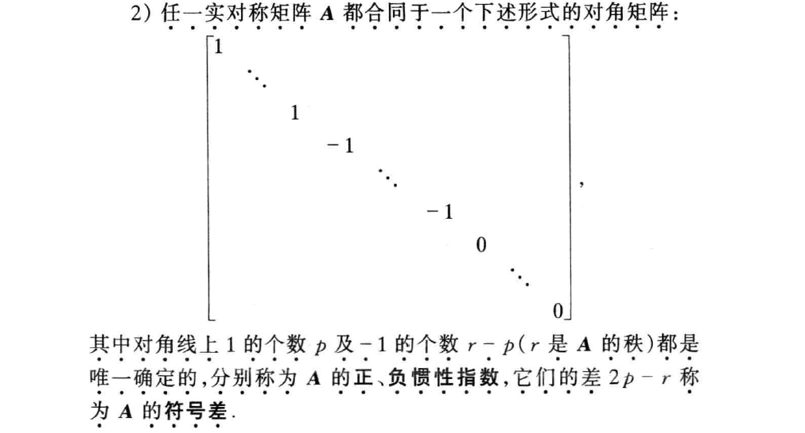

  

  

### § 4 正定二次型

+ 正定二次型定义: 如果对于任意一组**不全为零的**实数 $x_1, x_2, \cdots , x_n$ 都有 $f(x_1, x_2, \cdots , x_n) > 0$.
  
+ [例] $f\left(x_{1}, x_{2}, \cdots, x_{n}\right)=x_{1}^{2}+x_{2}^{2}+\cdots+x_{n}^{2}$ 是正定的, 因为只有$x_i$全为零时 它才等于零, 其余情况都大于零.
  
+ 实二次型正定的充要条件:
  $$
  f\left(x_{1}, x_{2}, \cdots, x_{n}\right)=d_1 x_{1}^{2}+d_2 x_{2}^{2}+\cdots+d_n x_{n}^{2}
  $$
  是正定的 当且仅当 $d_i > 0, \ \forall i, \ i = 1, 2, \cdots , n$ 注意这里必须要所有的$i$, 意味着必须要$n$个$x_i^2$都在.

+ 非退化线性替换保持正定性不变, 所以干脆就变成规范形:

+ $n$元实二次型是正定 的充分必要条件 是它的正惯性指数等于$n$

  证明思路: 标准形每一项系数大于零.

+ 正定二次型规范形 就是系数都为1 的二次型, 而且每一项都要有.

+ 实对称矩阵$\boldsymbol A$的正定:

  如果二次型 $\boldsymbol X' \boldsymbol A \boldsymbol X$ 正定.

+ 实对称矩阵$\boldsymbol A$正定的充要条件:

  与单位矩阵$\boldsymbol E$合同.

  + 正定矩阵的行列式大于零.

    证明: $\boldsymbol A$ 是正定矩阵:
    $$
    \boldsymbol A = \boldsymbol C' \boldsymbol E \boldsymbol C = \boldsymbol C' \boldsymbol C
    $$
    $\boldsymbol C$ 可逆, 两边取行列式即可.

+ 顺序主子式:

  

+ 实对称矩阵$\boldsymbol A$正定的充要条件(用来判别):

  $\boldsymbol A$ 的顺序主子式全大于零. (证明未看)

+ 类似地有 负定, 半正定, 半负定: $f(x_1, x_2, \cdots , x_n) < 0, \dots$; 不定的: 既不是半正定又不是半负定 等定义.

+ $\star \ \star$ 实二次型 $f(x_1, \cdots , x_n) = \boldsymbol X' \boldsymbol A \boldsymbol X$, $\boldsymbol A$ 是实对称的, 下列条件等价:
  1. $f(x_1, \cdots , x_n)$是半正定的
  2. 正惯性指数 等于 秩
  3. 存在可逆矩阵$\boldsymbol C$, 使 $\boldsymbol C' \boldsymbol A \boldsymbol C$ 是对角阵, 且对角线上的元素 $\geq 0$
  4. $\star$ 存在实矩阵 $\boldsymbol C$, 使 $\boldsymbol A = \boldsymbol C' \boldsymbol C$
  5. $\boldsymbol A$ 的所有主子式(行指标与列指标相同的子式) 都 $\geq 0$

## 第六章 线性空间

### § 1 集合 $\cdot$ 映射

+ 两个集合含有完全相同的元素, 即$a \in M$当且仅当$a\in N$, 那么称为集合相等.

+ 集合$M$到集合$M'$的一个映射: 它使$M$中每一个元素$a$都有$M'$中一个确定的元素$a'$与之对应.

  记为 $\sigma(a) = a'$, 其中$a'$称为在映射下的像, $a$称为映射下的原像.

+ 恒等映射/单位映射: $\sigma(a) = a$, 映射到自身.

复习屈书离散, 关于单射, 双射, 满射等.

### § 2 线性空间的定义与简单性质

定义: $V$ 是数域 $P$ 上的线性空间:

$V$是非空集合, $P$是一个数域.

+ 在V的元素之间定义了一种代数运算: 加法 $\Rightarrow$ 对于V中任意两个元素 $\boldsymbol \alpha$ 和 $\boldsymbol \beta$ 在$V$中都有唯一的一个元素 $\boldsymbol \gamma$ 与之对应. 记为 $\boldsymbol \gamma = \boldsymbol \alpha + \boldsymbol \beta$

  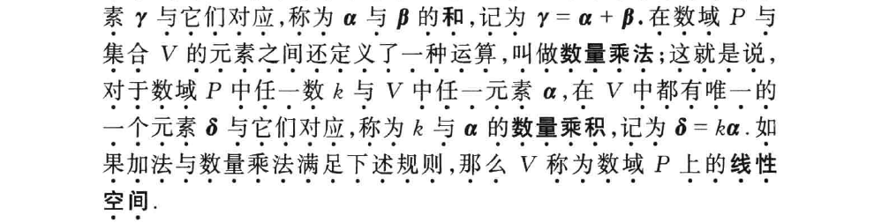

+ 如果加法和数量乘法满足:

  + 加法:

    1. 交换律: $\boldsymbol \alpha + \boldsymbol \beta = \boldsymbol \beta + \boldsymbol \alpha$
    2. 结合律: $(\boldsymbol \alpha + \boldsymbol \beta) + \boldsymbol \gamma = \boldsymbol \alpha + (\boldsymbol \beta + \boldsymbol \gamma)$
    3. 零元存在: $\exist \ \boldsymbol 0 \in V, \ \forall \boldsymbol \alpha \in V, \ \boldsymbol 0 + \boldsymbol \alpha = \boldsymbol \alpha$
    4. 负元存在: $\forall \ \boldsymbol \alpha \in V, \ \exist \ \boldsymbol \beta \in V, \ \boldsymbol \alpha + \boldsymbol \beta = \boldsymbol 0$

    

  + 数量乘法:

    1. 零元存在: $1 \boldsymbol \alpha = \boldsymbol \alpha$
    2. $k (l \boldsymbol \alpha) = (kl) \boldsymbol \alpha$

    

  + 数量乘法和加法满足:

    1. 分配律(对常数): $(k + l) \boldsymbol \alpha = k \boldsymbol \alpha + l \boldsymbol \alpha$
    2. 分配率(对$V$中元素): $k ( \boldsymbol \alpha + \boldsymbol \beta) = k \boldsymbol \alpha + k \boldsymbol \beta$

  

+ 线性空间也称向量空间

线性空间性质:

1. 零元唯一.

   证明: 反证法假设两个零元.

2. 负元唯一.

   证明: 反证法假设两个负元, 用其中一个负元去加零元(代换).

   + $\boldsymbol \alpha$ 的负元记为 $ - \boldsymbol \alpha$

     利用负元可以定义减法.

3. $0 \ \boldsymbol \alpha = \boldsymbol 0, \ k \ \boldsymbol 0 = \boldsymbol 0, \ (-1) \boldsymbol \alpha = - \boldsymbol \alpha$

   注意零向量 $\boldsymbol 0$, 和常数$0$

4. 如果$k \boldsymbol \alpha = \boldsymbol 0$, 那么$k = 0$或者$\boldsymbol \alpha = 0$.

### § 3 维数 $\cdot$ 基与坐标

线性组合 线性表出 定义:

+ 设$V$是数域$P$上的一个线性空间, $\boldsymbol \alpha_1, \ \boldsymbol \alpha_2 , \cdots , \boldsymbol \alpha_r$ 是$V$中一组向量, $k_1, k_2, \cdots , k_r$ 是数域$P$中的数, 那么
  $$
  \boldsymbol \alpha = k_1 \boldsymbol \alpha_1 + k_2 \boldsymbol \alpha_2 + \cdots + k_r \boldsymbol \alpha
  $$
  称为向量组 $\boldsymbol \alpha_1, \ \boldsymbol \alpha_2 , \cdots , \boldsymbol \alpha_r$ 的一个线性组合. 此时也说向量 $\boldsymbol \alpha$ 可以用向量组 $\boldsymbol \alpha_1, \ \boldsymbol \alpha_2 , \cdots , \boldsymbol \alpha_r$ 线性表出.

  

+ 线性相关, 线性无关, 都与之前类似:

  

+ 线性相关的充要条件是其中有一个向量是其余向量的线性组合.
+ 之前重要定理: 如果向量组$\boldsymbol \alpha_1, \ \boldsymbol \alpha_2 , \cdots , \boldsymbol \alpha_r$线性无关, 并且可以被$\boldsymbol \beta_1, \ \boldsymbol \beta_1 , \cdots , \boldsymbol \beta_s$线性表出, 那么$r \leq s$.
+ $\star$ 如果 $\boldsymbol \alpha_1, \ \boldsymbol \alpha_2 , \cdots , \boldsymbol \alpha_r$ 线性无关, 但 $\boldsymbol \alpha_1, \ \boldsymbol \alpha_2 , \cdots , \boldsymbol \alpha_r, \boldsymbol \beta$ 线性相关, 那么$\boldsymbol \beta$可以被 $\boldsymbol \alpha_1, \ \boldsymbol \alpha_2 , \cdots , \boldsymbol \alpha_r$ 线性表出, 而且表法是唯一的.

+ 线性空间的维度: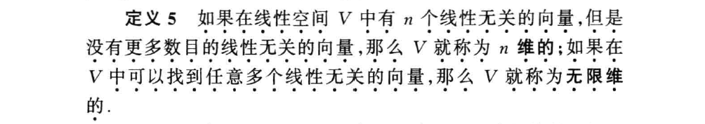

  维度就是线性空间中最大的线性无关的向量数.

+ $\star$ 线性空间的一组基:

  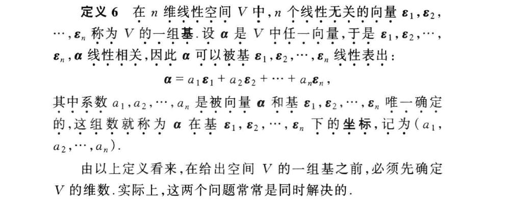

  任一向量都可以被基线性表出.

反过来:

+ 如果线性空间$V$中有$n$个线性无关的向量$\boldsymbol \alpha_1, \ \boldsymbol \alpha_2 , \cdots , \boldsymbol \alpha_n$, 并且$V$中任一向量都可以用它们线性表出, 那么: $V$ 是$n$维的, 而 $\boldsymbol \alpha_1, \ \boldsymbol \alpha_2 , \cdots , \boldsymbol \alpha_n$ 就是$V$的一组基.

  证明: $\star \ \star$ 就是前面重要定理的应用:

  + 首先$V$的维数至少是$n$.
  + 其次$n+1$个向量比线性相关, 反证法: 设 $\boldsymbol \beta_1, \ \boldsymbol \beta_2 , \cdots , \boldsymbol \beta_{n + 1}$ 线性无关, 又可以被 $\boldsymbol \alpha_1, \ \boldsymbol \alpha_2 , \cdots , \boldsymbol \alpha_n$ 线性表出, 由定理有 $n+1 \leq n$, 矛盾.

  

  [例] 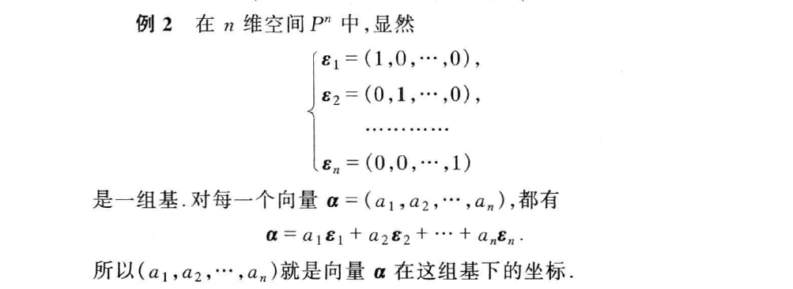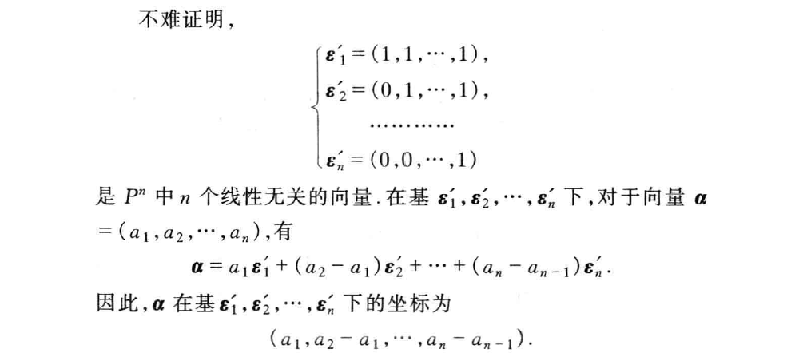

  

  

### § 4 基变换与坐标变换

随着基的改变, 向量的坐标是怎么变化的.

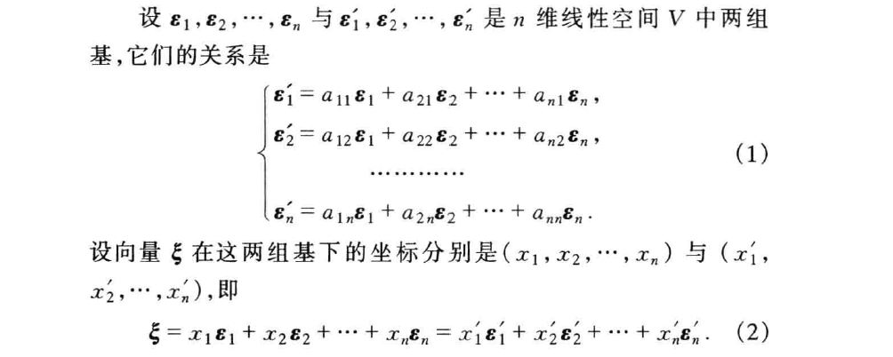

现在就是要找到 $(x_1, x_2, \cdots , x_n)$ 与 $(x_1', x_2', \cdots , x_n')$. 使用矩阵表达:
$$
\xi=\left(\varepsilon_{1}, \varepsilon_{2}, \cdots, \varepsilon_{n}\right)\left(\begin{array}{c}
x_{1} \\
x_{2} \\
\vdots \\
x_{n}
\end{array}\right)
$$

+ $\star \ \star$ 过渡矩阵: 两组基之间的变换 (根据上面(1)式):

  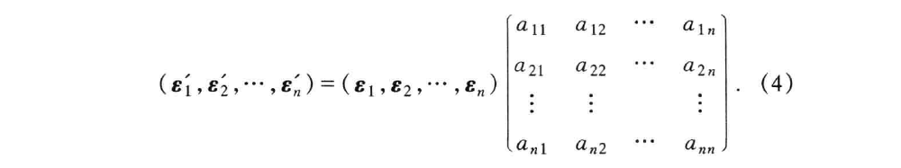 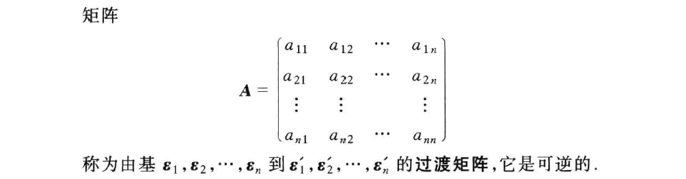

  由向量 $\boldsymbol \varepsilon_1', \boldsymbol \varepsilon_2', \cdots , \boldsymbol \varepsilon_n'$ 的线性无关性, 可以推出过渡矩阵可逆.

  

+ 

+ 

+ 

上面基变换((4)式), 代入: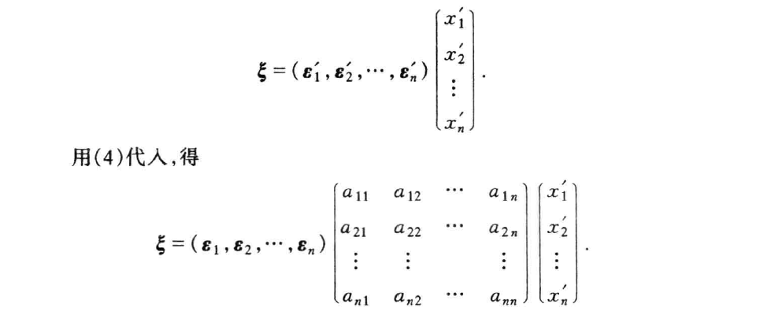

对比: $\xi=\left(\varepsilon_{1}, \varepsilon_{2}, \cdots, \varepsilon_{n}\right)\left(\begin{array}{c} x_{1} \\ x_{2} \\ \vdots \\ x_{n} \end{array}\right)$

由基向量的线性无关性, 我们有: 

### § 5 线性子空间

## 第七章 线性变换

### § 1 线性变换的定义

+ 线性空间$V$的一个变换$\mathscr{A}$称为线性变换: 如果对于$V$中任意的元素$\boldsymbol \alpha, \boldsymbol \beta$和数域$P$中任意数$k$, 都有:
  $$
  \mathscr A (\boldsymbol \alpha + \boldsymbol \beta) = \mathscr A (\boldsymbol \alpha) + \mathscr A ( \boldsymbol \beta ) \\
  \mathscr A (k \boldsymbol \alpha) = k \mathscr A (\boldsymbol \alpha)
  $$
  线性变换保持向量的加法与数量乘法.

  可以用来证明是不是线性变换.

线性变换有以下简单的性质:

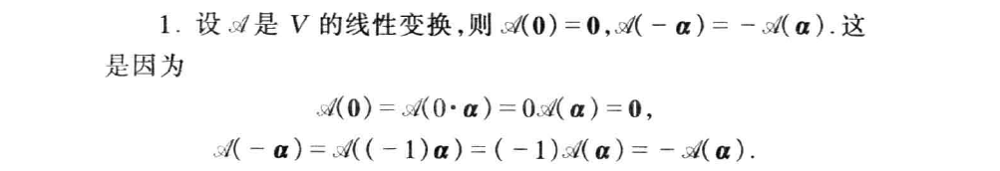

### § 2 线性变换的运算

+ 线性变换的乘积也是也是线性变换. 线性变换的乘法适合结合律.

  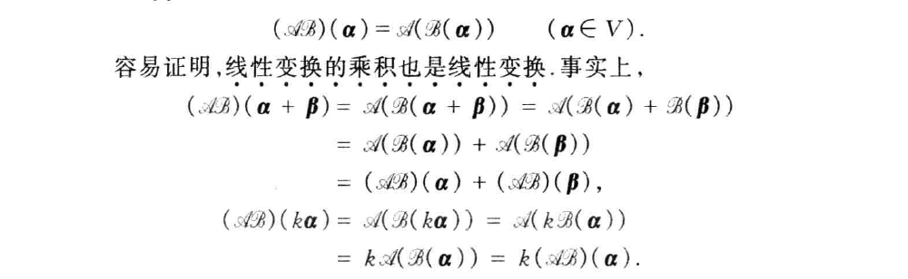

  

+ 线性变换的和还是线性变换:

  

  

+ 分配律:

  

  

+ 线性变换的数量乘法:

  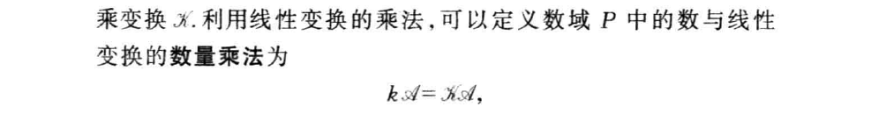

  

+ 线性变换的逆:

  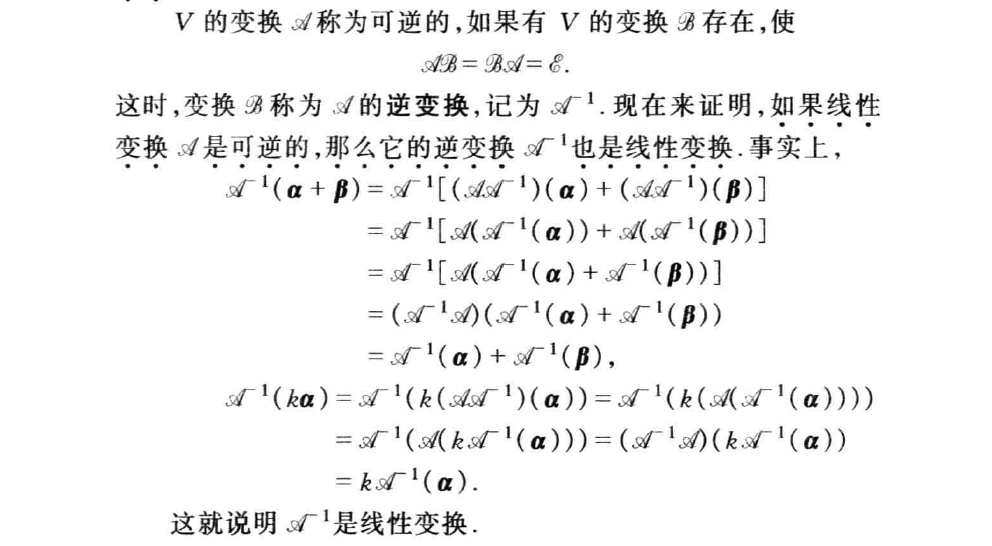

  

+ 线性变换的幂:

  

### § 3 线性变换的矩阵

+ 

  所以如果两个线性变换在 一组基 上的作用相同: $\mathscr{A} (\varepsilon_i) = \mathscr{B} (\varepsilon_i), \quad \forall i$, 那么有 $\mathscr{A} = \mathscr{B}$

  

+ 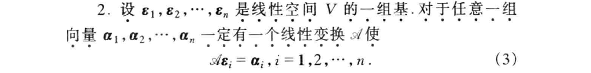

  证明:
  $$
  \xi=\sum_{i=1}^{n} x_{i} \varepsilon_{i} \\
  \mathscr A \xi = \sum_{i = 1}^n x_i \alpha_i
  $$
  然后证明上述构造的 $\mathscr A$ 是一个线性变换即可.

由上两点:

+ 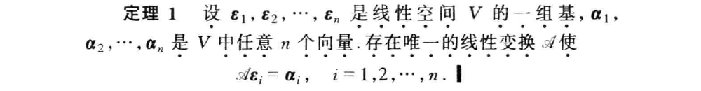

  所以我们可以有:

+ 设 $\varepsilon_1, \varepsilon_2, \cdots , \varepsilon_n$ 是线性空间 $V$ 的一组基, $\mathscr A$ 是一个线性变换, 基向量的像可以被基线性表出:
  $$
  \left\{\begin{array}{c}
  \mathscr A \boldsymbol{\varepsilon}_{1}=a_{11} \boldsymbol{\varepsilon}_{1}+a_{21} \boldsymbol{\varepsilon}_{2}+\cdots+a_{n 1} \boldsymbol{\varepsilon}_{n} \\
  \mathscr{A} \boldsymbol{\varepsilon}_{2}=a_{12} \boldsymbol{\varepsilon}_{1}+a_{22} \boldsymbol{\varepsilon}_{2}+\cdots+a_{n 2} \boldsymbol{\varepsilon}_{n} \\
  \ldots \ldots \ldots . . \\
  \mathscr{A} \boldsymbol{\varepsilon}_{n}=a_{1 n} \boldsymbol{\varepsilon}_{1}+a_{2 n} \boldsymbol{\varepsilon}_{2}+\cdots+a_{n n} \boldsymbol{\varepsilon}_{n}
  \end{array}\right.
  $$
  注意 矩阵表达 为:
  $$
  \mathscr A (\varepsilon_1, \varepsilon_2, \cdots , \varepsilon_n) = (\mathscr A \varepsilon_1, \mathscr A \varepsilon_2, \cdots , \mathscr A \varepsilon_n) = (\varepsilon_1, \varepsilon_2, \cdots , \varepsilon_n) A
  $$
  其中矩阵 $A$ 称为 $\mathscr A$ 在基下的矩阵.

+ 从此, 线性变换的和, 乘积等就有很好的对应, 例如:

+ $\star \ \star$

  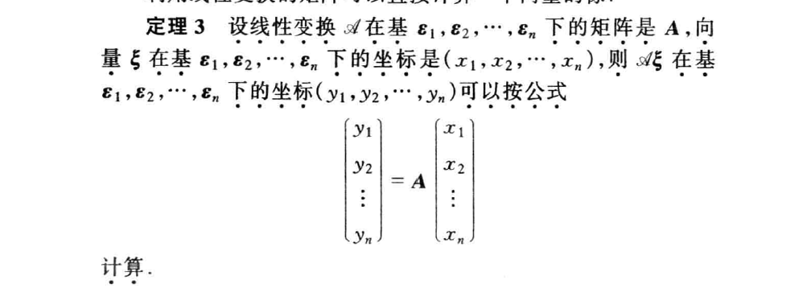

  证明($\star$):

  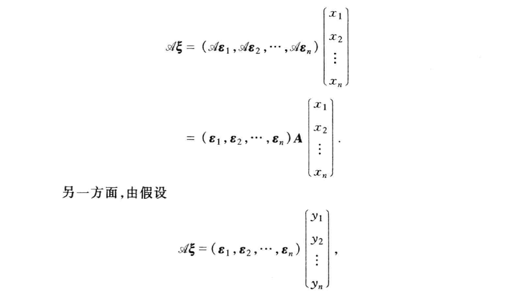 

+ 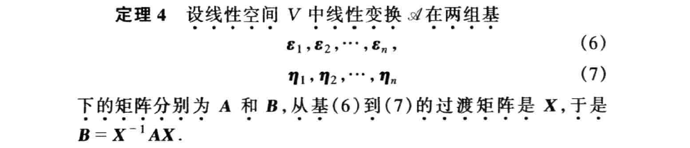

  证明:

  

  这样就得到了 同一个线性变换 $\mathscr A$ 在不同基下的 矩阵之间的关系.

+ $\star \ \star$ 矩阵相似: $A \sim B$

  

  等价关系: 满足自反, 对称, 传递 性.

  

+ 如果两个矩阵是相似的, 那么它们可以看做同一个线性变换 在两组基下所对应的矩阵.

  证明: $B = X^{-1} A X$, 令一组基为:
  $$
  (\eta_1, \eta_2, \cdots, \eta_n) = (\varepsilon_1, \varepsilon_2, \cdots, \varepsilon_n) X \\
  \mathscr A (\varepsilon_1, \varepsilon_2, \cdots, \varepsilon_n) X = (\varepsilon_1, \varepsilon_2, \cdots, \varepsilon_n) A X =  (\eta_1, \eta_2, \cdots, \eta_n) B
  $$
  所以 $\eta$ 这组基在 $\mathscr A$ 下的矩阵就是 $B$.

### § 4 特征值与特征向量

+ 定义:
  $$
  \mathscr A \boldsymbol \xi = \lambda_0 \boldsymbol \xi
  $$
  $k \boldsymbol \xi$ 也是特征向量, 特征值被特征向量唯一决定.

+ 找特征向量, 特征值的方法:

   

  上面齐次方程组有非零解的充分必要条件是系数行列式为零. 

  

  + $A$ 是数域 $P$ 上一 $n$ 级矩阵, $\lambda$ 是一个文字, 

    $A$ 的特征多项式: 矩阵 $\lambda E - A$ 的行列式: $|\lambda \boldsymbol E - \boldsymbol A|$.

    注意上面所述系数行列式为零 $\Rightarrow$ $\lambda_0$ 是 $|\lambda \boldsymbol E - \boldsymbol A| = 0$ 的一个根.

  所以:

  

  

  

+ [例]

  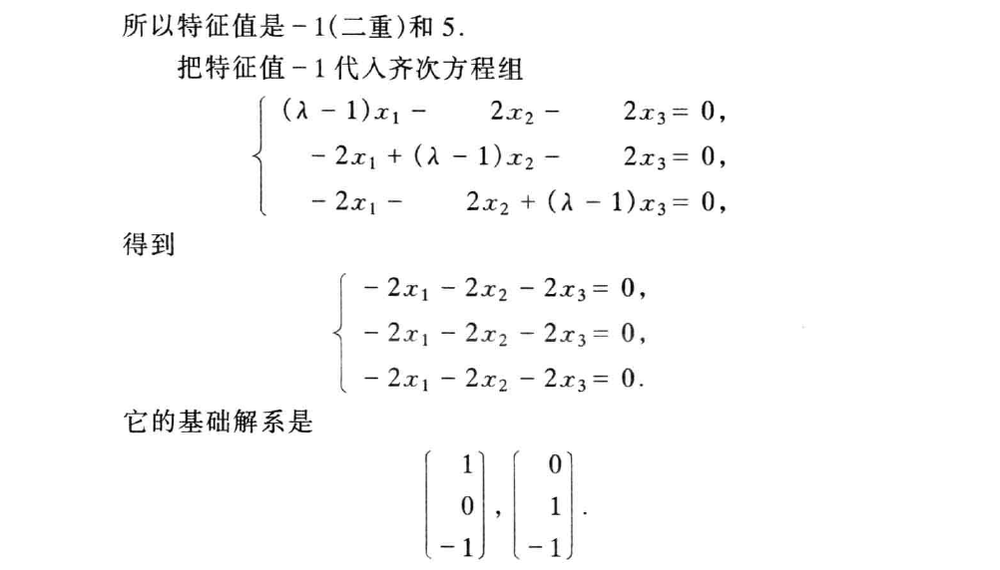 

  

  

+ $\text{Tr} (\boldsymbol A)$ 迹: 全体特征值的和.

+ 全体特征值的积为 $|A|$.

### § 5 对角矩阵

+ $\mathscr A$ 的矩阵 在某一组基下 为对角矩阵 $\Leftrightarrow$ $\mathscr A$ 有 $n$ 个线性无关的特征向量.

  证明: 这组基就是特征向量:

  

  

+ 属于不同特征值的特征向量 线性无关:

  证明: 数学归纳法:

  1. 一个特征向量 线性无关;

  2. 假设 $k$ 个不同特征值的特征向量 线性无关;

  3. $k + 1$ 个时:

     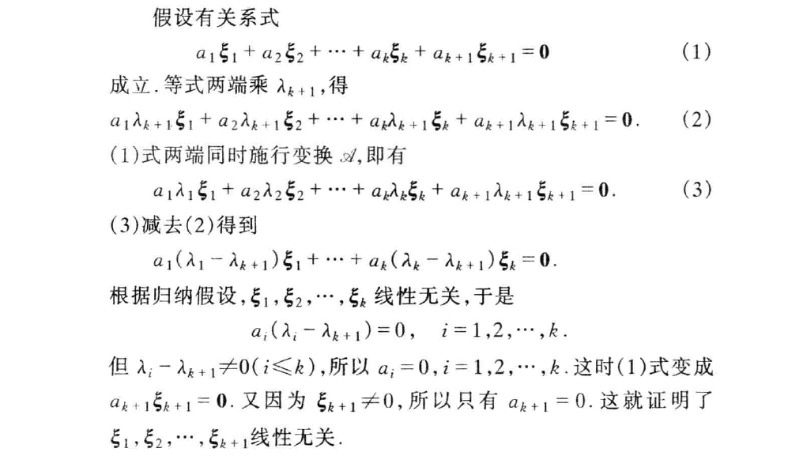

     注意 线性无关的证明方向是第$k+1$个特征向量的系数也要为零, 还有构造两端同时作用 $\mathscr A$, 使 $\xi_{k + 1}$ 被减掉.

## 第八章 $\lambda$ - 矩阵

### § 1 $\lambda$ - 矩阵

## FAQ

+ 导数存在蕴含导数连续?

  答: https://zhuanlan.zhihu.com/p/28543551

  注意$\frac{0}{0}$型洛必达条件:

  + $x \rightarrow x_0$, $f(x)$和$g(x)$ 都 $\rightarrow 0$.
  + 在$x_0$的去心邻域, $f', g'$都存在. 而且$g'(x) \neq 0$.
  + $\lim_{x \rightarrow x_0} \frac{f'(x)}{g'(x)}$ 存在或为正无穷.

  

+ 导数存在的充要条件?

  答: https://www.zhihu.com/question/42221580 左右导数存在且相等, 并且该点连续.

  注意这里左右导数是 导数定义里面那个 $\lim_{x \rightarrow x_0} \frac{f(x) - f(x_0)}{x - x_0}$. 然后取极限做一个处理.

  

  知乎讲得很好.

注意上面两问中$x^2 sin(\frac{1}{x})$扮演重要角色.

+ [例]
  $$
  x(y, z), \ y(x, z), \ z(y, z) \\ f(x, y, z) = 0 \\ proof. \ \ x_y \ y_z \ z_x = -1
  $$
  解:

  

  对$f(x, y, z) = 0$两边微分:
  $$
  df = f_x \ dx + f_y \ dy + f_z \ dz \\ = (f_x x_y dy + f_x x_z dz) + f_y \ dy + f_z \ dz \\
  = (f_x x_y + f_y)dy + (f_xx_z + f_z) dz
  $$
  