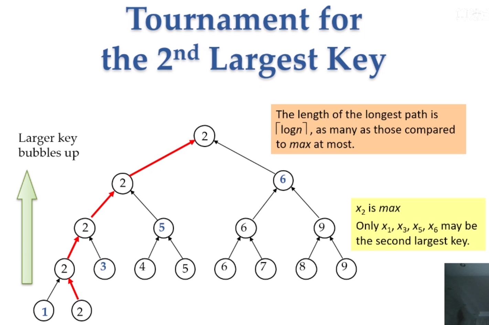
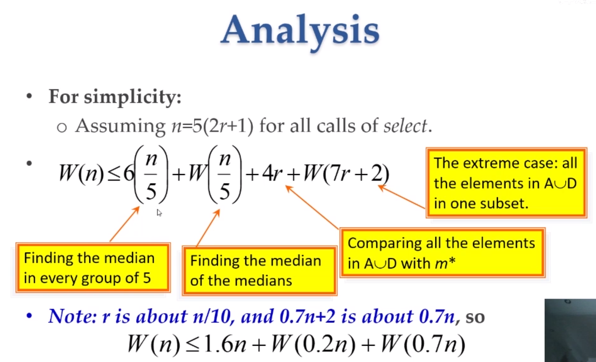
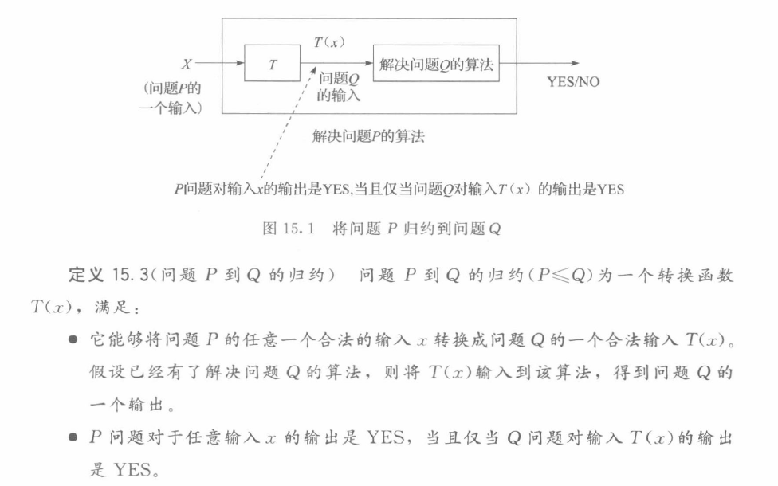

# Algorithm Notes

算法课笔记

[TOC]

## Adversary Argument (L7 - Selection)

+ 抽象和数学: 对于所有算法成立.
+ 对手论证: 一个对手总在捣乱(在合法输入的范围内, 尽量对算法设计者不利的情况(比较或者其他操作更多次)), 算法设计者可以使用各种方法.

### The Selection Problem

找第$k$大的元素. Selection 和 Search 还是有点区别.

+ 证明select MAX的下界:

  任何算法必须 比较 $n - 1$ 次 $\Rightarrow$ 如果一个算法比较 $n - 2$ 次那么就是错误的.

  证明思路:

  一个元素需要比$n - 1$个元素大才是最大, 任何一个算法如果用$n - 2$次, 那么就可以使没有比较的那一个比它更大, 所以此时选择出的MAX不是最大.

  

  上面其实提出了形式化的类似Adversary Argument框架.

  

#### Comparison based sorting

都可转换为决策树. 树深度下界可以由叶子节点个数下界决定.

所以上面的Selection问题可以转化为树叶子节点最多$n$个, 所以树的高度$log n$. 但是这不是一个紧的下界.

### Select MAX and MIN

算法也要先设计出好的: 这里需要同时找MAX和MIN, 搜两遍太慢了.

这里好的算法有点像 出两拨人打架.

+ 算法: 分两拨两两比较, MAX只可能在胜者里出现, MIN只可能在败者里出现.

  复杂度: $\frac{n}{2} + 2( \frac{n}{2} - 1 )$

  

+ 证明: 共性的数学性质, MAX比其他$n - 1$大, 因为上面的算法关注的是两两比较, 对手论证的证法就是把两两的所有情况讨论出来:

  定义Unit of information: 没有比较过的到输过一次或者赢过一次就是增加一个Unit.

  + 举个很明确的对手策略的例子:

    一个曾经比别人大的元素$x$ VS 一个没比过的元素$y$:

    让$x > y$更好, 因为如果$x < y$, 那么$x$就是曾经比别人大 也曾经比别人小的元素, 这样$x$就不可能是MAX也不可能是MIN了, 这带来的信息量就很多了. 对手就是想给算法设计者信息量更小一点.

    

  

  

### Find the $2^{nd}$ Largest key

暴力: $n - 1$ 找MAX, $n - 2$ 找第二大.

如果一个元素 比一个 不是最大的元素 小, 那么肯定就不是$2^{nd}$.

思路: 锦标赛排序, 只需要在 和MAX比较中 的元素中找第二大的即可:

所以$n - 1$找最大, 然后在所有和MAX比过的元素中 $logn - 1$ 找第二大.

### Lower Bound 通过Adversary分析:

比如$x>y$, 那么一次比较$x$获得一定的量(比如获得$y$的全部量), 那么考虑$x$获得MAX应得的量要多久. 这个速度就来了.

partition其实就是找到 比它小的有$k$个.

### SELECT(Selection) 来了:

快排平均$O(nlogn)$, worst case $O(n^2)$.

首先 列(竖着看) 五个五个元素一组, 先五个五个一组找到每组的median, 然后把这些median组合在一起再找median(中间横着的那一行Medians)

问题划分的平衡性对算法复杂度有巨大影响.

中间的$m^{\star}$, 注意不管Adversary怎么做, 都能保证$B, C$那么多的比$m^{\star}$小和大的那么多元素. 所以这个划分不会不平静.

+ 5个元素找median, 最多6次. (可以思考)

分析如上图, 

1. $6 \left( \frac{n}{5} \right)$ 就是五个五个一组有$\frac{n}{5}$组, 每个组6次可以找到median.
2. $W(\frac{n}{5})$ 是递归地找出 前面一步 $\frac{n}{5}$ 组的median.
3. 上图中$A, D$就是上面划分的集合.

要有一个数学刻画, 分析出什么样的比较结果对算法来说更加不好. 总结为带来的信息更少, 算法设计者得到的东西更少. 比如已有$x < median$, 那么Adversary更希望$y > x$, 因为这样$y$和$median$的关系就不知道了.

Selection 算法的下界: $\frac{3n}{2} - \frac{3}{2}$.

## (L8 - logn search)

把数据组织成特定的结构, 使$O(logn)$可以查找到.

第一反应是折半查找 (需要保证在常数时间寻址, 链表不行, 访问任何一个地方都是$O(1)$). 这次课是广义的折半查找.

#### [例] Peak Number

+ 思路: 看中间元素满不满足Peak的性质, 按照上升顺序(和左右两个元素的大小关系)确定在左边还是右边, $O(logn)$.

#### [例] 找连续有序数组中最小的缺失的数.

+ 思路: 如果$\frac{n}{2}$是$\frac{n}{2}$, 说明前面的元素都是连续的, 缺失地在这个$\frac{n}{2}$后面. 如此折半.

##### [例] 同上思路, 找 `A[i] = i` 的元素, 同样方法解.

## 第六部分 计算复杂性理论初步

#### 15.1.1 优化问题和判定问题

+ (CLIQUE-优化问题) 最大团问题: $H$ 为无向图 $G$ 中一个团, 如果 $H$ 是 $G$ 的子图 并且是完全图. 团的大小为它所含顶点的个数.
+ 这里的优化问题的指标就是团的大小.

一个优化问题往往可以定义其相应的判定问题: 判定问题关注同样的问题结构, 但是引入一个参数$k$, 并且问一个"是/否"的问题: 是否存在这样的结构.

+ (CLIQUE-判定问题)

  输入无向图 $G$, 还输入 参数 $k$

  判定问题: 图 $G$ 中是否存在大小为 $k$ 的团.

1. 为什么要研究判定问题?
2. 判定问题比优化问题更简单, 研究判定问题复杂性能否全面反映该原问题复杂性.

#### 15.1.2 问题间归约的定义

引入科学工具来比较不同问题之间的难易程度.

##### P问题

##### 多项式时间的归约

##### NP问题

该问题的解在多项式时间内可验证, 非确定性地任意猜测一个解, 可以在多项式时间内检查这个解是不是该问题的解.

##### NP难

任意一个NP问题都可以多项式时间归约到它, 则它是NP难问题. NP难问题难度没有上界.

##### NP完全

如果它 $\in$ NP, 并且是NP难问题.

就是NP问题中最难的问题.

如果任意NP完全问题可以在多项式时间内解决, 则所有NP问题可以在多项式时间内解决, 即P = NP.

