# 计网笔记

[TOC]

## 第四章 网络层

### 4.1 概述

网络层协议是协议栈中最具挑战性(最有趣)的部分.

两种用于构造网络层分组交付的方法: 数据报模式和虚电路模式.

编址在传递分组到目的主机所起的重要作用.

### 4.1.1 转发和路由选择

网络层重要**功能**:

+ 转发: 当一个分组到达路由器的一条输入链路时, 路由器必须将该分组**移动到适当的输出链路**.
+ 路由选择: 当分组**从发送方流向接受方**时, 网络层必须决定这些分组所**采用的路由或路径**. 计算这些路径的算法是路由选择算法.
+ 连接建立: 源到目的地沿着所选择的路径彼此握手, 以便在需要传输的数据分组**开始流动之前建立状态.** (TCP中数据从发送方到接受方之前需要三次握手)

路由器的**转发表**: 路由器通过**检查到达的分组首部字段的值**来转发分组(决定输出链路的接口).

**路由选择算法决定了路由器中转发表的表项.** 在任何情况下都是**路由器接收路由选择协议报文**, 该信息被用于配置其转发表.

分组交换机: 通用分组交换设备, 根据分组首部字段中的值, 从输入链路接口到输出链路接口转移分组.

路由器: 于网络层字段中的值做转发决定.

网络服务模型: 定义了分组在**发送与接收端系统之间的**端到端运输特性.

当运输层向网络层传递分组时, **由网络层提供的**特定**服务**:

+ 确保交付, 能到目的地
+ 具有时延上界的, 保证在上界内交付

网络层 能给源和目的地之间**的分组流** 提供以下服务:

+ 有序分组交付, 维持发送顺序
+ 确保最小带宽.
+ 确保最大时延抖动
+ 安全性服务: 使用仅源和目的主机知晓的秘密会话秘钥.

网络层: 尽力而为的服务. 分组间的定时是不能确保被保证的. 分组接受顺序也不能保证与发送顺序一致.

ATM服务模型是 恒定比特率和可用比特率服务.

网络层也能够在两台主机之间提供无连接服务或连接服务(以握手开始)

网络层连接与无连接服务 和 运输层连接和无连接服务的差异:

+ 网络层: 这些服务是由网络层向运输层提供的主机到主机的服务; 运输层: 这些服务是运输层向应用层提供的进程到进程的服务.
+ 网络层不同时提供连接 无连接服务. 仅在网络层提供的连接服务的计网 叫做**虚电路网络**, 仅在网络层提供无连接服务的计网叫做**数据报网络**.
+ 运输层面向连接服务是在位于网络边缘的端系统中实现的; 网络层连接服务出了在端系统中, 也在位于网络核心的路由器中实现.

### 4.2.1 虚电路网络 P208

网络层连接服务以源和目的主机间的握手开始; 网络层无连接服务则没有.

组成:

1. 源和目的主机之间的路径
2. VC号: **沿着路径的**每段链路的号码
3. 此路径上**每台路由器中转发表表项**

在虚电路上传递的分组, **首部携带VC号**, 随着它所处的位置变化(路由器来更改, 从转发表中获得). 一条虚电路在每条链路上可能具有不同的VC号. 每台中间路由器必须用一个新的VC号替代每个传输分组的VC号.

(以下可结合书本) 跨越一台服务器创建一条新的虚链路, 转发表就增加了一个表项. 反之释放一个连接需要删除表项

为什么分组在链路上不保持VC号?

答: 1. 逐条链路修改VC号减少了在分组首部中VC字段的长度. 2. 简化虚电路的建立.

虚电路网络中路由器必须**为进行中的连接维持连接状态信息**. 每当跨越一台路由器创建一个新连接, 必须在该路由器的转发表中增加一个新的连接项, 每当释放一个连接必须从该表中删除. 没有VC号转换也有必要维持连接状态信息.

虚电路三个不同阶段: 虚电路建立->数据传送->虚电路拆除.

虚电路网络层中 沿两个端系统之间路径上的路由器**都要**参与虚电路的建立, 且每台路由器都**完全知道**经过它的所有虚电路.

信令报文: 端系统向网络发送 指示虚电路启动与终止的报文, **以及路由器之间传递的用于建立虚电路**(即修改路由器表中连接状态)的报文.

信令协议: 用来**交换**信令报文的协议.

---

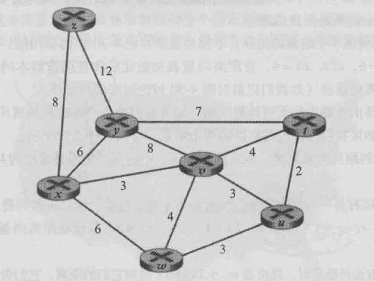

P26:

| Step | $N$     | u        | t        | v    | w    | z    | y    |
| ---- | ------- | -------- | -------- | ---- | ---- | ---- | ---- |
| 0    | x       | $\infty$ | $\infty$ | 3, x | 6, x | 8, x | 6, x |
| 1    | xv      | 6, v     | 7, v     |      | 6, x | 8, x | 6, x |
| 2    | xvu     |          | 7, v     |      | 6, x | 8, x | 6, x |
| 3    | xvuw    |          | 7, v     |      |      | 8, x | 6, x |
| 4    | xvuwy   |          | 7, v     |      |      | 8, x |      |
| 5    | xvuwyt  |          |          |      |      | 8, x |      |
| 6    | xvuwytz |          |          |      |      |      |      |

### 4.2.2 数据报网络 P209

数据报网络中端系统发送分组: 在发送分组上**加上目的地端系统的地址**, 然后将分组推进网络. 没有虚电路.

其间每台路由有一个将目的地址映射到链路接口的转发表, 当分组到达路由器时, 查表找到适当的输出链路接口.

路由器用分组的目的地址的**前缀**与该表中的表项进行匹配. 关注:

+ 表项中有一个"其他", 如果与上面三项都不匹配, 就发往"其他"对应的那个端口.
+ 与多个表项匹配, 则使用**最长前缀匹配原则**.

学习因特网编址的时候可以更好地理解最长前缀匹配规则.

###### 4.3 路由器工作原理 P211

+ 输入端口: 将一条输入的物理链路与路由器相连接的物理层功能. 完成查找路由器转发表以决定输出端口.
+ 交换结构: 将路由器输入端口与输出端口相连接.
+ 输出端口: 存储从交换结构接受的分组, 并通过执行必要的链路层和物理层功能在输入链路上传输这些分组.
+ 路由选择处理器: 执行路由选择协议, 维护路由选择表以及连接的链路状态信息, 并为路由器计算转发表.

路由转发平面: 这些转发功能.

###### 4.3.1 输入端口 P214

在此 路由器使用转发表来查找输出端口.

转发表从路由选择处理器 经过独立总线 复制到线路卡(每个输入端口).

三态内容可寻址存储器(TCAM) 常被用于转发表的查找.

确定了输出端口之后就可以进入交换结构, 如果其他分组正在使用交换结构, 则此分组会被暂时阻塞. 被阻塞的分组需要在输入端口排队.

###### 4.3.2 交换结构 P215

位于路由器的核心部位.

+ 经内存交换: 目的地址的查找 和 将分组存储(交换)进适当的内存存储位置 是由输入线路卡来处理的.
+ 经总线交换: 输入端口经一根 共享总线 将分组直接传送到输出端口, 不需要路由选择处理器的干预.
+ 经互联网络交换: 

###### 4.3.3 输出端口 P217

去除存放在 输出端口内存 中的分组, 并将其发送到输出链路上.

###### 4.3.4 关于排队

在 输入端口和输出端口 都能够形成分组队列.

排队的位置和程度取决于流量负载, 交换结构的相对速率和线路速率. 如果路由器的缓存空间耗尽则会出现丢包.

+ $R_{line}$: 输入线路和输出线路的速度, (分组/秒)
+ $N$: 输入, 输出端口的数量
+ $R_{switch}$: 交换结构传输速率, (分组/秒)

$R_{switch}$比$R_{line}$快$N$倍, 仅有一点点在**输入端口**排队. 但是在输出端口, 如果$N$个包从不同输入进来, 处理后发向同一个输出端口, $N$个包就会排队(等待)传输到输出链路.

缓存数量$B$ = 平均往返时延$RTT$ $\times$ 链路的容量$C$.

当有大量的TCP流($N$)流过一条链路时, 缓存所需要的数量$B = RTT \times C / \sqrt{N}$.

输出端口排队之后, 需要分组调度程序 选一个来发送(提供服务质量保证). 先来先服务$FCFS$, 加权公平排队$WFQ$.

P219 针对排队问题的剔除算法: $AQM$主动队列管理, $RED$随机早期检测

###### 4.3.5 路由选择控制平面

未

---

###### 4.4 网际协议: 因特网中的转发和编址

IP协议版本4: IPv4

###### 4.4.1 数据报格式

IPv4 数据报格式:

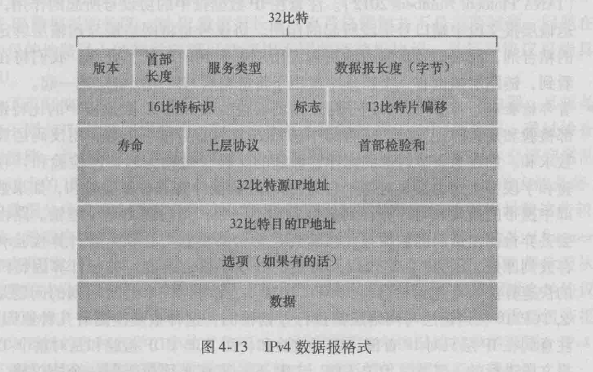

+ 版本号: 4比特, 规定了数据报的IP协议版本.
+ 首部长度: 4比特, 确定IP数据报中数据部分实际从哪里开始.
+ 服务类型(TOS): 包含在IPv4首部中, 使不同类型的IP数据报能相互区别开来.
+ 数据报长度: 16比特, 是IP数据报的总长度.
+ 标识/标志/片偏移: 和IP分片有关. 在数据报首部.
+ 寿命(Time-To-Live, TTL): 确保不会在网络中循环, 当数据报每经由一台路由器处理时, 该字段减1. 若TTL = 0, 则该数据报被丢弃.
+ 上层协议: 仅在一个IP数据报到达其最终目的地才使用, 指示了IP数据报的数据部分应交给哪个特定的运输层协议.
+ 首部检验和: 用于帮助路由器检测收到的IP数据报中的比特错误.
+ 源和目的IP地址: 通常源主机通过 DNS 来查找目的地址.
+ 选项: 允许IP首部扩展.
+ 数据(有效载荷): 包含交付给目的地的运输层报文段.

###### IP数据报分片 fragment

动机: 有的链路层协议只能承载小分组, 例如以太网帧承载最大1500字节.

MTU(Maximum Transmission Unit): 最大传送单元.

为了坚持网络内核保持简单的原则, IPv4设计者决定将数据报的重新组装工作放到端系统中.

分片后的数据报每一片具有初始数据报的源地址, 目的地址与标识号. 最后一个片的标志比特被设为0, 其他的为1. 偏移字段指定该片应该放到初始IP数据报中的哪个位置.

###### 4.4.2 IPv4 编址 P225

接口(interface): 主机与物理链路之间的边界, 路由器与它任意一条链路之间的边界.

IP 要求每台主机和路由器接口拥有自己的IP地址, IP是和接口相关联的.

IPv4地址4字节, 点分十进制记法(即每个字节用其十进制书写, 用"."隔开), 每个字节最高就255哦.

全球唯一.

以下结合书本来看

互联3个主机接口与1个路由器接口的网络:

+ 是一个子网(subnet)
+ IP编址为这个子网分配的一个地址: `223.1.1.0/24`
+ `223.1.1.0/24`中: `/24`是子网掩码(network mask), 指示了32比特中的最左侧24比特定义了子网地址.
+ 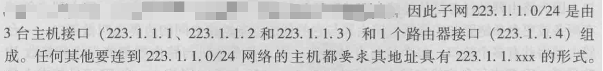

子网定义: (请结合书本) 分开主机和路由器的每个接口, 产生集合隔离的网络岛, 使用接口端接这些隔离的网络的端点. 则这些隔离的网络中每一个都叫做子网.

子网定义, 关键看`/24`, 后$32 - 24$位决定了有多少个子网. 会因为x的不同造成子网划分不同吗?

因特网的地址分配策略被称为 无类别域间路由选择(CIDR).

IP地址被划分为两部分: `a.b.c.d/x`

+ 前x比特构成了IP地址的网络部分, 是网络前缀.
+ 剩余的32 - x比特是用于区分内部设备的. 当子网内部的路由器转发分组时才会考虑这些比特.

在CIDR被采用之前, x = 8, 16, 24.

广播地址: `255.255.255.255`, 会交付给同一个网络的所有主机.

P17:

**Router1: **

| prefix                              | 连接到子网的接口 |
| ----------------------------------- | ---------------- |
| 11010110 01100001 11111110 '''''''' | 连接子网A的那个  |
| 11010110 01100001 11111111 1111111' | 子网F            |
| 11010110 01100001 11111111 1111101' | 子网D            |

**Router2: **

| prefix                              | 连接到子网的接口 |
| ----------------------------------- | ---------------- |
| 11010110 01100001 11111111 1''''''  | 连接子网C的那个  |
| 11010110 01100001 11111111 1111111' | 子网F            |
| 11010110 01100001 11111111 1111110' | 子网E            |

**Router3: **

| prefix                              | 连接到子网的接口 |
| ----------------------------------- | ---------------- |
| 11010110 01100001 11111111 0''''''  | 连接子网B的那个  |
| 11010110 01100001 11111111 1111110' | 子网E            |
| 11010110 01100001 11111111 1111101' | 子网D            |

ISP: 互联网服务提供商

+ 获取一块地址:

  1. ISP分配

  2. ISP是通过ICANN组织分配地址块, 这个组织还需要管理IP地址空间, 分配域名与解决域名纷争.

+ 获取主机地址: 动态主机配置协议 DHCP

  + 为本组织内的主机与路由器接口 逐个分配IP地址.
  + 使用动态主机配置协议 DHCP协议
  + DHCP自动获取IP地址. 配置DHCP后, 主机每次与网络连接之后能得到相同的IP地址, 或者某主机被分配一个临时的IP地址.
  + 主机加入或离开时, 更新可用的IP地址表.
  + DHCP是客户 - 服务器协议, 客户通常是新到达的主机, 它要获得包括自身使用IP地址在内的网络配置信息.
  + 每个子网中具有一台DHCP, 如果没有则需要一个DHCP中继代理
  + DHCP是即插即用协议.

+ DHCP协议四个过程:

  1. DHCP服务器发现: 通过使用一个 DHCP发现报文 发现一个要与其交互的DHCP服务器. DHCP发现报文是使用广播且"本主机"源地址是`0.0.0.0`
  2. DHCP服务提供: DHCP服务器收到 DHCP发现报文后, 广播一个DHCP提供报文(包含收到的发现报文事务ID, 推荐的IP地址, 网络掩码, IP地址租用期).
  3. DHCP请求: 新到达的主机从一个或多个服务器提供中选择一个, 并向选中的服务器响应 DHCP请求报文. 回显配置参数.
  4. DHCP ACK: 对DHCP请求报文的响应.

  DHCP还有一种机制可以更新IP的租期.

+ 网络地址转换(NAT) **没懂**

  + NAT路由器对外界的行为反过来就如同一个具有*单一IP*地址的单一设备.
  + 本质上 NAT使能路由器对外界隐藏了家庭网络的细节.

###### 4.4.3 因特网控制报文协议 ICMP P236

ICMP 被主机和路由器用来彼此沟通网络层信息, 最典型的用途是差错报告. 许多报错报文就是在ICMP中产生的.

ICMP报文承载在IP分组中, 作为payload.

ICMP报文有: 一个类型字段, 一个编码字段. 并且包含引起该ICMP报文 首次生成的IP数据报的首部和前8字节内容(以便发送方确定引发该差错的数据报).

`ping`发送一个ICMP类型8(回显(echo)请求)编码0的报文到指定主机.

源抑制报文也是ICMP报文, 使拥塞的路由器向一台主机发送一个ICMP源抑制报文, 强制该主机减小发送速率.

###### 4.4.4 IPv6 P238

最重要的变化:

+ 扩大的地址容量: 32 bits -> 128 bits. 除了单播地址和多播地址还引入了任播地址.
+ 简化高效的40字节首部
+ 流标签与优先级: 流: flow, 该字段可用于"给属于特殊流(发送方要求特殊处理的流)的分组加上标签". 音频和视频传输就可能被当做一个流. 可以改变优先权.

IPv6字段有:

+ 版本: 4比特字段, 表示IP版本号. == 6.
+ 流量类型: 8比特字段, 与IPv4中TOS字段含义相似.
+ 流标签
+ payload 长度: 16比特, 给出了数据报中跟在定长的40字节数据报首部 后面的字节数量.
+ 下一个首部: 标识数据报中的内容需要交付给哪个协议(如TCP或UDP).
+ 跳限制: 转发的数据报的每台路由器 将该字段内容减1. 到0时丢弃数据报.
+ 源地址和目的地址
+ 数据: payload

**注意与IPv4有什么相同类似的字段, 尽量都背起来!**

在IPv6中**消失的**字段:

+ 分片/重新组装: 如果IPv5数据报太大, 路由器会丢弃并发送 "发组太大" 的ICMP差错报文.
+ 首部检验和: 为了快速处理. IPv4中TTL改变所以每台路由器都要重新计算.
+ 选项: 转换到 "下一个首部".

跳过了一些.

###### 4.5 路由选择算法 P243

路由: 动词, 确定从发送方到接收方通过路由器网络的优秀路径.

第一跳路由器(默认路由器): 主机直接相连的路由器.

源路由器, 目的路由器: 源主机的第一跳路由器, 目的主机的第一跳路由器.

###### 4.5.1 链路状态路由选择算法

Dijkstra 算法:

+ 计算从源结点到其他结点的最低.

+ k次迭代之后 知道k个目的结点的最低费用路径.

+ 

  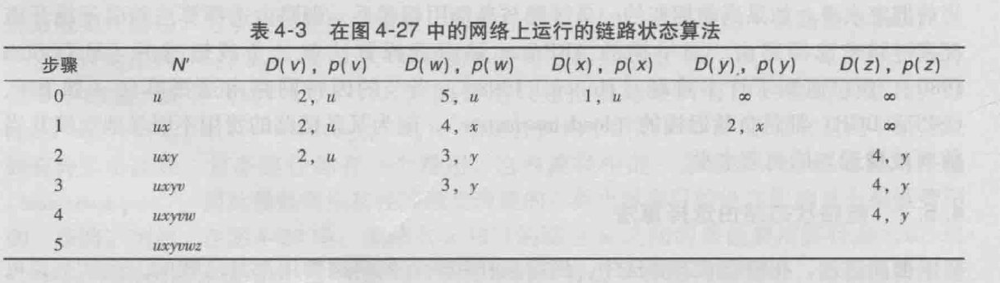

  别忘了黄宇老师讲的fringe, 步骤1就是x结点从fringe中被选出, 加入. 步骤二就是y结点从fringe中被选出..

  注意选出了一个之后, fringe中的所有都要更新. 上面图和表看懂就OK了.

+ 建立转发表: 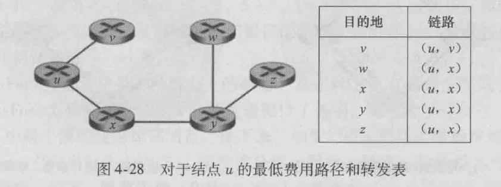

  确定的是下一跳(接下来)要走哪里.

+ 复杂度$O(n^2)$.

可能出现的问题:

+ 振荡: 拥塞敏感的路由选择的振荡.
+ 解法方法: 确保并非所有路由器同时运行LS算法.

###### 4.5.2 距离向量路由选择算法

+ 迭代的, 异步的, 分布式算法.
+ 分布式: 每个结点从直接邻居接受信息进行计算, 然后将计算结果分发给邻居, 这个过程持续到无更多信息进行交换(自我终止).
+ 看习题, 习题里面有震荡过程, 以及如何解决震荡过程.
+ 注意答题时表里面只写相邻的结点
+ 毒性逆转: x到y如果下一跳是z, 那么告诉z $\infty$.

###### 4.5.3 层次路由选择

执行同样的路由选择算法的同质路由器太low了, 将这些路由器组织进 自治系统(Autonomous System, AS) 的原因:

+ 规模: 路由器数目变得很大, 计算存储通信开销将很高, DV迭代算法无法收敛.
+ 需要管理自治: 一个组织希望运行和管理其网络, 比如改变路由选择算法.

**自治系统内部路由选择协议**: 在相同的AS中路由器全部运行相同的路由选择算法, 并且拥有彼此的信息(知道最优路径到彼此).

**网关路由器**: 负责向AS之外的目的地转发分组.

如果一个AS有两个以上网关路由器接到外面:

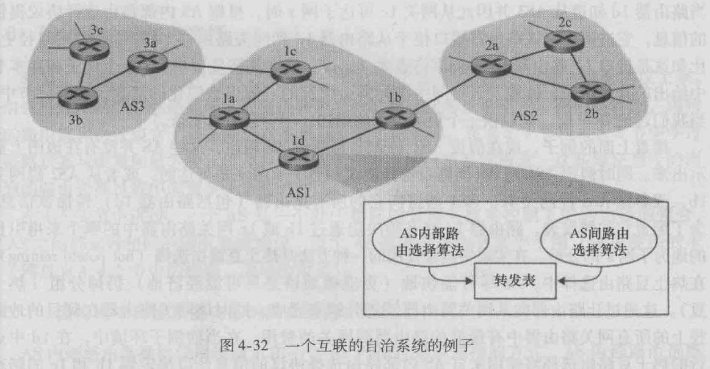

比如AS1: 该向1b还是1c转发? AS1 需要 知道1.通过1b和1c可达哪儿 2.向AS1中的路由器传播这些信息:

**自治系统间路由选择协议**: 处理 从相邻AS获取可达性信息和向该AS中的所有路由器传播可达性信息.

两个通信的AS必须运行相同的 自治系统间路由选择协议.

###### 4.6.1 因特网自治系统内部的路由选择: RIP

内部网关协议: AS内部路由选择协议.

**RIP**: Routing Information Protocol 路由选择信息协议:

+ 一种距离向量协议, 使用跳数作为费用测度. 费用被定义在路由器对之间, 实际上是从源路由器到目的子网.
+ RIP 的术语 跳: 从源路由器到目的子网(包括目的子网)的最短路径所经过的子网数量.
+ 任何一台路由器的距离向量是从这台路由器到该AS中子网的最短路径距离的当前估计值.
+ 在RIP中, 路由选择更新信息在邻居之间通过一种RIP响应报文(RIP response message)来交换, 响应报文又称作RIP通告.
+ 路由选择表(RIP 表): 包括该路由器的距离向量和该路由器的转发表, 第一列用于目的子网, 第二列指示了沿着最短路径到目的子网的下一个路由器标识, 第三列指出了沿着最短路径到目的子网的跳数(即需要穿越的子网数, 包括目的子网). 
+ RIP实现方面的几个问题: 
  1. RIP路由器大约每30秒交互通告, 如果超时会认为邻居司机, 此时RIP修改本地路由选择表, 后面??? // TODO

**OSPF**: Open Shortest Path First 开放最短路优先. 同RIP一样也是AS内部路由选择.

核心就是一个使用洪泛链路状态信息的协议 + 一个Dijkstra最低费用路径算法.

路由器使用OSPF构建了一幅关于整个自治系统的完整拓扑图, 确定 以自身为根结点的 到所有子网的 最短路径树. (设定不同的权值可以实现不同的需求).

更新: 路由器向自治系统内 所有其他路由器广播路由选择信息. 链路状态未改变也要周期性地广播状态.

OSPF协议 需 自己实现诸如可靠报文传输, 链路状态广播等功能.

优点:

+ 安全: 仅有受信任的路由器能参与一个AS内的OSPF协议.
+ 多条相同费用的路径: OSPF允许有多条 相同费用的 到达目的地的路径.
+ 对单播与多播路由选择的综合支持.
+ 支持在单个路由选择域内的 层次结构.

一个OSPF自治系统可以配置成多个区域, 每个区域都运行自己的OSPF链路状态路由选择算法, 一个区域内的每台路由器都向该区域内的所有其他路由器广播其链路状态.

###### 4.6.3 自治系统间的路由选择: BGP

跨越多个AS的源和目的对之间是如何确定路径的?

BGP: 边界网关协议.

BGP为每个AS提供:

+ 从相邻AS处获得子网可达性信息.
+ 向本AS内部 所有 路由器传播这些可达性信息.
+ 基于可达性信息和AS policy(策略), 决定到达子网的"好"路由.
+ 使每个子网向因特网其余部分通告它的存在.

外部BGP eBGP, 内部BGP iBGP.

BGP 使每个AS知道经过其相邻AS可达哪些目的地. BGP目的地不是主机 而是CDIR化的前缀: 表示一个子网或一个子网的集合.

BGP attribute: 带有属性的前缀被称为一条路由:

+ AS-PATH: 

###### 4.7 广播和多播路由选择

广播路由选择: 网络层提供了从一种源结点到网络中其他结点交付分组的服务

多播路由选择: 单个源结点能够向其他网络结点的一个子集发送分组的副本.

###### 4.7.1 广播路由选择算法

**N次单播**: 向N个目的地传输N个副本. 这种方法简单, 但是缺点: 效率低, 如果源经过单一链路与网络其余部分相连, 那么N个副本都要经过该链路传输. 解决方法: 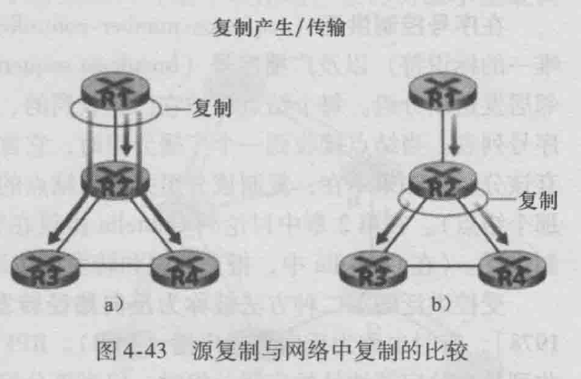 在第一跳的时候再复制, 如上图在R2复制.

? 

1. 无控制的flooding:

   副本向它的所有结点转发. 但是**广播风暴**(broadcast storm)会导致无休止的广播分组的复制与循环.

2. 受控flooding

   + 序号控制flooding: 源结点将地址以及广播序号放入广播分组, 再向邻居发送该分组. 每个结点维护**已经收到的/复制的/转发的**源地址和每个广播分组的**序号列表**. 当它收到一个分组时就检查一下在不在列表中. 如果在就丢掉.

   + 反向路径转发(Reverse Path Forwarding, RPF). 路由器收到具有给定源地址的广播分组时, 仅当该分组到达的链路正好是 **位于它自己返回其源的最短单播路径上** 它才向其所有出链路转发分组; 否则: 它丢弃入分组 不转发分组.

     例子: 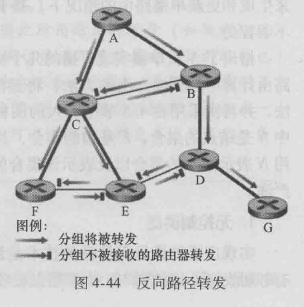 

     +  A最初广播 -> **C, B**.
     + **因为A在 到源A的最低费用路径上**, 所以B向(所有出链路) -> **C, D**转发.
     + B 将忽略从 **C, D** 来的 **源为A的**分组.
     + C 忽略从 **B** 来的 **源为A的**分组, 因为**B不在C到A的最低费用路径**上.

3. 生成树广播

   以上两种方法不能避免冗余广播分组的传输(收到冗余就拒绝).

   用图中**最小生成树**, 源结点向属于最小生成树的链路发送分组, 每个结点转发也是这样. 每个结点只需知道到哪些邻居的边是 属于MST的.

   + **基于中心的** 建立MST方法:

     

     ?

     

     

###### 4.7.2 多播

多播分组仅被交付给网络结点的一个**子集**.

多播数据报使用间接地址来编址(**D类多播地址**): 用一个标识来表示一组接受方, 寻址到该组的分组副本被交付给所有与该组相关联的多播接收方.

每台主机唯一的IP地址 完全独立于 它所参与的多播组的地址.

###### 引出**IGMP**

因特网组管理协议.

运行在一台**主机与其直接相连的路由器**之间;

IGMP可以让一台主机通知与其相连的路由器: 让本主机上运行的一个应用程序加入一个特定的多播组.

需要另一种协议 来协调遍及因特网内的多播路由器(包括相连的路由器), 以便多播数据报能路由到其最终目的地.

###### 多播路由选择算法

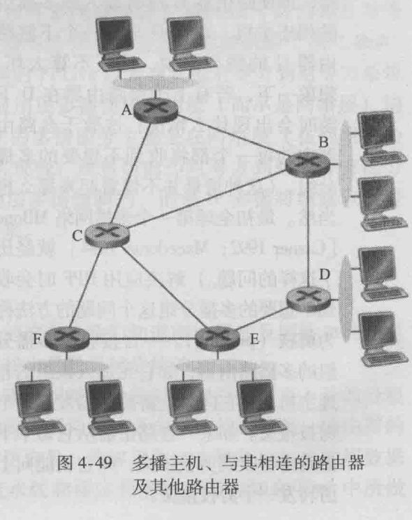

加入多播组的主机 深色.

只有 **A, B, E, F** 需要接收多播流量, 因为**D**相连的主机中没有一个加入多播组. **C**没有相连的主机.

多播路由选择的目标就是发现一生成树, 连接了所有 具有属于该多播组的相连主机的 **路由器**. 注意在这棵树中可能有不属于 多播组的相连主机的 路由器.

两种方法确定多播路由选择树:

+ 组共享树: 该树包含了所有具有属于 该多播组的相连主机的 边缘路由器. (在实践中, 使用基于中心的方法来构造多播路由选择树, 加入报文 使用单播路由选择朝中心结点转发, 结合中心结点选择算法).
+ 基于源的树: 为多播组中的每个源构建一棵多播路由选择树. (在实践中, 使用RPF算法(具有源结点x)来 构造一棵多播转发树).
+ R36: 在组共享树中，所有发送方使用相同的路由树发送其多播流量。而基于源的树 对来自给定源的多播数据包 在基于该源构造的特定路由树上进行路由; 因此，每个源可能有一个不同的基于源的树，一个路由器可能必须跟踪给定多播组的几个基于源的树。

###### NAT Network Address Translation, 网络地址转换

背景: IPv4告罄!

NAT: 替换IP报文头部的地址信息, 通常部署在一个组织的网络出口位置, 将内网IP替换为出口IP 以提供公网可达性和上层协议的连接能力.

三个保留地址段落：10.0.0.0-10.255.255.255；172.16.0.0-172.31.255.255；192.168.0.0-192.168.255.255 私有地址保留, 可以在任何组织或企业内部使用.

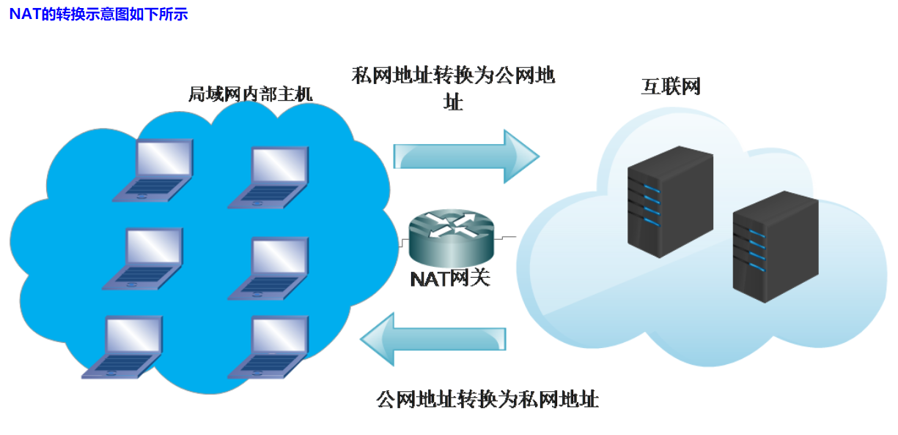

一般使用私网IP作为局域网内部的主机标识，使用公网IP作为互联网上通信的标识.

+ 网络被分为私网和公网两个部分，NAT网关设置在私网到公网的路由出口位置，双向流量必须都要经过NAT网关
+ 网络访问只能先由私网侧发起，公网无法主动访问私网主机
+ NAT网关在两个访问方向上完成两次地址的转换或翻译: 出方向做源信息替换，入方向做目的信息替换
+ NAT网关的存在对通信双方是保持透明的；
  NAT网关为了实现双向翻译的功能，需要维护一张关联表，把会话的信息保存下来。

##### 传输层

位于应用层和网络层之间. TCP和UDP协议.

###### 传输层概述

为运行在不同主机上的应用进程之间 提供了逻辑通信 功能: 运行不同进程的主机好像直接相连一样.

在端系统中实现:

+ 发送端: 运输层将从发送应用程序进程接受到的报文 转换成运输层分组. 也就是**报文段**.
+ 在发送端系统中, 运输层将这些报文段传递给网络层, 而后会在该层被封装成网络层分组(数据报) 并向目的地发送.
+ 网络路由器 部件厂封装在该数据报的运输层报文段的字段.
+ 接收端: 网络层从数据报中提取运输层报文段. 并上交给运输层, 运输层处理接受到的报文段, 使该报文段中的数据 为接受应用程序使用.

网络层提供了主机之间的逻辑通信, 而运输层为 运行在不同主机上的 进程之间提供了逻辑通信.

书上有个例子.

UDP: 用户数据报协议, 它为调用它的应用程序提供了一种不可靠, 无连接的服务.

TCP: 传输控制协议, 它为调用它的应用程序提供了一种可靠的, 面向连接的服务.

在生成套接字时必须指定是选择UDP还是TCP.

运输层分组称为报文段.

IP: 网络层协议, 网际协议, IP为主机之间提供了逻辑通信, IP的服务模型是尽力而为交付服务(best-effort). 但它并不做任何的确保: 1. 不确保报文段的交付, 2. 不确保报文段的按序交付. 这就是不可靠服务.

UDP和TCP 最基本的责任: 将两个端系统间IP的交付服务 扩展为 运行在端系统上的两个进程之间的交付服务. (将主机间交付 扩展到 进程间交付 被称为 运输层的多路复用与多路分解)

TCP的拥塞控制: 提供给整个因特网的服务, 防止任何一条TCP连接 用过多流量来淹没通信主机之间的链路和交换设备. TCP力求为每个通过一条拥塞网络链路的连接平等地共享网络链路带宽.

###### 3.2 多路分解与多路复用

将由网络层提供的主机到主机交付服务 延伸到 为运行在主机上的与应用程序提供进程到进程的交付服务.

多路复用与多路分解服务是所有计算机网络都需要的.

例子: 有四个进程正在运行, 当计算机中的运输层从底层的网络层接收数据时, 它需要将所接收到的数据定向到这4个进程中的一
个:

+ 一个进程有一个或多个套接字. 它相当于从网络向进程传递数据和从进程向网络传递数据的门户.
+ 接收主机中的运输层实际上并没有直接将数据交付给进程, 而是将数据交给了一个中间的套接字.
+ 每个运输层报文段中具有几个字段 将一个到达的运输层报文段定向到适当的套接字. 此时在接收端, 运输层检查这些字段， 标识出接收套接字， 进而将报文段定向到该套接字。将运输层报文段中的数据交付到正确的套接字的工作称为**多路分解**(demultiplexing).
+ **多路复用**(multiplexing): 在源主机从不同套接字中收集数据块， 并为每个数据块封装上首部信息（这将在以后用于分解）从而生成报文段， 然后将报文段传递到网络层.

运输层 多路复用要求: 

1. 套接字有唯一标识符.
2. 每个报文段有特殊字段来指示该报文段所要交付到的套接字。这些特殊
   字段是*源端口号字段*(source port number field)和*目的端口号字段*(destination port number field)。

UDP套接字: 二元组标识, 包含: 目的IP地址, 目的端口号. 源端口号作为返回地址的一部分, 会发报文段时起作用.

TCP套接字: 四元组标识, 包含: 源IP地址, 源端口号, 目的IP地址, 目的端口号. (两个具有不同源IP地址或源端口号的到达TCP报文段将被定向到两个不同的套接字).

###### web服务器与TCP

例如在端口80上运行一个Apache Web服务器. 当客户(如浏览器)向该服务器发送报文段时, 所有报文段的目的端口都将为80. 特别是初始连接建立报文段和承载HTTP请求的报文段都有80的目的端口.

运输层最低限度必须提供一种复用/分用服务, 以便在网络层与正确的应用级进程之间传递数据.

HTTP使用TCP而不是UDP, 因为对千具有文本数据的Web网页来说， 可靠性是至关重要的。

###### 3.3 无连接运输: UDP

UDP从应用进程得到数据, 附加上用于多路复用/分用服务的 源和目的端口号字段, 以及两个其他的小字段, 然后将形成的报文段交付给网络层. 网络层将该运输层报文段封装到一个IP数据报中, 然后尽力而为地 尝试将此报文段交付给接收主机.

如果该报文段到达接收主机, UDP使用目的端口号将报文段中的数据交付给正确的应用进程.

使用UDP时, 在发送报文段之前发送方和接受方的运输层实体之间没有握手.

DNS是一个通常使用UDP的应用层协议的例子. 当DNS应用程序想进行一次查询时, 它构造了一个DNS查询报文并将其交给UDP, 无须与运行在目的端系统中的UDP实体之间握手. 主机端的UDP为此报文添加首部字段， 然后将形成的报文段交给网络层。 网络层将此UDP报文段封装进一个IP数据报中， 然后将其发送给一个服务器。

更适合UDP的原因:

+ 关于何时, 发送什么数据的应用层控制更为精确: 采用UDP时， 只要应用进程将数据传递给UDP, UDP就会打包进UDP报文段并立即将其传递给网络层。(TCP有一个拥塞控制机制， 以便当源和目的主机间的一条或多条链路变得极度拥塞时来遏制运输层TCP发送方).
+ 无需连接建立: UDP不会引入建立连接的时延.
+ 无连接状态: UDP不维护连接状态, 这使某些专门用于特定应用的服务器可以比TCP支持更多的活跃用户.
+ 分组首部开销小: TCP(20字节), UDP(8字节).

###### 3.3.1 UDP 报文段结构

###### 3.3.2 UDP 检验和

UDP 检验和 提供了差错检测功能.

135页, 可以结合作业搞一下计算过程(细节).

UDP提供差错检测, 但不可以差错恢复.

端到端原则: 某种功能(比如差错检测)必须基于端到端实现.

###### 3.4 可靠数据传输原理

可靠传输 为上层实体提供的服务抽象是: 数据可以通过一条可靠的信道传输.

可靠数据传输协议: 实现这种服务抽象.

可靠数据传输协议的下层协议也许是不可靠的. 例如TCP在不可靠的(IP)端到端网络层之上实现的可靠数据传输协议.

// TODO 跳过了一点

ch3 P50

###### 3.5 面向连接的传输: TCP

TCP依赖于前面讨论的基本原理 (比如差错检测, 重传, 累计确认, 定时器以及用于序号和确认号的首部字段.)

TCP: 面向连接的, 两个进程发送数据之前必须先相互"握手".

连接状态完全保留在两个端系统中, TCP只在端系统中运行, 而不再中间的网络元素(路由器和链路层交换机)中运行. 中间路由器对TCP连接完全视而不见.

TCP提供全双工服务: A, B可以同时进行通信.

TCP连接也总是点对点的. 单个发送方和单个接受方之间的连接. "多播": 在一次发送操作中将数据传送给多个接受方 对TCP来说是不可能的.

发起连接的是客户进程, 另一个是服务器进程.

连接建立过程(三次握手 (之间发送了三个报文段)): 客户 首先发送一个特殊的TCP报文段, 服务器用另一个特殊的TCP报文段来响应, 最后客户再用第三个特殊报文段作为响应. 前两个报文段不承载"有效载荷", 也就是不包含应用层数据; 而第三个报文段可以承载有效载荷.

客户进程的数据 传递通过套接字之后, 就由运行中的TCP控制了. TCP将这些数据引导到该连接的发送缓存里. 发送缓存是三次握手初期设置的缓存之一. TCP可从缓存中取出并放入报文段中的数据数量(数据字段)受限于最大报文段长度(MSS). MSS通常根据最初确定的 由本地发送主机发送的最大链路层帧长度(即最大传输单元(MTU))来设置.

TCP为每块数据配上一个TCP首部, 从而形成多个TCP报文段. 它们传给网络层后本封装在网络层IP数据报中.

从以上讨论中看出, TCP连接包括: 两台主机上的缓存, 变量, 与进程连接的套接字 在这两台主机之间的网络元素没有为该连接分配任何缓存和变量.

TCP发送一个大文件, 例如web页面上的图像, 通常将其划分为长度为MSS的若干块.

###### 3.5.2 TCP报文段结构

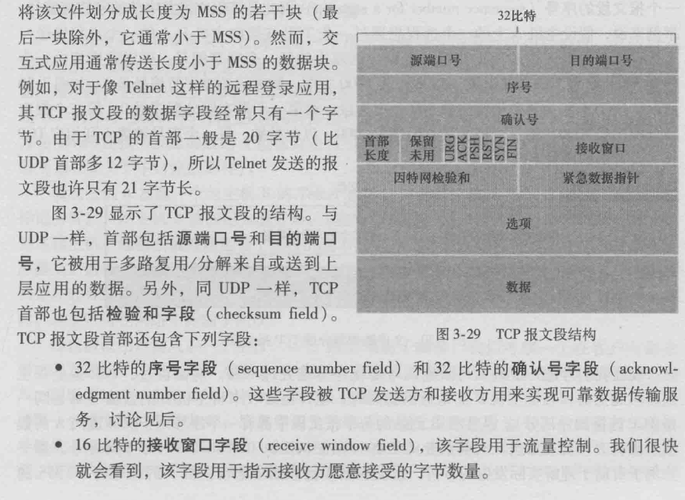

首部字段, 数据字段.

+ 首部: 源端口号, 目的端口号. 首部被用于多路复用/分解来自或送到上层应用的数据. TCP也包括检验和字段(checksum field).

  还包括:

  + 序号字段(sequence number): 32比特, ACK号字段(acknowledge number): 被 TCP 发送方和接收方用来实现可靠数据传输服务
  + 接受窗口字段(receive window): 16比特: 用千流最控制, 指示接收方愿意接受的字节数量.
  + TODO P158 自己看.

###### Telnet

用于远程登录的流行应用层协议. 运行在TCP之上, 被设计成可在任意一对主机之间工作.

该例子更好地阐述TCP的序号和ACK号.

A发起会话(客户), A -> B, B(服务器). 在客户端键入的字符 -> B, B做echo back显示在Telnet用户的屏幕上.

P160 建议看一下详细.

CDN 内容分发网: 流式视频系统.

###### 7.1 多媒体网络的应用

视频的性质:

+ 高比特率, 流式高分辨率电影(3Mbps)
+ 能被压缩, 要在视频质量与比特率间进行折中.
  + 空间冗余: 给定图像的内部冗余.
  + 时域冗余: 一幅图像和后续图像的重复程度. 没有理由对后续图像再进行编码.

音频的性质(脉冲编码调制, PCM):

+ 模拟音频(由人和乐器所产生的)如何转换为数字信号:

  + 以固定速率采样
  + 量化操作: 每个采样值被四舍五入为有限个数值中的一个($2^x$).
  + 量化之后的样值采样用比特表示, 并会被级联起来. 通过音频扬声器播放的时候, 这个数字信号能转换回来(解码到)模拟信号
  + 注意解码的模拟信号只是初始信号的近似, (例如高频的声音可能在解码中丢失了).

+ 音频在实际应用中也是使用压缩技术来减小流的比特速率(比如MPEG1第3层, MP3: 128kbps是最常用的编码速率).

###### 7.1.3 多媒体应用的类型

流式视频最重要的新能测量是平均吞吐量.

+ 流式存储音频/视频

  通常结合了视频和音频组件.

  依赖的媒体是预先录制的视频(放置在服务器上), 用户向服务器发送请求按需观看视频(从CDN而非从单一的数据中心流式播放)

  + 流: 客户从视频的一个位置开始播放时, 同时从服务器接收该视频的后续部分.
  + 相互作用: 用户可以对多媒体内容进行暂停, 重新配置前进, 倒退快进等.
  + 连续播放: 播放应该按照初始记录的时序进行, (???) 视频帧停滞(等待延迟的帧)或帧跳过(漏掉延迟的帧).

  

+ 会话式IP语音/视频

  因特网电话, IP语音, 会话式视频与之类似. (允许用户生成具有多方参与者的会议).

  高度时延敏感.

  容忍丢包, 这些丢失杜宇客户经常可以部分或全部地隐藏.

  时延和丢包相互关系和重要程度要看具体实际应用.

+ 流式实况音频/视频

  该应用类似于传统的电台广播和电视, 只是通过因特网传输.

  网络必须为每个实况多媒体流提供大于该视频消耗速率的平均吞吐量.

###### 7.2 流式存储视频

预先录制 放在服务器上. 可能有暂停或者定位到视频某一位置. 分为三种类型:

1. UDP流
2. HTTP流
3. 适应性HTTP流

三种形式的视频流共同特点是广泛使用了客户端应用缓存, 以此来缓解端到端时延和变化的服务器和客户之间可用带宽量的影响.

当视频开始到达客户时如果没有播放, 就会在应用程序缓存中建立该视频的储备. 这种客户缓存有两种重要的优点:

1. 客户端缓存能够吸收服务器到客户时延中的波动, 如果某部分延迟, 只要在缓存中的"接受但尚未播放"耗尽之前到达就没事.
2. 如果服务器到客户带宽暂时低于视频消耗速率, 用户能继续享受连续的播放. 只要客户应用缓存没有完全耗尽.

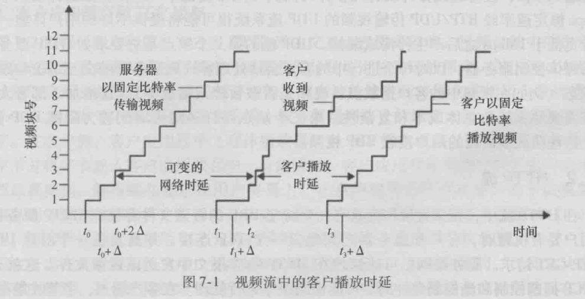

书上P391例子, "第$i$块的网络时延是服务器传输该块的时间与客户收到该块的时间之间的水平距离."

###### 7.2.1 UDP流

服务器通过UDP以一种稳定的速率记录下视频块, 用 与客户的视频消耗速率 相匹配的速率传输视频.

UDP无速率通知的限制, UDP流通常使用很小的客户端缓存.

视频块在传递给UDP之前会被封装在 RTP 实时传输协议的 (特定设计的)运输分组中.

UDP除了服务器到客户的视频流外, 两者间还并行地维护一个单独的控制连接, 从而客户可以发送类似暂停, 重定位等操作. 这里是实时流协议.

UDP流不足:

+ 服务器和控制之间的可用带宽无法预测并且是变化的.
+ 恒定速率UDP流不能提供连续播放.

###### 7.2.2 HTTP流

视频直接作为具有一个特定URL的普通文件存储在HTTP服务器上.

当用户要看视频时, 客户和服务器之间建立一个TCP连接, 并且发送一个对该URL的HTTP GET请求, 服务器则尽可能快地在HTTP响应报文中发送该视频文件.

在客户端上, 应用缓存超过阈值则开始播放(从缓存中周期性地抓取并对帧解压缩 显示).

---

1. 预取视频:

   对于流式存储视频, 客户能够尝试以高于消耗速率的速率下载视频, 所以要 预取(frefetching)将来会被消耗的视频帧.

2. 客户应用缓存和TCP缓存

   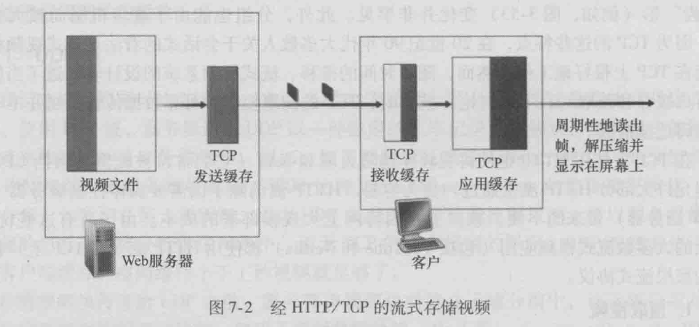

   如上图, TCP发送缓存显示为满, 服务器停止视频文件传输到套接字.

   客户端应用程序从TCP接收缓存(通过套接字), 并放入应用缓存中.

   同时客户应用程序周期性地从缓存中抓取, 解压缩 显示.

   注意到如果客户应用缓存大于该视频文件, 则该过程等价于普通文件经HTTP的下载.

   如果用户暂停了:

   + 比特未从客户应用缓存中删除. 甚至继续从服务器进入.
   + 客户应用缓存变满后, 引起对服务器的"反向压力", 两个缓存都满后服务器传输被阻塞.

###### 3. 流式视频分析

+ $Q$: 播放之前必须被缓存的数量.
+ $B$: 客户应用缓存的长度.
+ $r$: 视频消耗速率. 即客户在播放期间从客户应用缓存提取比特的速率.

假设客户缓存非空时服务器以 恒定速率$x$ 发送比特, (请注意在习题中变成了$x(t)$)

开始播放时间: $\frac{Q}{x}$.

接下来:

+ $x < r$:

  客户缓存一直不会满, 空掉之后等它传到$Q$再播放.

+ $x > r$:

  缓存以$x - r$的速率从$Q$增加到$B$. 可求$t_f$.

###### 4. 视频的早期中止和重定位

HTTP流中 常 HTTP GET 请求报文中的HTTP字节范围首部. 其指示了客户当前要从所希望的视频中获取的字节范围. 当客户需要重定位视频进度时非常有用.

重定位导致某些预取的视频数据不会被观看. 可能会造成资源的浪费.

###### 7.2.3 适应性流和DASH

HTTP流在实践中有缺陷: 所有客户都接收的相同编码的视频, 所以新型基于HTTP流: 经HTTP的动态适应性流(DASH).

在DASH中, 视频编码为几个 具有不同的比特率 对应不同的质量水平 的版本.

+ DASH允许客户使用不同的以太网接入速率 流式播放具有不同编码速率的视频.
+ 如果端到端带宽在 会话过程中改变, DASH允许客户适应可用带宽. (对于移动用户很重要).

使用DASH后, 每个视频版本存储在HTTP服务器中 有一个独立的URL. HTTP服务器也有一个告示文件(manifest file) 为每个版本提供了URL及其比特率.

1. 客户首先请求该告示文件 并得知各种比特率版本. 
2. 然后 HTTP GET 对每个块指定一个URL和一个字节范围. 
3. 下载块的同时, 客户也测量接受带宽, 并运行一个 速率决定算法 来选择下次请求的块.
4. 如果需要缓存的视频很多并且测试的接受带宽较高, 就会选择高速率(比特率)的版本. (所以DASH允许客户自由地在不同的质量等级之间切换).

DASH经常能够在可能的最好质量等级下实现连续播放.

###### 7.2.4 CDN 内容分发网

提供流式视频服务 建立单一的大规模数据中心 的缺陷:

+ 要通过许多ISP, 链路之一提供的吞吐量决定了端到端吞吐量.
+ 可能经过相同的链路许多次. 存在浪费.
+ 数据中心单点故障将导致崩溃.

CDN 内容分发网, 管理分布在多个地理位置上的服务器. 专用CDN: 由内容提供商自己所有. 第三方CDN: 多个内容提供商分发内容.

CDN 采用两种不同的服务器安置原则:

+ 深入: 通过在全球的接入ISP中部署服务器集群来 深入到 ISP的接入网中.
+ 邀请做客: 通过在少量关键位置建造大型集群并使用专用的高速网络连接这些集群 来邀请到ISP做客.

CDN可以跨集群复制内容. 如果客户向有一个未存储该视频的集群请求, 则集群检索该视频, 想客户流式传输的同时在本地存储一个副本.

1. CDN操作

   当客户检索一个 视频(URL标识)时, CDN截获该请求, 并:

   + 确定此时适合用于该客户的CDN服务器集群.
   + 将客户的请求重定向到该集群的某台服务器.

   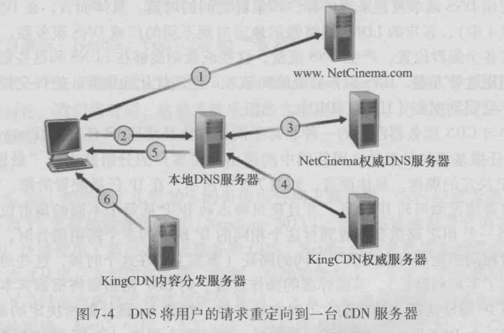

   书上DNS重定向到一个服务器的例子 P399.

   
   
2. 集群选择策略

   即动态地将客户定向到CDN服务器集群或数据中心的机制.

   DNS转换得到IP地址之后, CDN需要基于IP地址选择一个适当的集群.

   为了基于当前流量条件为客户决定最好的集群, CDN能够对其集群和客户之间的时延和丢包性能 执行周期性的实时测量.

   + 地理上最为邻近的策略. 缺陷: 地理最近邻可能并不是沿着网络路径最近邻的.

   + 使用客户与CDN服务器之间近期和进行中的流量特点.

   IP任播:

   

   思想: 让因特网中的路由器将客户的分组路由到"最近的"集群(就像有BGP决定的那样).

   上图:
   
   + IP任播配置阶段: CDN公司为每个集群指派相同的IP地址, 并使用标准的BGP从每个不同的集群位置来广播该IP地址.
   + 一个BGP路由器接收到 这个相同IP地址的advertisements时, BGP路由器将根据本地路由选择机制, 对该IP地址选择"最好的"路由.
   + 客户要观看视频时, CDN的DNS返回该任播地址.
   
   
   
###### 7.3 IP语音

实时会话式语音 (因特网电话).

VoIP: IP语音.

###### 7.3.1 尽力而为服务的限制

网络层协议IP提供了尽力而为的服务. 尽全力将每个数据报从源尽可能快地移动到目的地.

接收方需要更仔细地判断: 1. 什么时候播放一个块, 如何处理一个丢失块.

1. 丢包

   考虑VoIP应用产生的一个UDP报文段. 在发送方到接收方路径上的缓存可能是满的, 此时丢包.

   TCP中重传机制对于VoIP是不可接受的. 增加了端到端时延. 而且TCP拥塞机制可能导致缓存空, 所以几乎所有VoIP应用默认运行在UDP上.

2. 端到端时延

   造成端到端时延因素:

   + 路由器中传输, 处理和排队时延
   + 链路中的传播时延和端系统处理时延

   太长的时延会妨碍语音谈话的交互性. 接受方忽略时延超过特定阈值的分组.

3. 分组时延抖动

   由于具有可变的时延, 不同的分组可能时延不一样, 这就是时延抖动.

   减轻/消除时延抖动的机制:

   + 为每个块预先计划一个时间戳.
   + 在接收方延迟播放块.

固定播放时延:

接收方试图在块产生正好 $q$ ms 后播放它. 接收方会根据块的时间戳确定预计播放时间. 如果端到端时延经常发生大变化, $q$更大就更好.

适应性播放时延:

时延和丢包之间折中, 我们需要估计网络时延和网络时延变化, 在话音突峰期调整播放时延, 静默期少量压缩和拉长在谈话中是不易觉察的.

+ $t_i$: 第$i$个分组的时间戳.
+ $r_i$: 分组$i$被接收方接受的时间.
+ $p_i$: 分组$i$在接收方播放的时间.
+ 第$i$个分组的端到端网络时延: $r_i - t_i$.
+ 平均网络时延的估计值 $d_i = (1 - u)d_{i- 1} + u(r_i - t_i)$. 其中$u$是一个固定的常数(有点像RTT(TCP往返时间)迭代)
+ 与估计平均时延的平均时延偏差 的估计 $v_i = (1 - u)v_{i -1} + u | r_i - t_i - d_i|$
+ 分组$i$播放时刻:
  + 如果是话音突峰期的第一个分组: $p_i = t_i + d_i + Kv_i$.
  + 其他: $p_i$

###### 7.3.3 从丢包中恢复

丢包恢复方案:

+ 前向纠错(FEC):

  基本思想是给初始的分组流增加冗余信息, 两种方法:

  + 每发送$n$块之后发送一个冗余编码的块($n$块异或). 此时如果任一分组丢失可以重建, 但是两个以上就不行重建.
  + 发送一个较低分辨率的音频流作为冗余信息. 发送方通过从这个标称流中取出第$n$个块并加上第$n - 1$个块的冗余信息(低比特率的). 来构建第$n$个块. 所以只要没有连续分组的丢失, 接收方都可以通过播放和后续分组一起到达的低比特率编码块来隐藏丢失.
  + 通过给每个标称块附加上更多的低比特率块: 1. 在各种恶劣的尽力而为服务环境下接收方的音频质量变得可接受. 2. 附加的块增加了传输带宽和播放时延.

+ 交织

  VoIP应用可发送交织的音频, 发送方在传输之前对音频数据单元重新排序, 使得最初相邻的单元在传输流中以一定距离分开.

  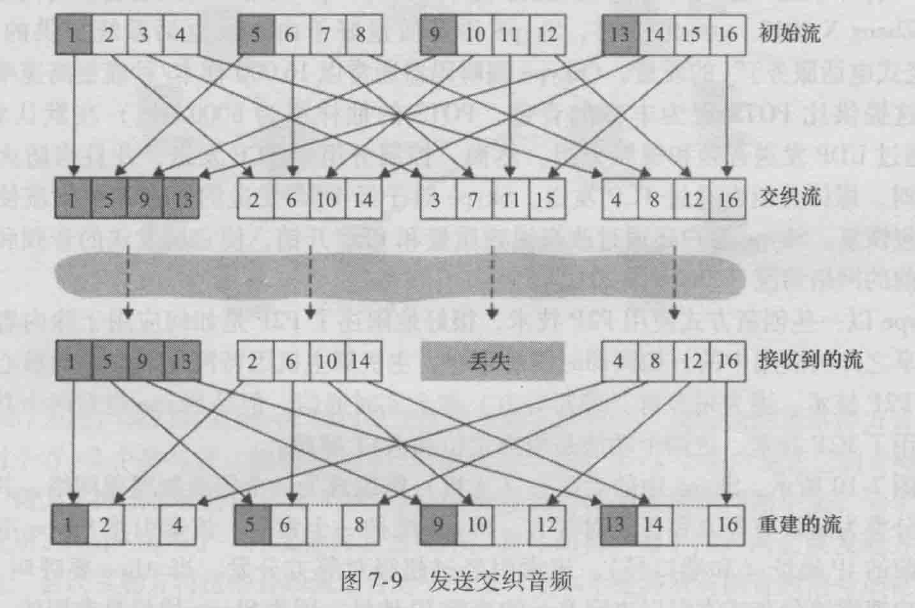

  交织的明显缺点是增加了时延.

  主要优点是不增加流的带宽需求.

+ 差错掩盖

  试图为丢失的分组产生一个与初始分组类似的替代物. 因为音频信号呈现出大量的短期自相似性, 所以可行.

###### 7.4 实时会话式应用的协议

实时会话式应用(VoIP和视频会议非常流行)

###### RTP:

定义 首部字段的 标准分组结构的标准.

RTP基础:

RTP通常运行在UDP之上, 发送端在RTP分组中封装媒体块, 然后在UDP报文段中封装该分组, 并将该报文段递交给IP.

发送端: 音频块和RTP首部一起形成了RTP分组. 向UDP套接字发送.

接收端(应用程序): 从它的套接字接口收到RTP分组, 从RTP分组提取出该音频块. 首部字段可以适当地阶码和播放该视频块.

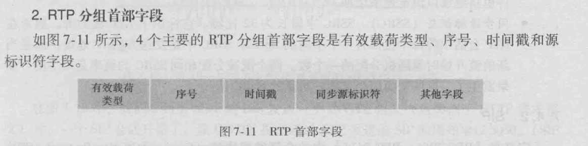

P414 一些重要字段的具体含义

###### 7.4.2 SIP

会话发起协议, 功能:

+ 提供了在主叫者和被叫者之间经IP网络创建呼叫的机制.
+ 提供了主叫者确定被叫者的当前IP地址的机制.
+ 提供了用于呼叫管理的机制.

1. 向已知IP地址建立一个呼叫:

   例子:
   
   A 在使用PC 要呼叫 B, 假设A知道B的PC的IP地址.
   
   
   
   + A发送给B一个INVITE报文, 类似于HTTP请求.
   + 此时一个SIP会话开始了, 该INVITE报文通过UDP发送给SIP的周知端口5060.
   + ???

###### 7.5.2 提供多种类型的服务

最简单的强化: 将流量划分为多种类型, 并为这些不同类型的流量提供不同等级的服务.

1. 激励思考的场景?

   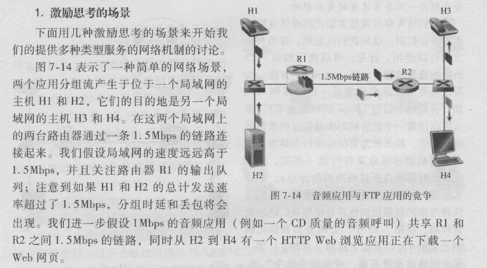

   在尽力而为的因特网中, 该音频和HTTP分组在路由器R1的输出队列中混合. 并且(通常)以FIFP次序传输.

   跳过了两个见解(???)

   

2. 调度机制

   FIFO:

   

   

   优先级队列:

   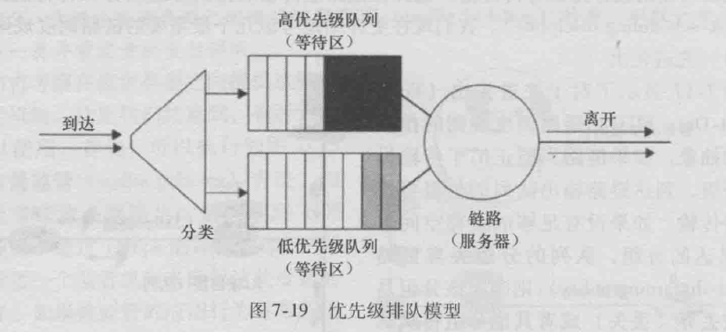

   优先级取决于其分组首部携带一个明显的标记(比如它的源, 目的端口号等).

   同一优先级的分组之间的选择通常用FIFO.

   

   

3. 循环排队规则:

   (round robin queuing discipline), 分组就像优先级排队一样被分类, 但是在类之间不存在严格的优先级, 循环调度器在这些类之间轮流提供服务.

   保持工作的循环规则: 在存在(任何类都可以)分组排队等待传输时不允许链路空闲, 当前类分组没有时立即检查循环队列中的下一个类.

   

   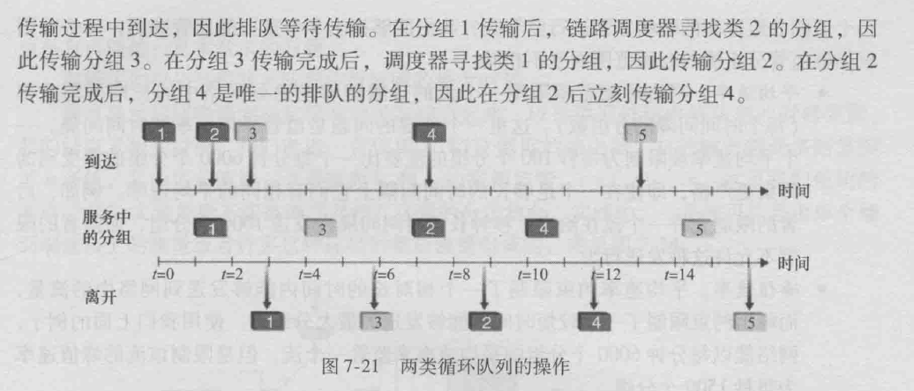

   

4. 加权公平排队(WFQ)

   到达的分组被分类, 与循环排队不同之处在每个类在任何时间间隔内可能收到不同数量的服务.

   每个类$i$分配权值$w_i$, 第$i$类保证分配到带宽的$\frac{w_i}{\sum_j w_j}$

###### 监管: 漏桶

速率调节是重要的QoS机制. 

3个重要的监管准则:

+ 平均速率. 重要的平均速率限定的时间段, 比如100分组/秒 比 6000分组/分严格.
+ 峰值速率: 平均速率约束限制了一个相对长的时间内能够发送到网络中的流歉, 而峰值约束限制了一个较短时间内能够发送的最大分组数.
+ 突发长度: 网络也许还希望限制极短的时间间隔内能够发送到网络中的最大分组数. 因为时间间隔长度趋近于0, 该突发长度限制了能够瞬间发送到网络中的分组数批.

漏桶机制: 表征这些监管限制的抽象.

假设一个分组向网络传输之前需要从漏桶(令牌桶)中去除一个令牌, 如果为空则需要等待一个. 因为在桶中最多能有b个令牌, 所以漏桶监管的流的最大突发长度是b个分组.

因为令牌产生速率是$r$, 所以在任何长度为$t$的时间间隔内能够进入网络中的最大
分组数目为$rt+b$. 所以令牌产生速率$r$用于限制分组能够进入网络的长期平均速率.

漏桶 + 加权公平排队 = 队列中可证明的最大时延.

###### 8 网络安全

安全通信特性:

+ 机密性: 仅有发送方和希望的接收方能够理解传输报文的内容. 这必须要求报文在一定程度上加密.
+ 报文完整性: 传输过程中通信的内容未被改变.
+ 端点鉴别: 发送方和接收方都应该能证实通信过程所涉及的另一方, 以确信通信的另一方确实具有他们所声称的身份.
+ 运行安全性: 与公共因特网相连接的网络潜在地能够被危及安全.

###### 8.2 密码学的原则

明文: 假设Alice要想Bob发送一个报文, 报文的最初形式被称为明文.

使用加密算法将明文加密成密文.

解密算法 输入密文和密钥, 输出初始明文.

对称密钥系统: Alice和Bob的密钥是相同的.

公开密钥系统: 使用一对密钥(一个密钥全世界所知(Alice和Bob也知道), 另一个只有Bob或Alice知道, 并不是双方都知道).

###### 8.2.1 对称密钥密码体制

凯撒密码: 同时后移几个.

单码代替密码(改进): 

破解Bob和Alice之间加密方案 的难易程度, 可以根据入侵者所拥有的信息区分三种不同的情况:

1. 唯密文攻击: 入侵者只能得到截取的密文.
2. 已知明文攻击: 当入侵者知道明文密文的一些匹配时, 我们将其称之为对加密方案的已知明文攻击.
3. 选择明文攻击: 入侵者能够选择某一明文报文并得到该明文报文对应的密文形式. (???)

多码代替密码:

###### 块密码

因特网协议(PGP(安全电子邮件), SSL(TCP连接更安全), IPsec(网络层传输更安全)).

要加密的报文被处理为$k$比特的块, 一对一映射: $k$比特块明文映射为$k$比特块密文. 例子:

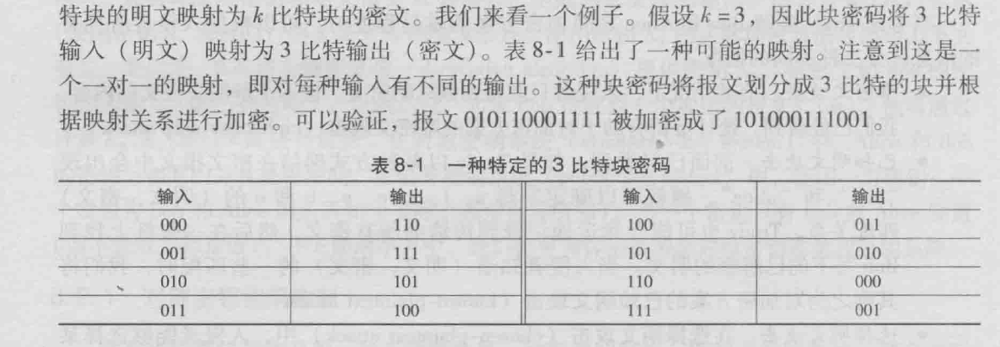

所以$k$要稍微大一点, 这样就有很多的映射数量.

块密码通常使用函数模拟随机排列表.

###### 流密码

无线LAN安全性.

..

