# Data Structure Notes

[TOC]

数据结构由某一数据对象及该对象中所有数据成员之间的关系组成.

数据结构包括“逻辑结构” 和“物理结构”两个方面(层次):

+ 逻辑结构 是对数据成员之间的逻辑关系的描述，它可以用一个数据成员的集合和定义在此集合上的若干关系来表示;
+  物理结构 是逻辑结构在计算机中的表示和实现，故又称“存储结构” 。

数据结构: 数据的逻辑结构 + 存储结构 + 数据的运算.

抽象数据类型 (ADTs: Abstract Data Types)

+ 由用户定义，用以表示应用问题的数据模型
+ 由基本的数据类型组成, 并包括一组相关的服务（或称操作）
+ 支持了逻辑设计和物理实现的分离，支持封装和信息隐蔽

数据结构 + 算法 = 程序设计

算法：一个有穷的指令集，这些指令为解决某一特定任务规定了一个运算序列。
(算法是对特定问题求解步骤的一种描述)

一个算法必须满足以下五个重要特性：

+ 输入  有0个或多个输入
+ 输出  有一个或多个输出(处理结果)
+ 确定性  每步定义都是确切、无歧义的
+ 有穷性  算法应在执行有穷步后结束
+ 有效性  每一条运算应足够基本

算法和程序的区别:

+ 程序不一定满足有穷性，即不一定是算法。如操作系统。
+ 程序中的指令必须是机器可执行的，而算法中的指令虽要求可执行，但不一定是“机器可执行”。

算法的性能标准:

+ 正确性
+ 效率: 时间代价, 空间代价
+ 可读性
+ 可使用性
+ 健壮性

算法效率的衡量方法: 后期测试, 事前估计.

### 线性表

定义: $n$ ($\geq 0$) 个表项的有限序列: $L = (a_1, \cdots, a_n)$, 其中 $a_i$ 是表项.

+ 顺序存储: 顺序表, 连续的存储空间(逻辑顺序和物理顺序一致) 支持随机访问.
+ 链表存储: 链表

#### 顺序表

顺序表查找数据代价:

+ 搜索成功: $ACN$(平均比较次数), 其中$p_i$是搜索概率, $c_i$是比较次数.
  $$
  ACN = \sum_{i = 0}^{n - 1} p_i \times c_i \\ ACN = \frac{1 + 2 + \cdots + n}{n} = \frac{1+n}{2}
  $$

+ 

顺序表插入时间代价:

+ $AMN$(平均移动次数): 第一个位置插 移动$n$次, 最后一个不移动:
  $$
  AMN = \frac{n + (n - 1) + \cdots + 0}{n+1} = \frac{n}{2}
  $$
  删除元素同理计算.

#### 链表

链表: 表头结点本身不带数据, 仅标志表头.

循环链表解决约瑟夫问题, 多项式链表存储: 多项式项数可以动态增长, 插入删除方便.


+ 顺序表和链表比较:
  + 顺序表:
    + 存储利用率高, 存取速度快.
    + 插入, 删除需要移动大量数据.
  + 链表:
    + 适应表的动态增长和删除, 不连续空间利用.
    + 需要额外的指针空间, 不支持随机访问.


#### 静态链表

定义: 为数组中每个元素附加一个链接指针. 不改变各元素的位置, 重新链接就可以改变这些元素的逻辑顺序. 存储空间大小不会变化.


### 栈和队列

与表不同的是, 限制存取位置.

#### 栈

双栈: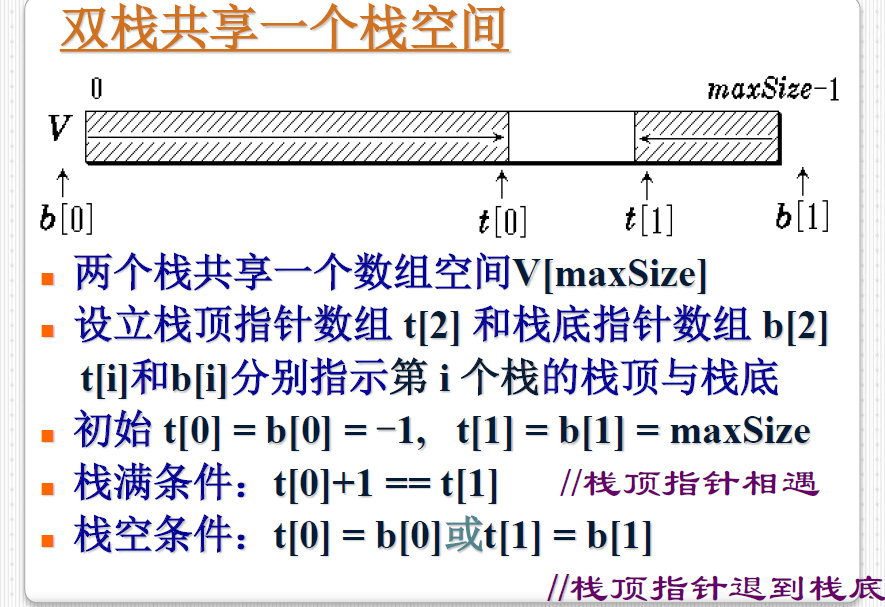

##### 栈的应用

`DFS`

###### 表达式计算:

+ 中缀: `A + B * (C - D) - E / F`
+ 后缀: `ABCD-*+EF/-`

中缀表达式就是我们正常看到的.

中缀转后缀:

1. 方法一: 先对中缀表达式按运算优先次序加上括号，再把**操作符**后移到右括号的后面 并**以就近移动**为原则:

2. 利用栈: 

   需要考虑各操作符的优先级:

   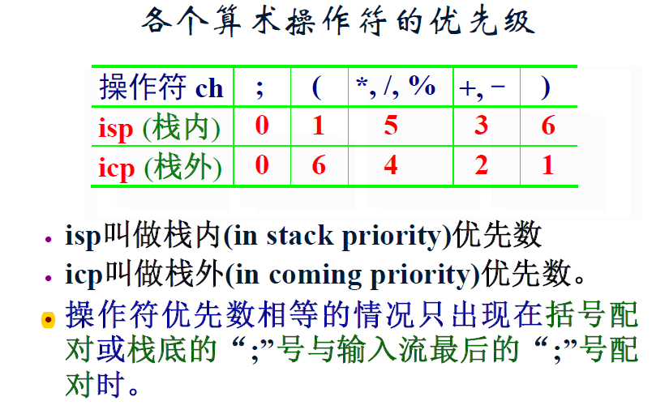

   主要步骤:

   先`;`进栈, 然后读入中缀进栈: 

   + 如果是操作数, 直接输出
   + 如果是操作符, 判断该操作符的 栈外优先数 和 位于栈顶的操作符的 栈内优先数比较.
     + 栈外优先数 $>$ 栈内那个操作符优先数: 则进栈.
     + $<$: 栈内那个操作符退栈输出, **注意这个过程是一直持续知道其他情况出现的**, 就是继续比较下一个.
     + $=$: 退栈但是不输出.


应用后缀表达式计算: (后缀表达式: 已经隐含了 加括号的 优先次序)

+ 从从左向右顺序地扫描表达式，并用一个栈暂存扫描到的操作数或计算结果。
+ 扫描中:
  + 遇操作数则压栈
  + 遇操作符则从栈中退出两个操作数，计算后将结果压入栈
+ 最后计算结果在栈顶

#### 栈与递归

阶乘:

```python
def factorial(n) {
    if n == 0:
    	return 1
    return n * factorial(n - 1)    
}
```

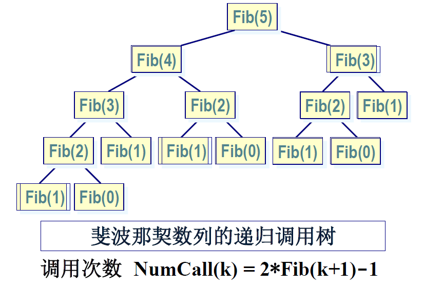

递归的内部实现(ICS):

调用时:

+ 保存现场: 局部变量, 返回地址, 形参 都入栈
+ 虚实结合: 计算实参, 变成形参.
+ 转入执行.

返回时:

+ 恢复现场: 局部变量赋值给相应变量, 返回地址, 形参赋值给相应变量, 出栈.

递归程序的验证: 数学归纳法.


#### 队列

循环队列:


##### 队列的应用

打印杨辉三角:

 

优先队列


### 数组、串与广义表

二维数组动态定义:

```c++
int **A;
int row = 3, col = 3; inti, j;
A = new int*[row];
for (i = 0; i < row; i++)
	A[i] = new int[col];
```

+ 行优先存放, 寻址: `arr[j][k] = begin + (j * m + k) * size`
+ 列优先存放, 寻址: `arr[j][k] = begin + (k * n + j) * size`


#### 特殊矩阵

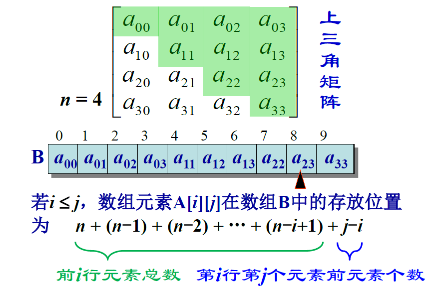

就是先定位到 第$i$行存放的那个区域的 第一个元素, 然后再看是第$j$个.

+ 稀疏矩阵:

  稀疏因子 $s$ 是非零元素,  $e = \frac{s}{m \cdot n}$.

  存非零元素的位置和值. 三元表.

+ 稀疏矩阵快速转置算法:

  

  注意要保持行有序.

  快速转置算法思想: 对原矩阵$A$扫描一遍, 按$A$中每一元素的列号, 立即确定在转置矩阵$B$三元组表中的位置, 并装入它.

  + 为加速转置速度，建立辅助数组`rowSize`和`rowStart`:
    + `rowSize`记录矩阵转置前各列，即转置矩阵各行非零元素个数
    + `rowStart`记录各行非零元素 在转置三元组表中**开始存放位置**

  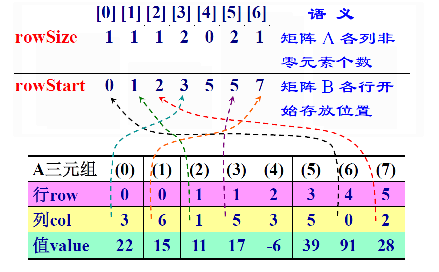

  

  扫描矩阵三元组表, 根据某项列号, 确定它转置后的行号, 查`rowStart`表, 按查到的位置直接将该项存入转置三元组表中. 比如最开始值22的那个就是放在3的位置.

  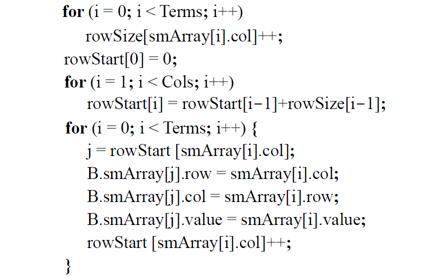

  前面两个`for`是做`rowStart`和`rowSize`的初始化;

  注意放了一个元素之后`rowStart`要**加一**.

  

##### 用正交链表来表示稀疏矩阵

+ 优点: 适应矩阵操作的非零元素动态变化.
+ 


#### 字符串的模式匹配

+ **KMP**

  消除每趟失配后实施下一趟比较时 目标指针的回退.

  $O(n + m)$

  + `next`数组: 

    `next[i] = k`, 代表`i`之前的字符串中有最大长度为`k`的**相同前缀后缀**:

    ```
    子字符串　 a b a b a b z a b a b a b a
    最大匹配数 0 0 1 2 3 4 0 1 2 3 4 5 6 ?
    上面abab对应2, 因为`ab`与`ab`是2相同.
    同理ababa对应3, 表示`aba`前缀和`aba`后缀相同, 三个.
    ```

    

    也意味着在某个字符失配时, 该字符对应的next值会告诉你下一步匹配中, 模式串应该跳到哪个位置（跳到`next[i]`的位置）

    next数组是**对于模式串**而言. 在模式串上搞下一次移动最优.

    

  + 如何运用`next`数组进行匹配:

    

    请注意:

    + 关注蓝色箭头.

      在模式串的`idx = 3`位置失配, 看`next[2] = 1`, 

      所以下一个位置就是对齐原来的后缀(1个的)

      同理`next[5] = 3`也同理可证.

    

  + 如何求`next`

    未, 可看https://www.zhihu.com/question/21923021


#### 广义表

广义表是$n \geq 0$个表元素组成的有限序列, 记作:
$$
LS(a_1, a_2, a_3, \cdots , a_n)
$$
$LS$是表名, $a_i$是表元素, **可以是表（称为子表）, 可以是数据元素（称为原子）.**

$n$为表的长度, $n = 0$ 的广义表为空表.


广义表的特性:

1. 有次序性, 2. 有深度, 3. 可递归 4. 有长度, 5. 可共享.

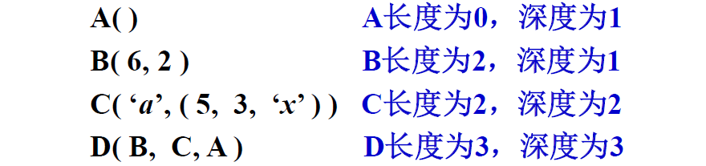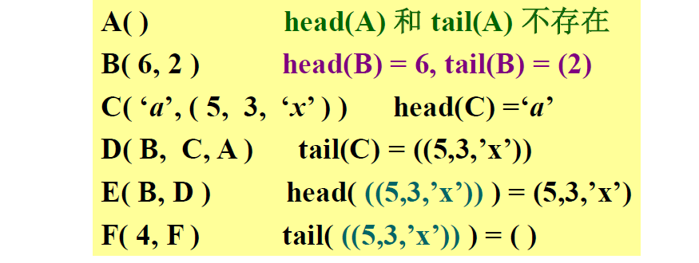

广义表的表示:

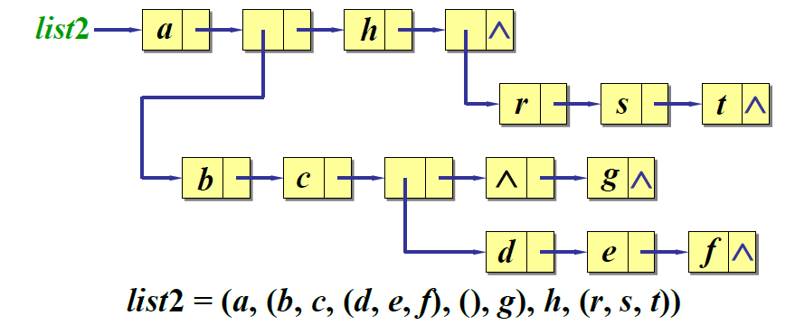

广义表的删除, 扫描:

+ 若结点数据为$c$, 删除(可能循环连续地).
+ 若结点数据不为$c$, 不执行删除.
+ 若结点为子表, 递归在子表执行删除.


上面结点类型3应该改为2.


### 树与二叉树

有根树, 根结点只有直接后继, 没有直接前驱.

+ 深度: 从根到叶子, 从第1层开始算.
+ 高度: 叶结点高度为1.
+ 树的高度: 根结点的高度.

#### 二叉树

空树, 一个结点也是二叉树.

递归的定义: 二叉树是结点的有限集合:

+ 该集合或者为空.
+ 或者是由一个根结点加上两棵分别称为左子树和右子树的 互不相交的二叉树.

+ 性质: 对任何一棵二叉树, 叶结点(出度为0的有 $n_0$ 个, 出度为2的非叶结点有 $n_2$ 个), 则有:
  $$
  n_0 = n_2 + 1
  $$
  证明:

  设度为1的有 $n_1$ 个, 总结点数为 $n$, 总边数为 $e$, 则:
  $$
  \left\{ \begin{aligned} n =& n_0+n_1+n_2 \\ e =& 2n_2 + n_1 = n - 1 \end{aligned}\right.
  $$
  注意 $e = n - 1$, 树的性质.

  总体来说用点和边的关系证明了.

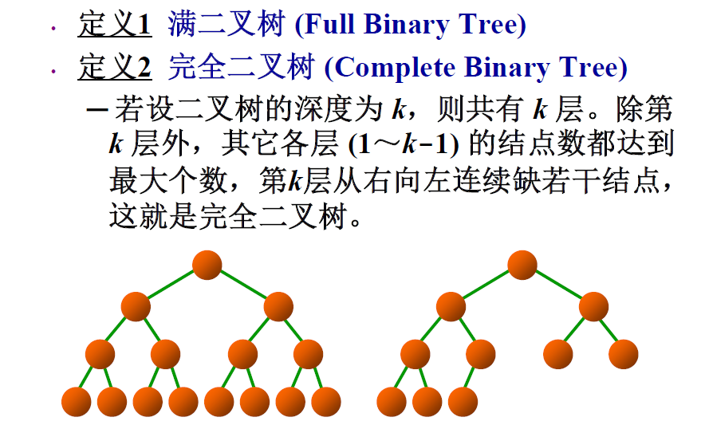

+ 结点数 $n$, 深度 $k$:
  $$
  2^{k - 1} < n \leq 2^k - 1
  $$
  
+ 二叉树数组存(顺序表示):

  

  

+ 前序遍历, 中序遍历, 后序遍历非递归算法:

  + 前序遍历: 1. 访问当前结点, 右儿子进栈, 指针进到左儿子. 2. 如果当前结点没有左儿子, 指针就指向退栈的那个. 栈空结束.
  + 
  + 


+ 层次遍历: 用队列. 是非递归的.

#### 线索化二叉树

穿线树.

+ 通过二叉树的遍历, 将所有结点数据排列在一个线性序列中, 可以找到某数据在这种排列下的前驱和后继.

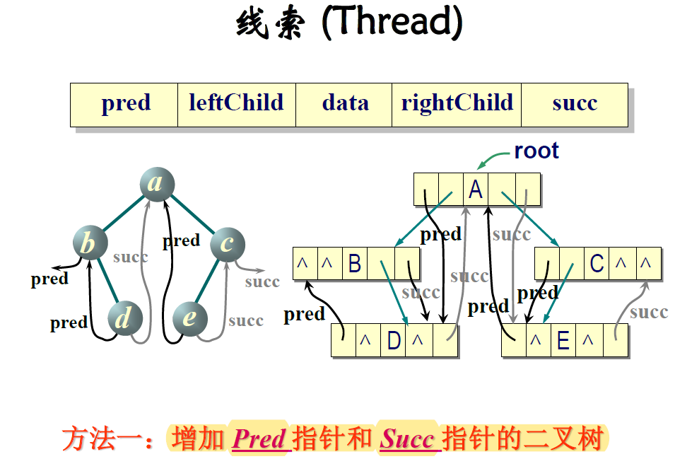 但是这种方法开销大, 存储消耗大.


线索化二叉树:


+ 线索化的意思其实就是 按照前中后序遍历 把那些空指针连起来.
+ 利用已有的指针
  使得找前驱和后继更加简单
  但是也有缺陷 就像后面在前序后序下找就有的情况比较麻烦
+ 一个是上一个从哪来, 一个是下一个是谁.
+ 代码未看. 有详细过程.

寻找中序下前驱和后继.

跳过了一些呀..

#### 树的子女-兄弟表示

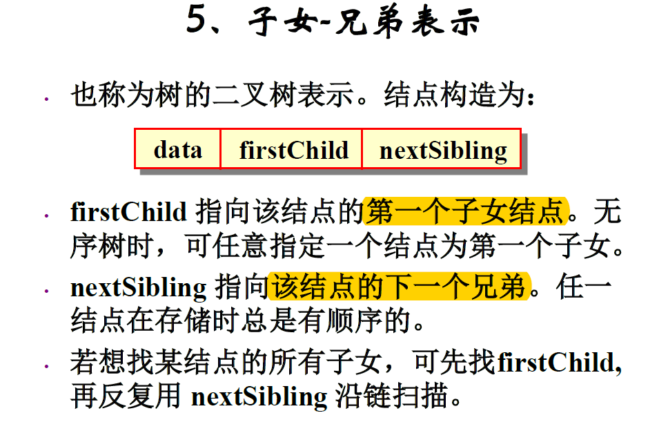 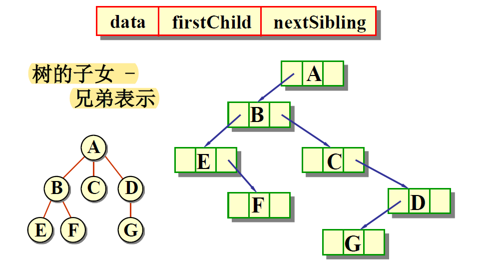

##### 树的遍历

+ 先根次序遍历: 遍历结果与其对应二叉树表示的 前序遍历 结果相同.

+ 后根次序遍历: 与其对应二叉树表示的 中序遍历 结果相同.

+ 广度优先(层次次序遍历):

  

  一层一层进队.

##### 森林与二叉树的转换


详细未看.


#### 堆

优先级队列: 每次出队的是优先权最高的元素.

+ 堆的下标:

  $i = 0$: 根结点.

  $\lfloor({i}-{1}) / 2)\rfloor$: 结点$i$的父结点.

  $2i + 1$: 左儿子.

  $2i + 2$: 右儿子.

  

+ 堆的建立:

  ```c++
  heap = new E[maxHeapSize];
  
  // 开始调整了:
  // 找到初始位置: 最后的分支结点.
  int currentPos = (currentSize - 2) / 2;
  // 逐步向上扩大堆.
  while (currentPos >= 0) {
      siftDown(currentPos, currentSize - 1);
      currentPos--;
  }
  ```

  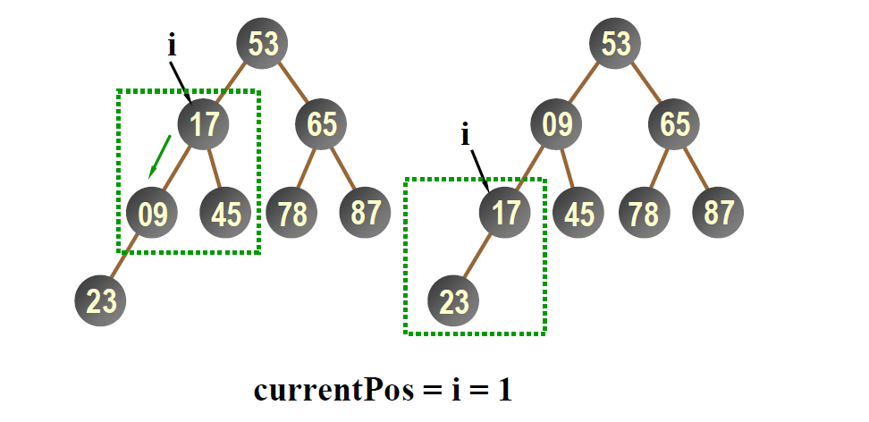

  最后53也还要移动一下.

  

+ `siftDown`

  ```c++
  // 参数是 start 和 m(总大小).
  int i = start, j = 2 * i + 1; // j 现在是 i 的左子女位置.
  Data tmp = heap[i]; // 先取出来, 准备往下放:
  //
  while (j <= m) {
      if (j < m && heap[j] > heap[j + 1])
          ++j;
      if (temp <= heap[j])
          break; // 到了终止的地方了, 下面的更大.
      else {
          heap[i] = heap[j]; // 整体网上移动, i, j 下降.
          i = j;
          j = 2 * j + 1;
      }
  }
  heap[i] = tmp; // 下放的元素放回去.
  ```

  

+ 最小堆的插入:

  每次插入在堆的最后, **自下向上**执行调整. 使其重新形成堆.

  $O(log_2 n)$

  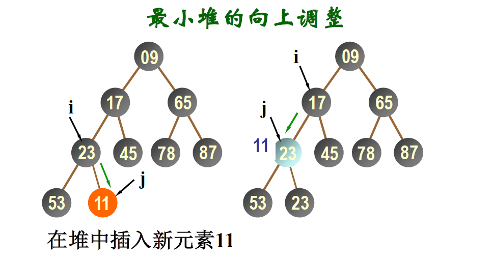

  

+ 最小堆的删除算法:

  堆顶删除, 把最后一个(最下面最后一个)放到堆顶, 执行`siftDown`.


#### Huffman 树

+ 路径长度: 两个结点之间的路径长度 PL 是连接两结点的路径上的分支数.
+ 树的外部路径长度是 各叶结点 到根结点 的路径长度之和 EPL.
+ 树的内部路径长度是 各非叶结点 到根结点 的路径长度之和 IPL.

+ 树的路径长度为PL = EPL + IPL:

  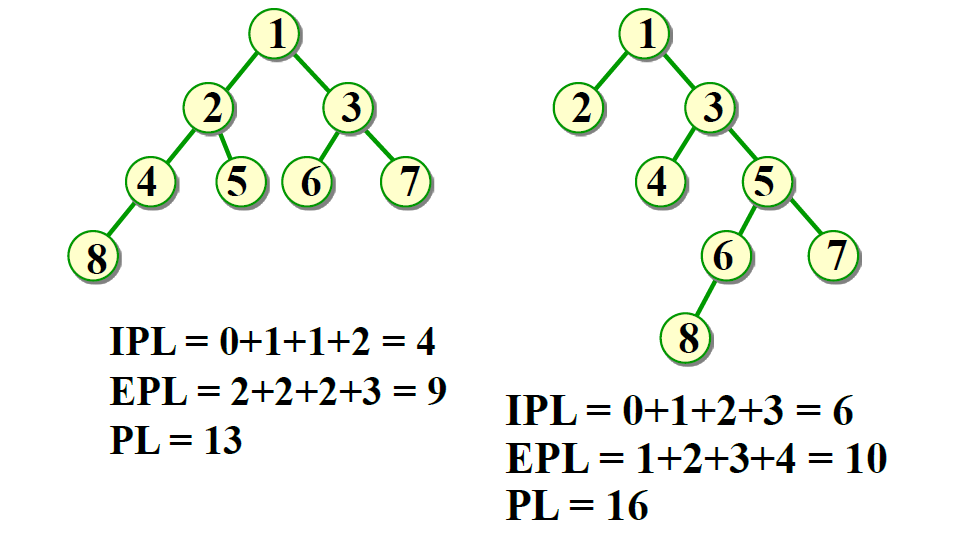

+ $n$ 个结点的二叉树的路径长度 $\geq \sum_i^n \lfloor log_2 i \rfloor$

  完全二叉树或理想平衡树满足要求.


+ 带权路径长度: WPL.

  叶结点赋予一个权值 (表示出现频度, 概率值等).

+ 扩充二叉树: 只有度为2的 内结点 和 度为0的 外结点.

  扩充二叉树 有 $n$ 个外结点就有 $n - 1$ 个内结点, 总结点数为 $2n - 1$.

  

+ 带权路径长度: 外结点的权值为 $w_i$, 到根的路径长度为 $l_i$, 则该外结点到根的带权路径长度为 $w_i \cdot l_i$

+ 扩充二叉树的带权路径长度定义为 树的各外结点 到根的带权路径长度之和:
  $$
  WPL = \sum_{i = 1}^n w_i \cdot l_i
  $$
  带权是带到一个结点上的
  离根远的权值小 离根近的权值大 这样总的会最小:

  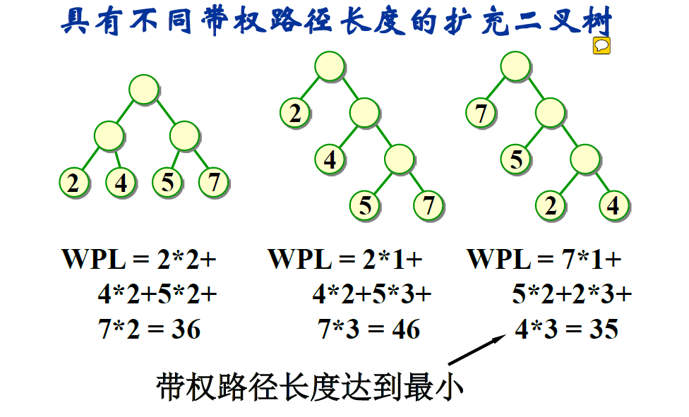

**Huffman 树**

带权路径长度达到最小的扩充二叉树即为Huffman树. 权值大的结点离根最近.

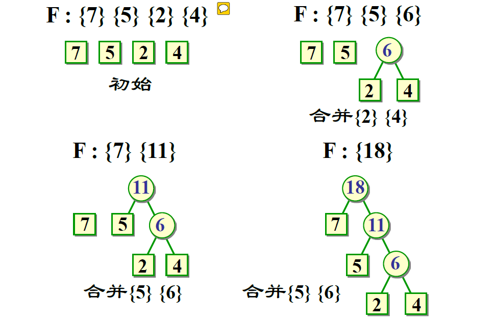

##### Huffman 编码

各个字符出现的频度(次数). 能否减少总编码长度. 总编码长度就是Huffman树的带权路径长度WPL.

前缀编码, 任一个二进制编码不会是其他的前缀, 解码时不会混淆. (如果 T 编码是10, S 是101 这就是前缀编码了 会有重复的 就出现歧义了)


### 集合与字典

+ 集合定义: 集合是成员(元素)的一个群集. 集合中的成员可以是原子(单元素), 也可以是集合. 同一集合中所有成员具有相同的数据类型.

+ `bitset`:

  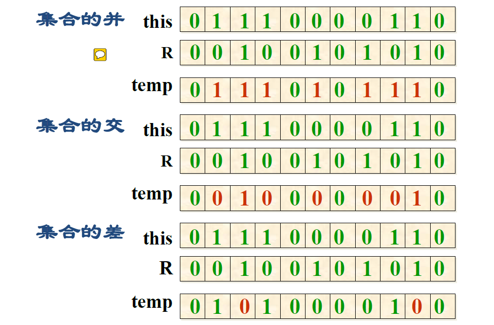

  并操作: 按位或
  交操作: 按位与
  差操作: 按位异或

+ 等价关系: $\equiv$ 集合上的一个自反, 对称, 传递的关系.
+ 等价类: 通过等价关系划分成若干个互不相交的子集 $S_1, \cdots , S_n$, 这些子集即为等价类.

#### 并查集

支持: 合并, 查找, 构造.

每个集合用一棵树表示. 刚开始每一个元素是独立的一棵树
合并操作就是合并两棵树.


最开始: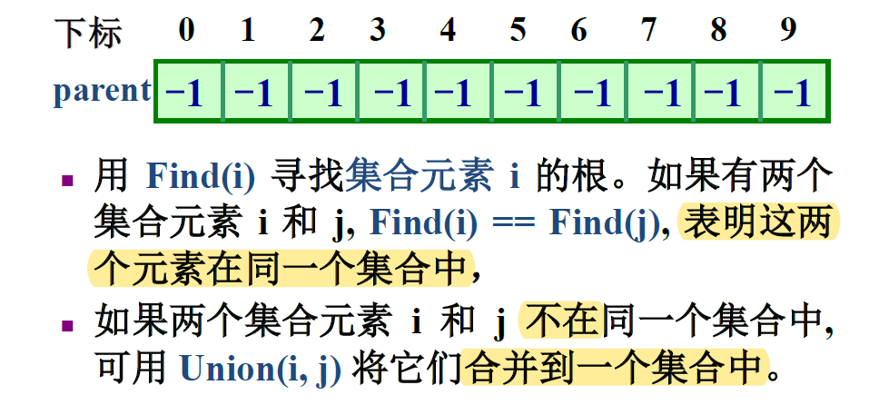

防止产生退化的树, 合并时: 1. 按树的结点个数合并, 2. 按树的高度合并, 3. 压缩元素的路径长度. 还有:

压缩路径: 


#### 字典

有关字典的操作:

+ 确定一个指定的key是否在字典中.
+ 搜索出 value
+ 修改 value
+ 插入 <key, value>
+ 删除 <key, value>

#### 有序顺序表 顺序搜索的时间代价

衡量一个搜索算法的时间效率的标准是: 在搜索过程中关键码平均比较次数, 也称为平均搜索长度 ASL (Average Search Length), 通常它是字典中元素总数 $n$ 的函数.

搜索第 $i$ 个元素的概率为 $p_i$, 搜索到第 $i$ 个元素所需比较次数为 $c_i$, 则:

+ 搜索成功:
  $$
  ASL_{success} = \sum_{i = 1}^n p_i \cdot c_i = \frac{1}{n} \cdot \frac{(n + 1)n}{2} \\ \sum_{i = 1}^n p_i = 1
  $$
  
+ 搜索不成功:

  因为是有序的, 所以不需要比较到表尾, 发现下一个元素更大就可以判定不成功.
  $$
  ASL_{unsucc} = \frac{1}{n + 1} \left( \sum_{i = 1}^n i + n\right)
  $$
  

  
+ 例子:

  

  就是算比较了几次 比如 6 进来 就是只有比较一次 搜索失败就落在10左边那个方框里, 反之搜索成功 就落在圆框里. 所以那个 $ASL_{unsucc}$ 是计算时候有两个6.


#### 折半搜索


搜索失败落在方框里, 搜索成功落在圆框里, 算比较次数一定要直接带进去算.

注意判定树都是扩充二叉树.


#### 散列表 (Hash Table)

在元素存储位置与其关键码之间建立一个确定的对应函数关系`Hash()`, 使得每个关键码与唯一的存储位置相对应: `Address = Hash(key)`.

+ 散列方法: 在插入时依此函数计算存储位置并按此位置存放. 在搜索时对元素的关键码进行同样的计算, 把求得的函数值当做元素存储位置, 然后按此位置搜索.

+ 冲突: 把不同的关键码映射到同一个散列地址上.
+ 两个关键问题:
  + 对于给定的一个关键码集合, 选择一个计算简单且地址分布比较均匀的散列函数, 避免或尽量减少冲突.
  + 设计解决冲突的方案.


+ 散列函数 (`Hash()`):
  + 尽量简单, 较短时间内计算出.
  + 尽量均匀分布.
  + 定义域包括所有key的范围.

+ 直接定址法:
  $$
  Hash(key) = a \cdot key + b
  $$
  key 的集合大小与地址空间相同.

  

+ 数字分析法:

  设有 $n$ 个 $d$ 位数, 每一位可能有 $r$ 种不同的符号. 这 $r$ 种不同符号在各位上出现的频率不一定相同. 根据散列表的大小, 选取其中各种符号分布均匀的若干位作为散列地址.

  数字分析法仅适用于事先明确知道表中所有关键码每一位数值的分布情况.

  

+ 除留余数法:

  设散列表中允许地址数为 $m$, 取一个不大于 $m$, 但最接近于或等于 $m$ 的质数 $p$ 作为除数:
  $$
  Hash(key) = key \ \% \ p, \quad p \leq m
  $$
  要求 $p$ 不是接近2的幂.

#### 处理冲突的闭散列方法

+ 线性探查法:

  

  下面的数字表示存放的时候要经过多少次比较 就是查找次数, 有冲突的就往后顺延, 就是离本来要放的位置多远这个意思.

  

  ??? 不成功的ASL有点不懂

  

+ 例子:

  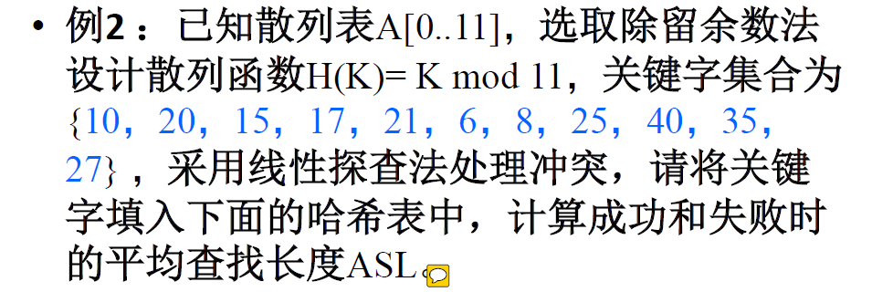 

  失败比较次数是:

  mod之后有个地址, 如果地址是空位就是比较一次 如果不是空位 就一直循环找然后找到空位的地方, 算比较了几次.

  注意关键的地方就是最后一位不能取 因为 mod 不会mod到到最后一位.


#### 处理冲突的开散列方法

+ 链地址法: 

  首先对key集合用某一个散列函数计算它们的存放位置.

  具有相同地址的关键码归于同一子集, 称为一个桶.

  

开散列方法的缺点(很像链表和线性表的缺点): 要用空间资源 要开辟指针空间.

开散列的优点: 查找速度很快, 即插入和删除的代价也低.


### 搜索结构

所谓搜索, 就是在数据集合中寻找满足某种条件的数据对象.

#### 静态搜索结构

+ 使用“监视哨”的顺序搜索方法:

  ```c++
  Arr[Size].key = x; // 将x设置为监视哨.
  int i = 0;
  while (Arr[i].key != x)
      ++i; // 从前向后顺序搜索.
  
  return i + 1;
  ```

  

#### 二叉搜索树

定义:

+ 每个结点都有一个作为搜索依据的key, 所有结点互不相同.
+ 左子树上所有结点的key都小于根结点key.
+ 左子树和右子树也是 二叉搜索树.

中序遍历二叉搜索树 结果就是从小到大的顺序.


+ 二叉搜索树的删除:

  + 删除 叶结点: 直接删.

  + 被删结点 右子树空, 左子树不空: 左儿子顶替它的位置. 反过来同理.

  + 左右子树都不空: 在右子树中找 中序下第一个结点, 填补到被删结点中.

    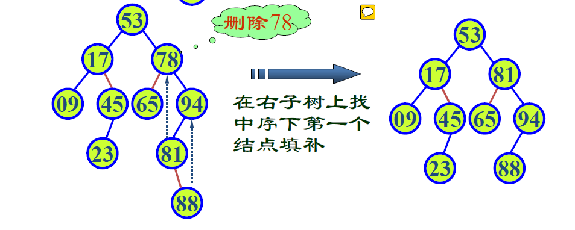

    

    

#### AVL 树

定义:

+ 左子树和右子树都是AVL树.
+ 左子树和右子树高度之差的绝对值不超过1.

平衡因子 `bf`: 右子树高度 减 左子树的高度所得的高度差.

平衡化旋转:

+ 左单旋转(Rotate Left):

  

  

+ 右单旋转(Rotate Right):

  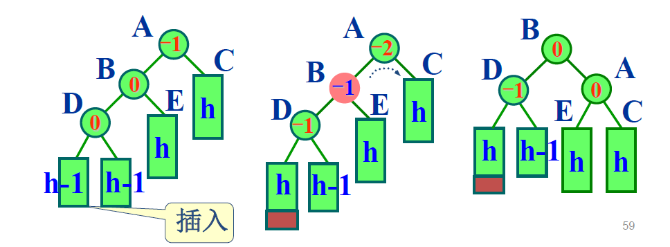

  

+ 先左后右双旋转(Rotation Left Right):

  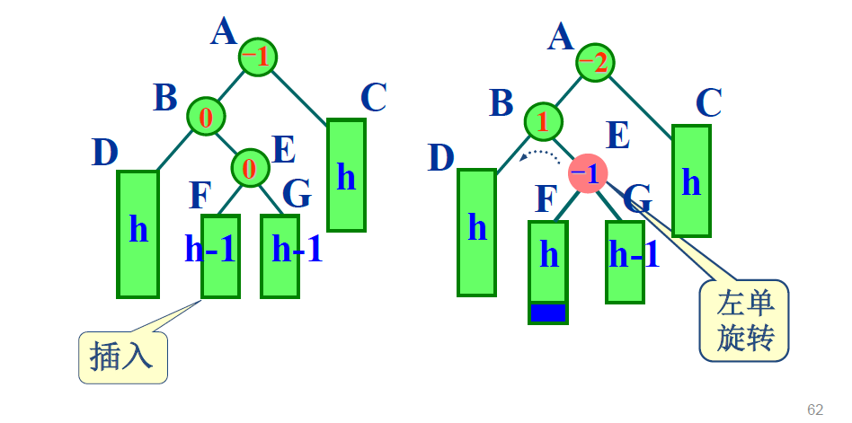

  

+ 先右后左双旋转(Rotation Right Left):

  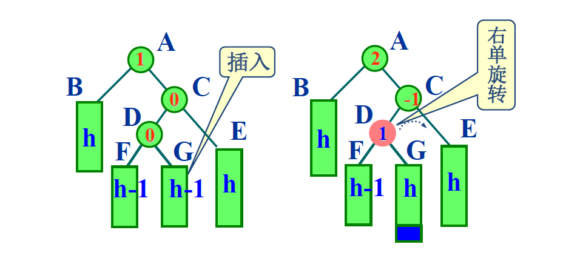 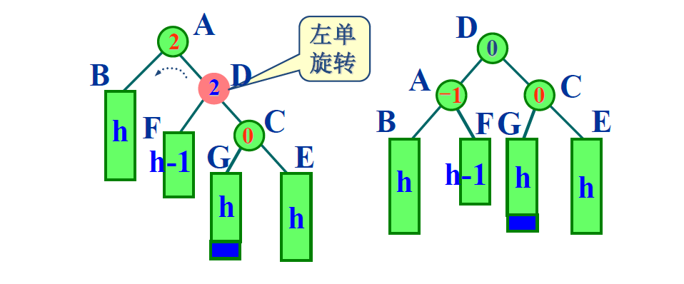

  

+ 例子:

   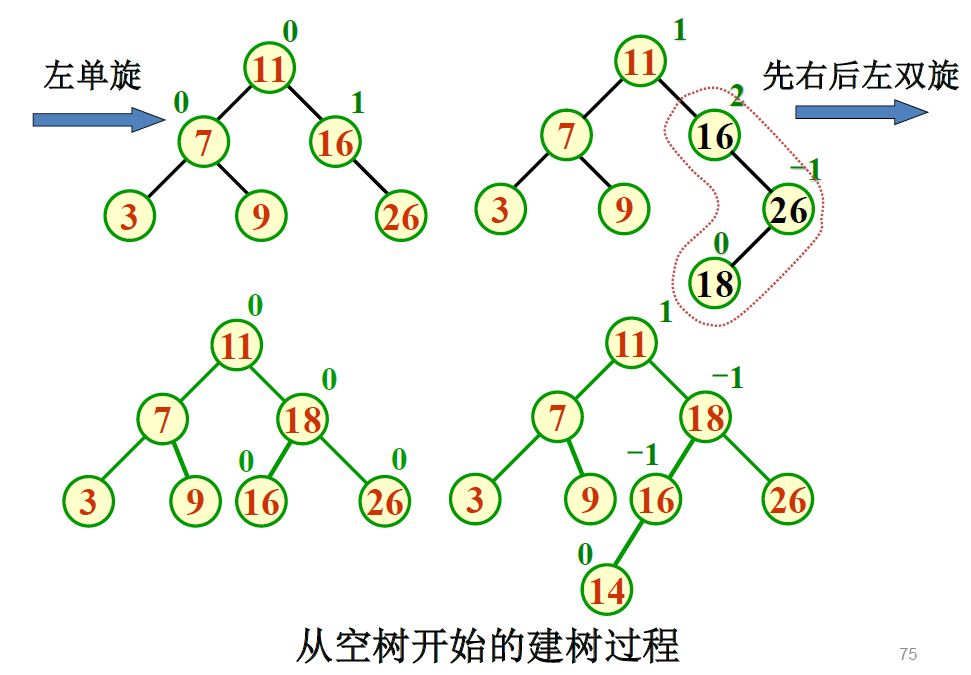 


+ AVL树的删除:

  "继续检查上层结点的平衡因子"

  未看.


### 图

定义: 图是由顶点集合 以及 顶点间的关系集合 组成的一种数据结构. $Graph = (V, E)$.

+ 完全图: $n$ 个顶点的无向图, 有 $\frac{n (n - 1)}{2}$ 条边. 有向图则为 $n(n-1)$.
+ 顶点的度: 出度和入度之和.


+ 路径: 在图 $G=(V, E)$ 中, 若从顶点 $v_i$ 出发, 沿一些边经过一些顶点 $v_{p1}, v_{p2}, \cdots , v_{pm}$ 到达顶点 $v_j$. 这个顶点序列就叫路径.
+ 简单路径: 路径上的各顶点不相互重复.

+ 连通图: **无向图**中 任意顶点间存在路径.
+ 连通分量: 非连通图的极大连通子图叫连通分量.
+ 强连通图: **有向图**中 每一对顶点$v_1, v_2$, 都存在 $v_1 \rightarrow v_2$ 和 $v_2 \rightarrow v_1$ 的路径.
+ 强连通分量: 非强连通图的极大强连通子图叫做强连通分量.

+ 生成树: 一个连通图的生成树是其极小连通子图. $n$ 个点则有 $n - 1$ 条边.

无向图邻接矩阵对称, 有向图不一定.

+ 邻接表:

  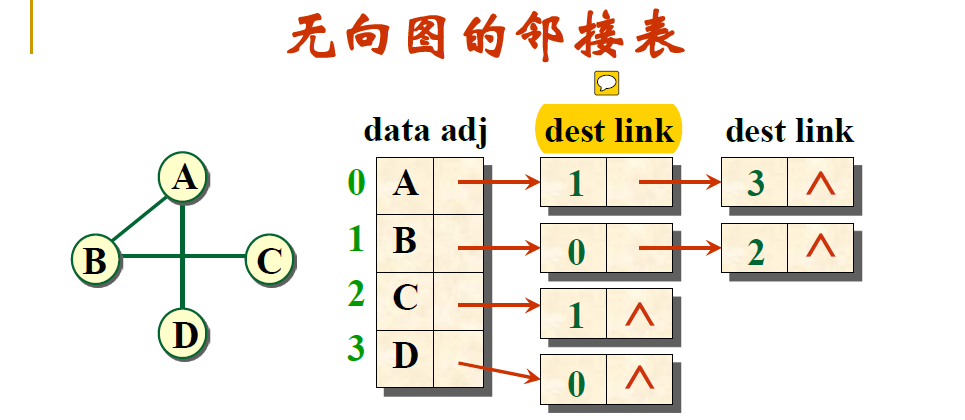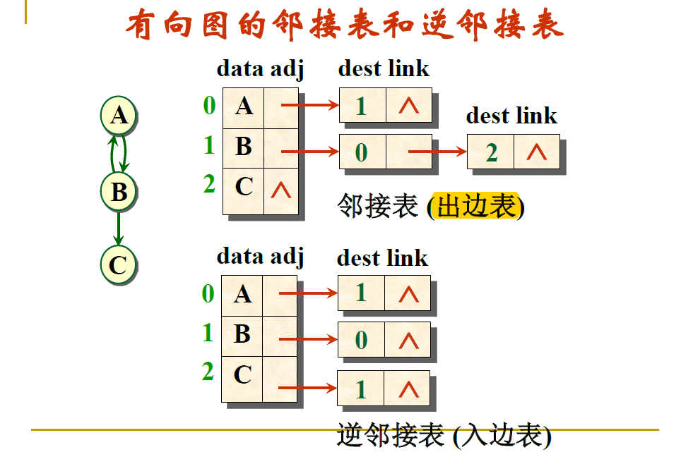

  

+ DFS:

  

  

+ BFS:

  

  

#### 最小生成树(MST)

网络中使权值和最小.

##### Kruskal

最小堆(按权值从小到大选择边) + 并查集(加边时检查会不会产生回路).

随着加边的过程, 各连通分量也在逐步合并直到最后形成一个连通分量为止.

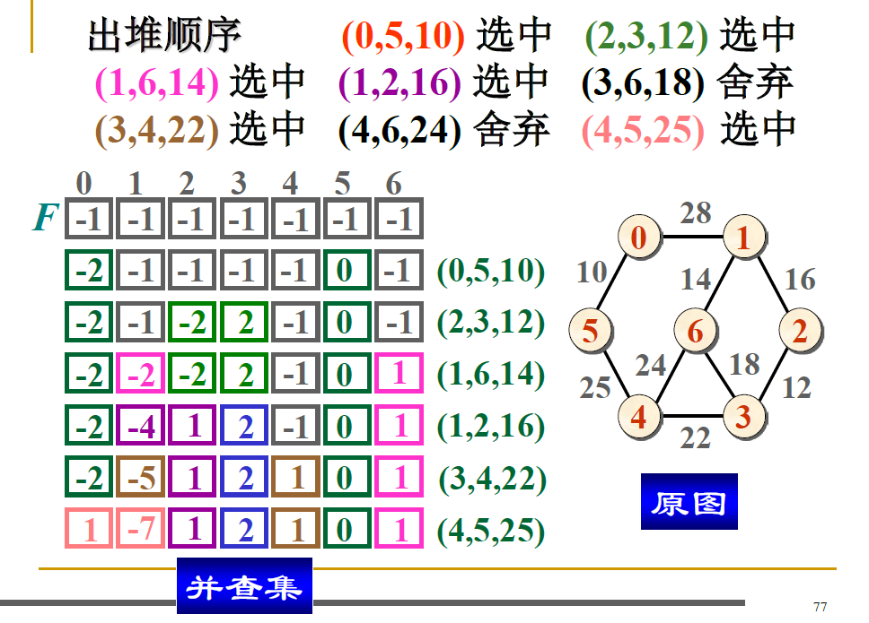

##### Prim

CUT 的那个思想, 请看黄宇老师算法.


+ Prim 算法适用于边稠密的
+ Kruskal 算法适合于边稀疏的

生成树可能不唯一.


#### 最短路问题

##### Dijkstra

边权值非负的 单源最短路问题.

类似Prim:

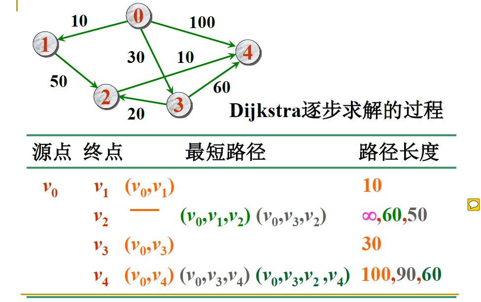

上图也是一层一层迭代的.

路径保存数组(有点难):

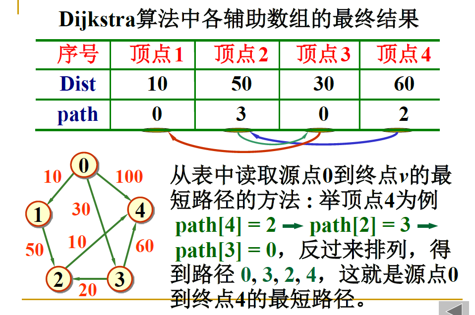

未看.

##### Floyd

所有顶点之间的最短路径, 允许带负权值的边:

```c++
// k 在外层.
for (int k = 0; k < n; ++k) {
    for (int i = 0; i < n; ++i) {
        for (int j = 0; j < n; ++j) {
            if (a[i][k] + a[k][j] < a[i][j]) {
                a[i][j] = a[i][k] + a[k][j];
                path[i][j] = path[k][j] // 缩短路径长度, 绕过 k 到 j.
            }
        }
    }
}
```

路径 (有点难):


#### 活动网络 AOV (Activity On Vertices)

定义: 用有向图表示一个工程. 在这种有向图中，用顶点表示活动, 用有向边 $<v_i, v_j>$ 表示活动 $v_i$ 必须先于活动 $v_j$ 进行.

不能出现有向环.

##### 拓扑排序

检测有向环的方法.

排列成线性有序的序列, 其在AOV网络中存在前驱和后继关系.

+ 选没有前驱的结点. 输出.
+ 删点, 继续上一步.


没有前驱的结点 $\Rightarrow$ 入度为零.

+ 用栈实现:

  

  最开始是在这个第一个, 从上往下扫描 扫描到第一个 2 是入度等于零.

  top就放到2, 而且 -1 表示是栈顶 又是栈底.

  然后再扫描到 4 入栈, 就是 top 放到 4 然后count[4] = 2 (这样就表示入栈了).

  第三个, 退栈 top 退到2, 顺便 0 1 5的入度都要减一, 这时 0 的入度为零, 又像之前一样 top 被放到0, 0这个入栈了.

  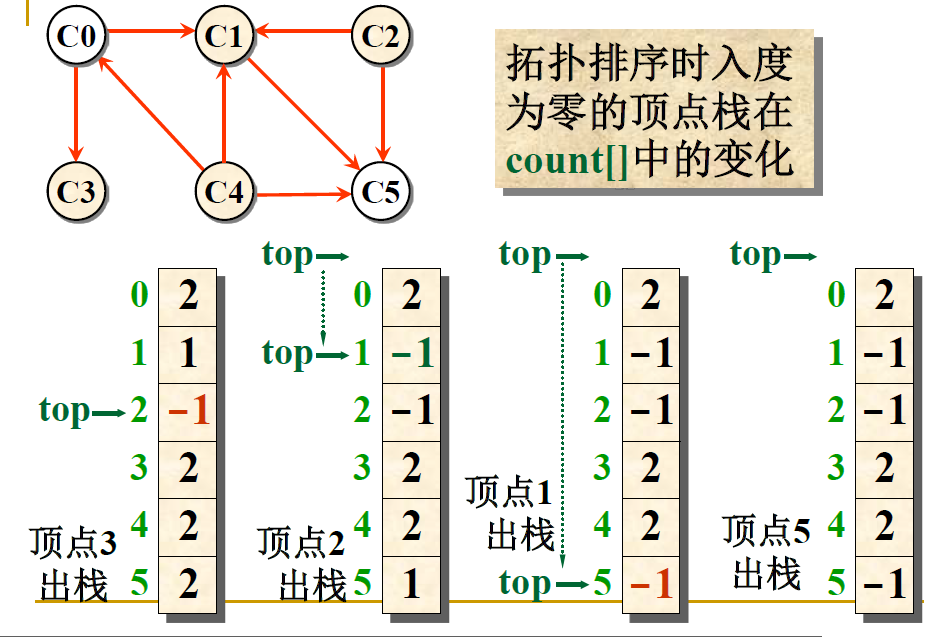

拓扑排序时间复杂度: $O(n + e)$


#### 用边表示活动的网络 AOE


