# 离散数学

[TOC]

### 命题逻辑

+ 逻辑: 数学里, 逻辑是指研究某个形式语言的有效推论.

+ 命题: 无法严格定义, 主要是指一些字或者其他符号组合成的一种形式, 这种形式所表达的或者为真或者为假.

  命题是可以判断真假的陈述句.

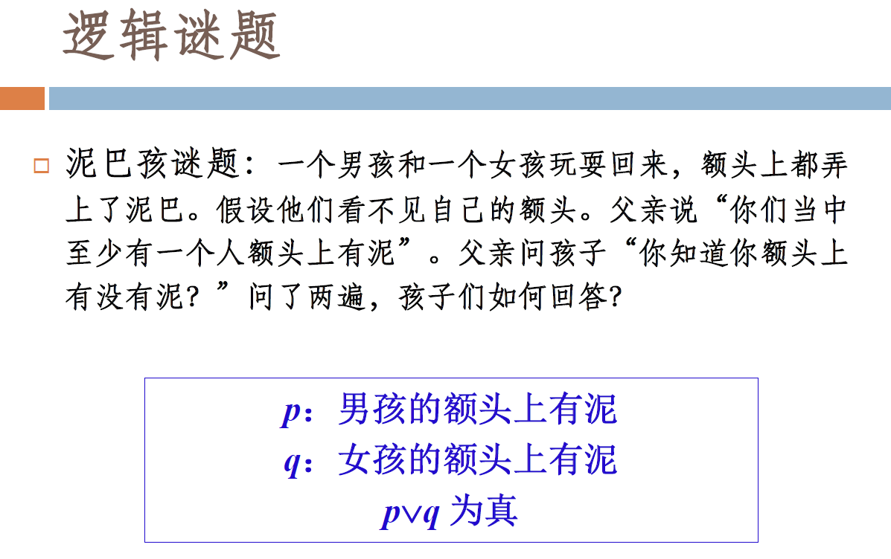

+ 运算符的优先级:
  $$
  \lnot, \land, \lor, \rightarrow, \leftrightarrow
  $$

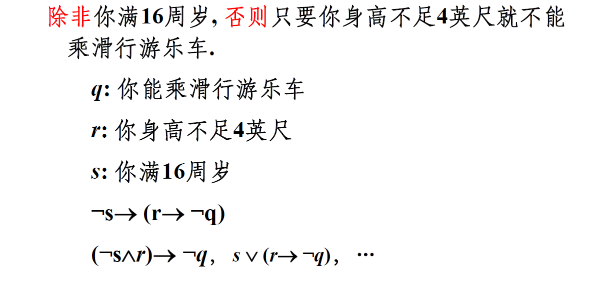

指派: 对命题变元的一种赋值.

逻辑等价.

可满足: 存在一个对其变元的赋值使其为真.

Sudoku 转换为可满足性的判定问题.

范式: 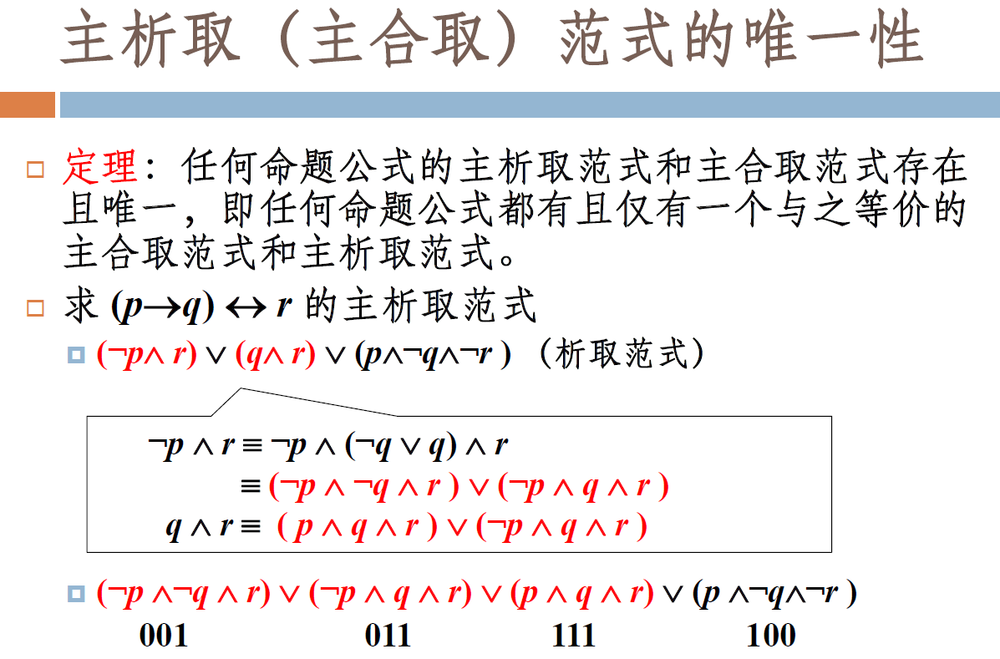

&nbsp;

### 谓词逻辑初步与推理规则

+ 谓词: $P(x)$ 可以视同关于 $x$ 的一个属性的取值, 是一个函数.

  "$x$ 大于2" 可以表示为 $P(x)$.

+ 量词: 

  $\forall$ 全称量词.

  $\exist$ 存在量词.

  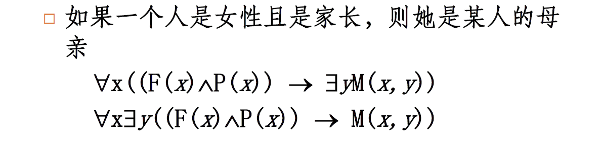 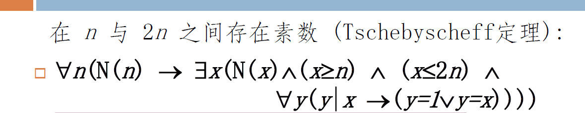

  

+ 一阶谓词逻辑: 命题逻辑 + 谓词 + 量词;

论证形式: 

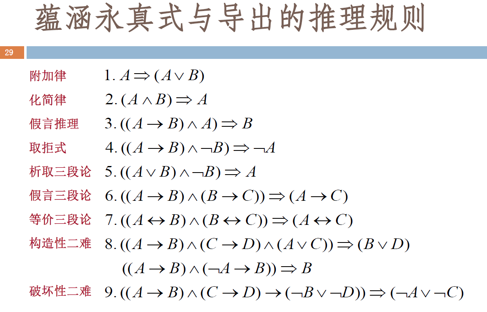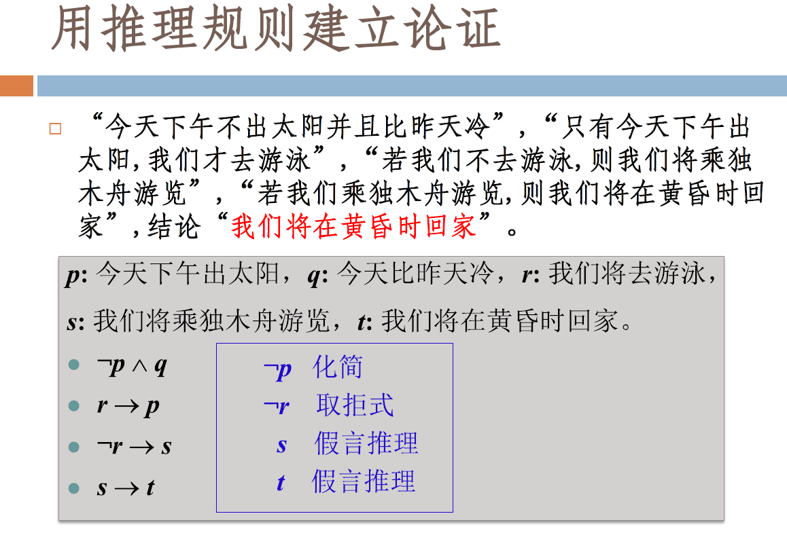

前提正确 + 过程正确 $\Rightarrow$ 结论正确.

&nbsp;

### 证明方法

证明的本质是保证真实性.

+ 直接证明法:

  

+ 间接证明法:

  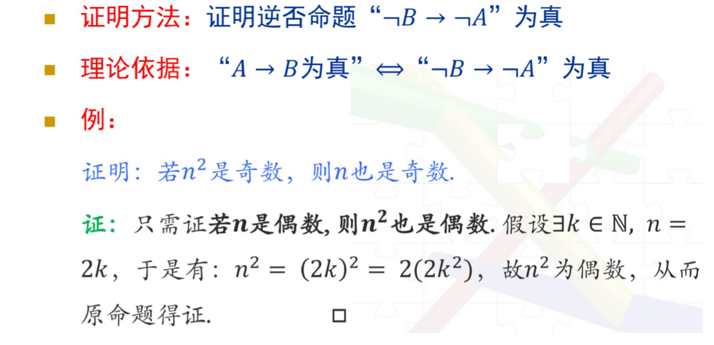

+ 空证明法(前件假证明法):

  

+ 平凡证明法(后件真证明法):

  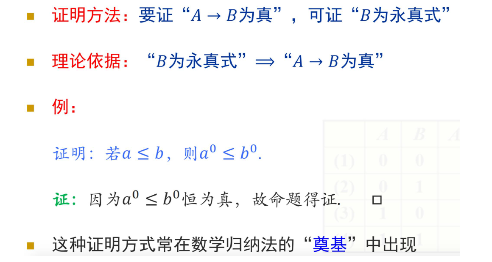

+ 归谬法(反证法):

  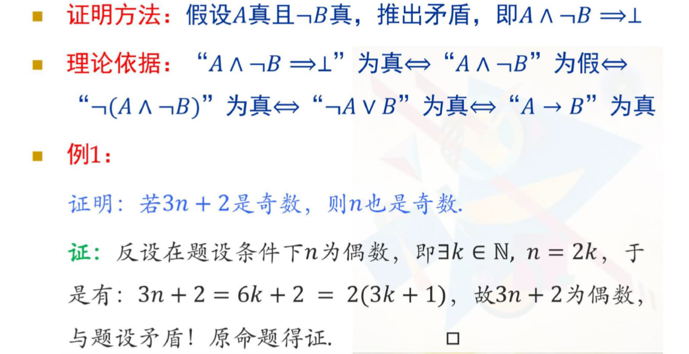

+ 穷举法

+ 猜想:

&nbsp;

### 集合及其运算

+ 罗素悖论:

  $\{ \ x | P(x) \ \}$ 未必产生集合: 令 $R = \{ \ x | x \notin x \ \}$, 因为 若 $R$ 为集合, $R \in R$ 与 $R \notin R$ 矛盾.

  与朴素集合论的概括原则 矛盾.

+ 危机的解决: 公理化集合论.

  ZF 公理化集合论的正则公理避免了罗素悖论:

  正则公理: 每一个非空集合$x$, 总包含一元素 $y$, 使 $x$ 与 $y$ 不相交.

集合: 没有明确的定义.

康托给出了集合的一种刻画: 总括之全体即谓之集合. 可以用集合的外延公理和概括原则来描述.

+ 外延公理: 集合由其元素完全决定:
  $$
  A = B \Leftrightarrow \forall \ x, (x \in A \Leftrightarrow x \in B)
  $$

+ 概括原则: 集合的与元素为具有同一性质 $P$ 的那些对象:
  $$
  A = \{ \ x | P(x) \ \}, \ x \in A \Leftrightarrow P(x)
  $$

+ 空集公理: 存在一个集合其没有任何元素. 空集为任意集合(包含空集本身)的子集.

  空集是唯一的.

+ 无穷公理: $\exist A, \ (\emptyset \in A \land (\forall x \in A)(x^+\in A)$

  

+ 幂集公理:

  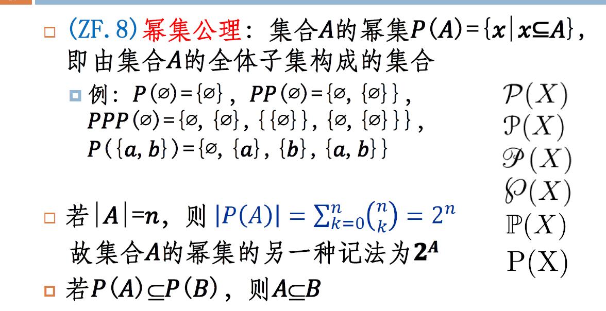

  全体子集构成的集合.

广义交和广义并: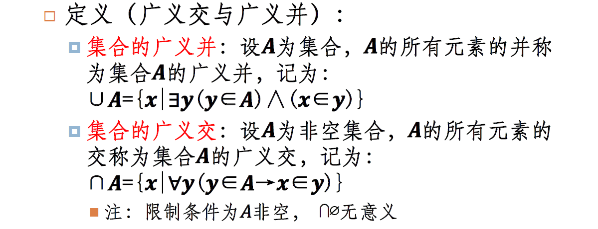

&nbsp;

### 关系、函数及其运算

关系: 若 $A, B$ 是集合, 从 $A$ 到 $B$ 的一个关系 $R$ 是 $A \times B$(笛卡尔积) 的一个子集. 集合的元素是有序对.

关系的逆: 

函数(映射): $A$ 和 $B$ 为非空集合, 从$A$ 到 $B$ 的函数 $f$ 是对元素的一种指派, 对 $A$ 的每个元素**恰好指派 $B$ 的一个元素**, 记为: $f: \ A \rightarrow B$.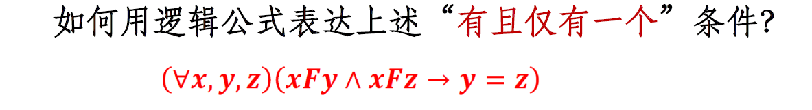

+ 单射: 一对一的

  如果$x_1 \neq x_2$, 那么 $f(x_1) \neq f(x_2)$.

+ 满射: 映上的

  任意 $y \in B$, 存在 $x \in A$, 使 $f(x) = y$.

+ 双射: 一一对应

  满射 + 单射.

&nbsp;

### 集合的基数

$\aleph_0$: 自然数的个数. 最小的无限数.

等势: 存在集合 $A$ 到 $B$ 的双射. 所以证明等势就是找到双射.

集合的势/集合的基数: $|A|$.

有限集合: 当且仅当存在自然数 $n$, 集合的基数为 $n$.

可数集/可列集: 存在到自然数集合 $\mathbb{N}$ 的**单射**.

+ 有限集都是可数集.
+ 无限集有可数集和不可数集.

证明 $\aleph$ 比 $\aleph_0$ 大: 证明实数集 $\mathbb{R}$ 不可数. 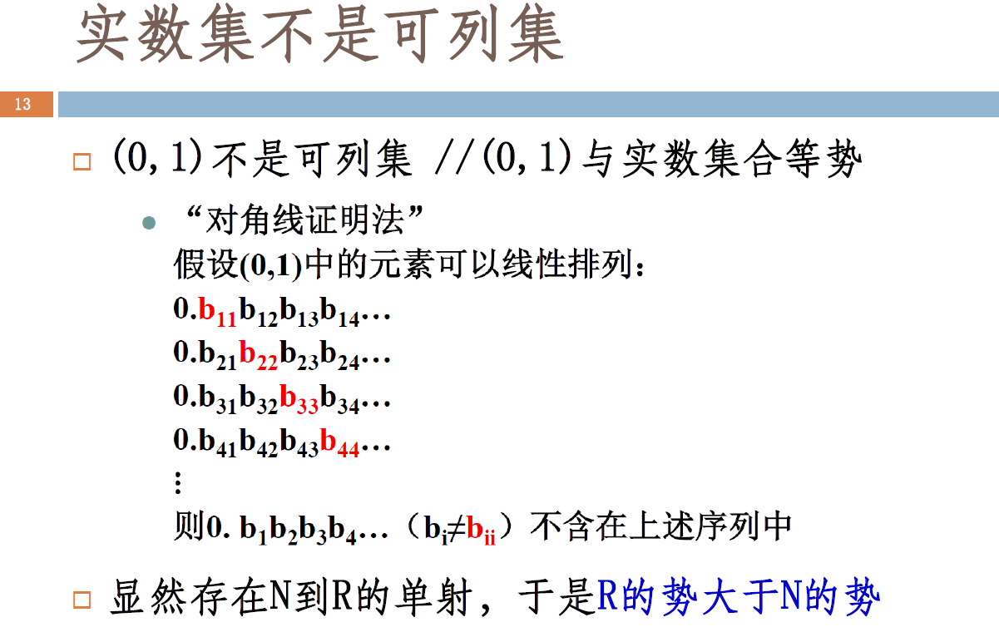

+ Cantor定理:
  1. $\mathbb{N}$, $\mathbb{R}$ 不等势.
  2. 对应任意集合$A$, 与它的幂集 $P(A)$ 不等势.

+ Bernstein 定理:

  ~~若 $A \prec B$~~

  若集合 $A$ 优势于 $B$, $B$ 优势于 $A$, 则 $A$ 与 $B$ 等势.

  所以就是找两个单射.

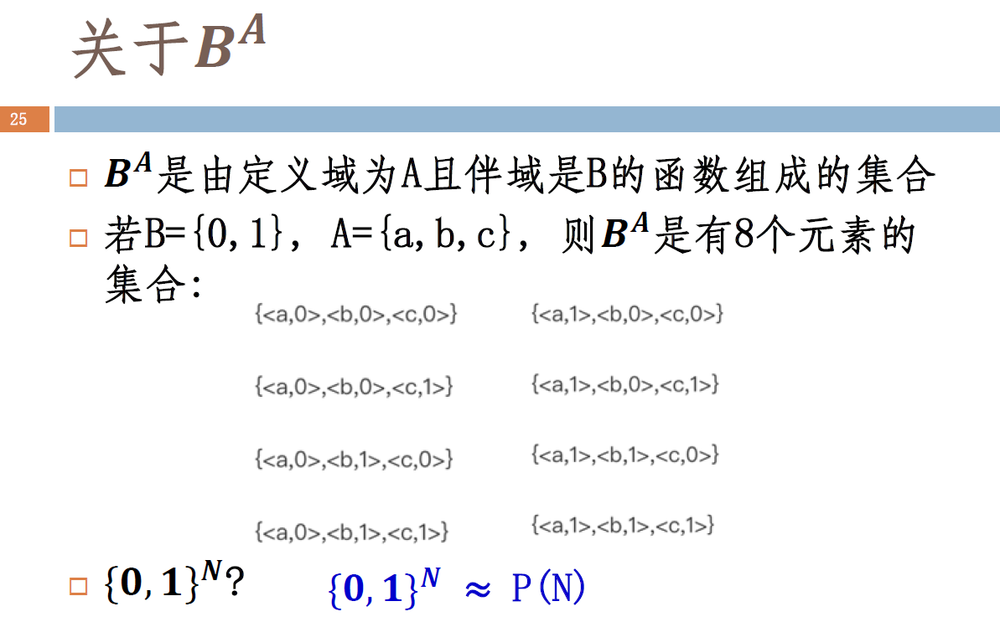

+ 连续统假设(CH):

  不存在集合 $S$:
  $$
  \aleph_0 < card \ S < \aleph
  $$

等势关系是等价关系: 自反, 堆成, 传递.

&nbsp;

### 数论初步

整除: 存在 $c$, 使 $b = a c$, 则 $a \ | \ b$

+ 带余除法:
  $$
  -11 = 3 \times(-4) + 1 \\
  -11 \ mod \ 3 = 1
  $$

+ 算术基本定理: 每个大于1的正整数都可以唯一地写为一个素数或者若干个素数的乘积:
  $$
  n = p_1^{\alpha_1} p_2^{\alpha_2} \cdots p_k^{\alpha_k}
  $$

+ 引理:

  若素数 $p$, $p | ab$, 那么不是 $p|a$, 就是 $p|b$.

+ 裴蜀定理:

  $a, b$ 互素 当且仅当 存在 $s, t \in \mathbb{Z}$, 使 $sa + tb = 1$.

  

+ 筛法求素数.

+ 素数的性质:

  

+ 最大公约数: $gcd(a, b)$
  $$
  \exist s, t \in \mathbb{Z}, \ gcd(a, b) = sa + tb \\
  gcd(a, b) = gcd(a, b - a) \ \ \ (a < b) \\
  gcd(a, b) = gcd(b, a \ mod \ b) \ \ \ (a > b)
  $$
  欧几里得算法.

+ 中国剩余定理:
  $$
  (S):\left\{\begin{array}{cc}
  x \equiv a_{1} & \left(\bmod m_{1}\right) \\
  x \equiv a_{2} & \left(\bmod m_{2}\right) \\
  \vdots & \\
  x \equiv a_{n} & \left(\bmod m_{n}\right)
  \end{array}\right.
  $$
  $m_1, m_2, \cdots, m_n$ 两两互素, 上面$S$有解, 在模$M$同余下是唯一的:
  $$
  \begin{array}{l}
  M=m_{1} \times m_{2} \times \cdots \times m_{n}=\prod_{i=1}^{n} m_{i} \quad M_{i}=M / m_{i}, \forall i \in\{1,2, \cdots, n\} \\
  t_{i} M_{i} \equiv 1 \quad\left(\bmod m_{i}\right), \quad \forall i \in\{1,2, \cdots, n\} \\
  x=\sum_{i=1}^{n} a_{i} t_{i} M_{i}
  \end{array}
  $$
  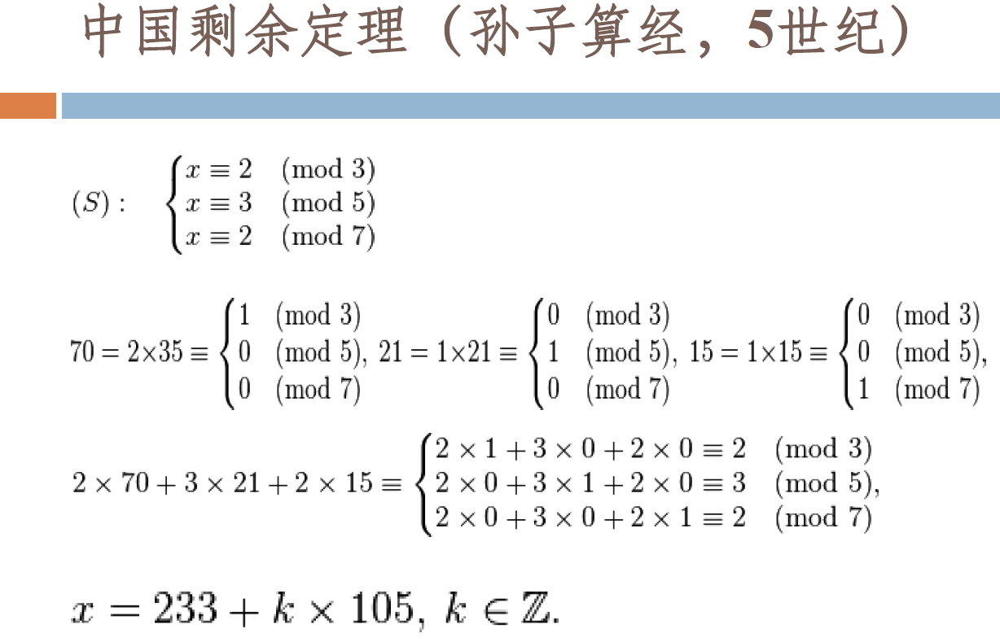

  

  

+ 欧拉函数: 不大于 $n$ 且与 $n$ 互质的正整数的个数.

  如果$m$, $n$互素, 则 $\phi(mn) = \phi(m) \phi(n)$

  

+ 欧拉定理

  

&nbsp;

### 归纳与递归

数学归纳法: 

+ 良序公理:

  正整数集合的非空子集都有一个最小元素.

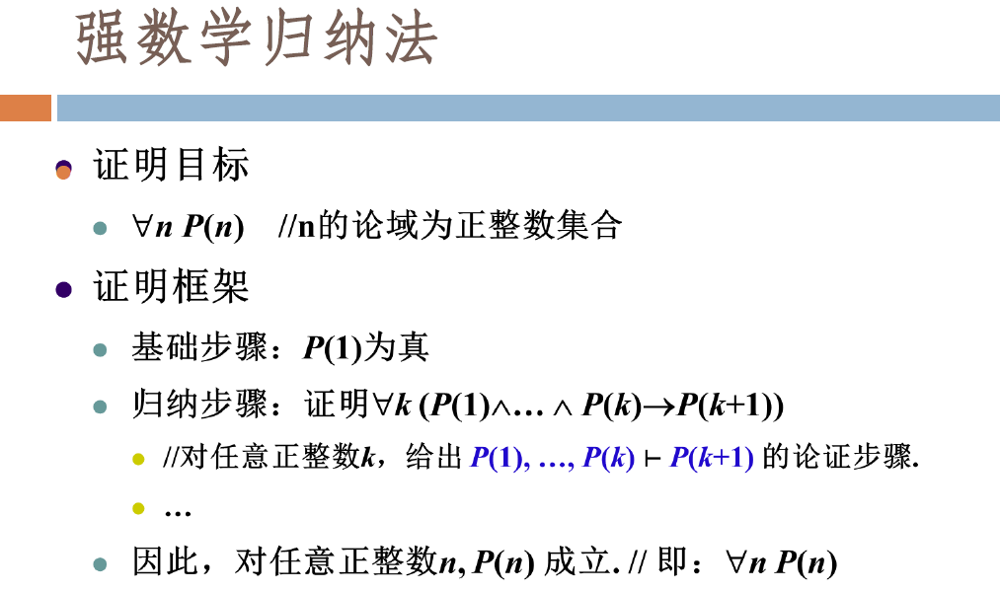 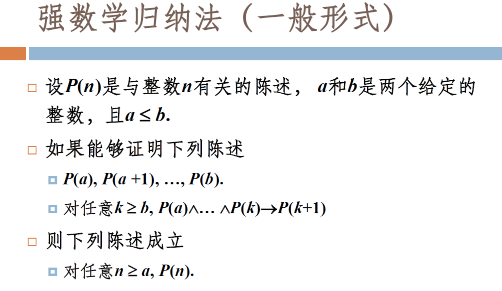 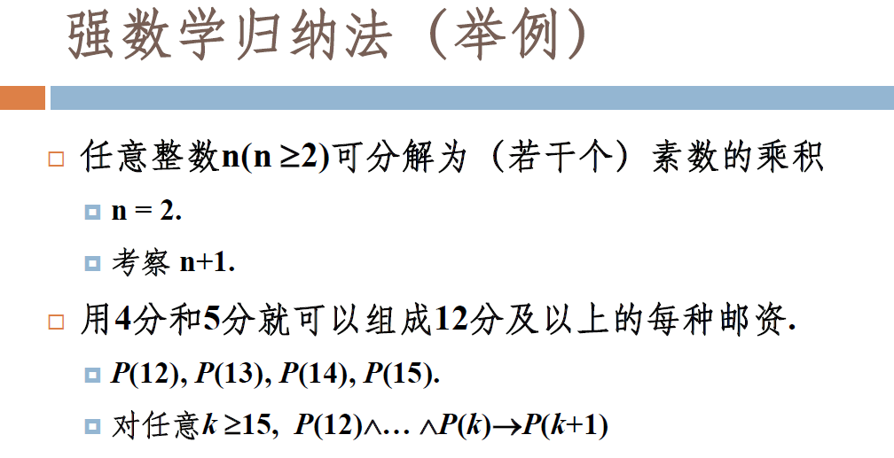

 

### 计数

