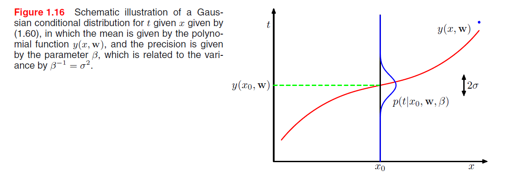
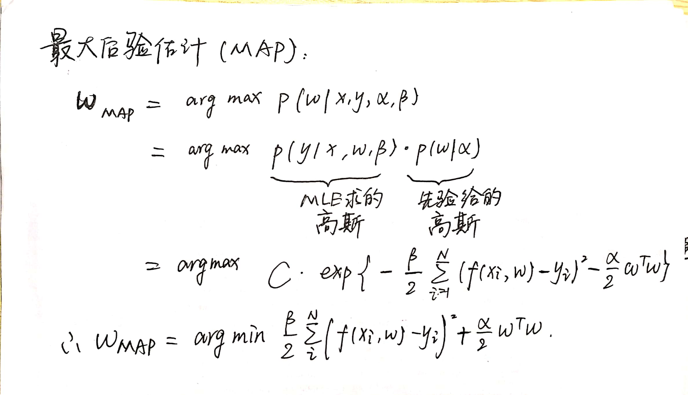
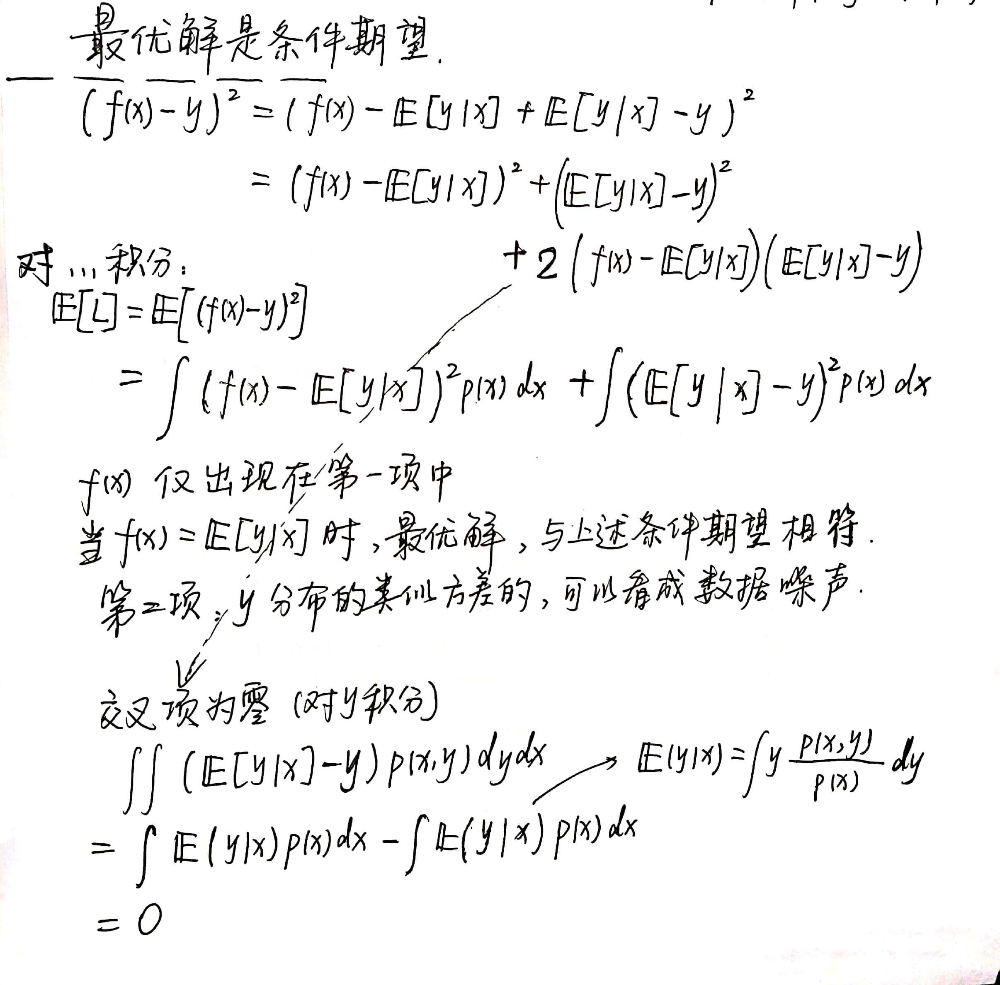

# PRML

[TOC]

### 1 绪论

泛化能力: 正确分类与训练集不同的新样本的能力.

强化学习: 关注在给定的条件下, 找到合适的动作, 使得奖励达到最⼤值.

#### 1.1 例子: 多项式拟合

用多项式函数: $y(x, \boldsymbol{w})=\sum_{i=0}^M w_i x_i$.

+ 预测值与目标值的平方和误差:

  损失函数求导后可以得到闭式解.

  多项式的次数$M$是超参数, 模型选择问题. 过拟合: $M$较大时损失函数为零, 但是曲线剧烈震荡.

+ 均方根误差:

  预测值与目标值的平方和 $\div$ 样本个数, 再开根号.

  以相同的基础对比不同大小的数据集.

随着$M$的增大, 系数通常会增大(暗示曲线会震荡), 但是多项式函数可以精确拟合训练集. 过分地拟合了随机噪声.

数据集规模增加, 过拟合问题变得不那么严重. 数据集规模越⼤, 我们能够⽤来拟合数据的模型就越复杂(即越灵活).

##### 正则化:

减少过拟合.

+ 岭回归: 平方和误差 $+$ 正则化项 $\lambda\|\boldsymbol{w}\|^2$.

&nbsp;

#### 1.2 概率论

+ 关于一个条件分布的条件期望:
  $$
  \mathbb{E}_{x}[f \mid y]=\sum_{x} p(x \mid y) f(x)
  $$

##### 1.2.3 贝叶斯概率

+ 先验: $p(\boldsymbol{w})$, 在观察数据之前, 我们有一些关于参数(比如多项式曲线例子中的$\boldsymbol{w}$)的假设.

+ 类条件概率/似然: $p(\mathcal{D} \mid \boldsymbol{w})$, 表达在不同的参数$\boldsymbol{w}$下, 观测数据出现的概率.

  似然函数不是$\boldsymbol{w}$的概率分布, 关于$\boldsymbol{w}$的积分不一定等于1.

$$
p(\boldsymbol{w} \mid \mathcal{D})=\frac{p(\mathcal{D} \mid \boldsymbol{w}) p(\boldsymbol{w})}{p(\mathcal{D})}
$$

+ 频率学家: 最大似然估计.

  $\boldsymbol{w}$ 是一个固定的参数, 由某种形式(比如数据集$\mathcal{D}$的概率分布)的"估计"来确定.

+ 贝叶斯: 包含先验概率. 实际观测到数据集$\mathcal{D}$, 参数的不确定性用$\boldsymbol{w}$的概率分布来表达. 该方法的缺点: 选择先验概率通常是选方便的而不是反映出先验知识的.

##### 1.2.4 高斯分布

高维高斯:
$$
\mathcal{N}(x \mid \mu, \Sigma)=\frac{1}{(2 \pi)^{\frac{D}{2}}} \frac{1}{|\Sigma|^{\frac{1}{2}}} \exp \left\{-\frac{1}{2}(x-\mu)^{T} \Sigma^{-1}(x-\mu)\right\}
$$

 

所以最大似然估计的均值可正确(是无偏估计), 但是方差被系统性地低估了(不是无偏估计).

$\mu_{MLE}$ 与 $\sigma^2_{MLE}$ 无关.

最⼤似然的偏移问题是我们在多项式曲线拟合问题中遇到的过拟合问题的核⼼:

##### 1.2.5 重新考察曲线拟合问题

很牛!

所以:

+ 在$\boldsymbol{w}$的先验是高斯, 就是上面图上那个曲线$y$轴方向的高斯.
+ 并且MLE作用于似然函数.
+ **最后MAP求解后的结果 $\Rightarrow$ 岭回归.** 这就是贝叶斯视角下的岭回归.

##### 1.2.6 贝叶斯曲线拟合

更纯的贝叶斯:

&nbsp;

#### 1.3 模型选择

交叉验证: 平均分成几份, 留一份做验证集, 其他的是训练集, 如此交替.

信息准则尝试修正最大似然的偏差, 增加惩罚项:

+ Akaike information criterion(AIC):
  $$
  \ln p(\mathcal{D}|w_{MLE}) - M
  $$
  第一项是对数似然, $M$ 是模型中可调节参数的数量.

  最大化上式.

&nbsp;

#### 1.4 维度灾难

+ 例子: 将输入空间划分成一个个单元格, 预测输入的类别就是它所在单元格中其他数据最多的类别.

  上例中单元格的数量随着空间的维数指数增大. 为了保证单元格不空, 需要指数量级的训练数据.

+ 多项式曲线拟合例子: 系数数量的增长速度类似于 $D^M$.

+ 考虑 $r = 1 - \epsilon$ 到 $r = 1$ 之间的体积 占超球总体积的百分比:
  $$
  V_D(r) = C_D \cdot r^D \\
  \frac{V_{D}(1)-V_{D}(1-\epsilon)}{V_{D}(1)}=1-(1-\epsilon)^{D}
  $$
  发现对于较大的 $D$, 即使是很小的$\epsilon$, 占比也趋近于1, 即大部分体积都聚集在表面附近的超球壳上.

但是仍有应用于高维空间的有效技术:

1. 真实数据经常被限制在有着较低的有效维度的空间区域中.
2. 真实数据通常比较光滑. 大多数情况输入数据微小改变, 目标值改变也很小.

&nbsp;

#### 1.5 决策论

先验: $p(\mathcal{C}_k)$.

后验: $p(\mathcal{C}_k | x)$.

输入与真值(真实类别)的不确定性: $p(\boldsymbol{x}, \mathcal{C}_k)$.

##### 1.5.1 最小化错误分类率

(两类)错误分类的概率, (多类)正确分类的概率:
$$
\begin{aligned}
p(\text { mistake }) &=p\left(\boldsymbol{x} \in \mathcal{R}_{1}, \mathcal{C}_{2}\right)+p\left(\boldsymbol{x} \in \mathcal{R}_{2}, \mathcal{C}_{1}\right) \\
&=\int_{\mathcal{R}_{1}} p\left(\boldsymbol{x}, \mathcal{C}_{2}\right) \mathrm{d} \boldsymbol{x}+\int_{\mathcal{R}_{2}} p\left(\boldsymbol{x}, \mathcal{C}_{1}\right) \mathrm{d} \boldsymbol{x}\\
p(\ \text{correct} \ ) &= \sum_k p\left(\boldsymbol{x} \in \mathcal{R}_{k}, \mathcal{C}_{k}\right) = \sum_{k = 1}^K \int_{\mathcal{R}_k} p(\boldsymbol{x}, \mathcal{C}_k) d \boldsymbol{x}
\end{aligned}
$$
其中$\mathcal{R}$是根据$\boldsymbol{x}$的类别划分的决策区域.

图例(很牛!):

+ 上图:

  小于$\hat{x}$, 被分类为$\mathcal{C}_1$.

  横轴标的是预测类别的决策区域.

  + 把 $\mathcal{C}_1$ 分到 $\mathcal{C}_2$: 蓝色区域, 就是$p(x, \mathcal{C}_1)$在决策区域 $\mathcal{R}_2$ 的概率和.
  + 把 $\mathcal{C}_2$ 分到 $\mathcal{C}_1$: 红色区域加绿色区域, 同理这就是 $p(x, \mathcal{C}_2)$ 在决策区域 $\mathcal{R}_1$ 的概率和.

  预测时候就是改变 $\hat{x}$, 注意到此时绿色和蓝色区域总和是常数. 红色区域面积在改变. 最优时候就是 $\hat{x} = x_0$. 等价于最小化错误分类率的决策规则.

&nbsp;

##### 1.5.2 最小化期望损失

损失(代价)矩阵 $L$: 分类错误代价.

期望损失:
$$
\mathbb{E}[L]=\sum_{k} \sum_{j} \int_{\mathcal{R}_{j}} L_{k j} \cdot p\left(\boldsymbol{x}, \mathcal{C}_{k}\right) \mathrm{d} \boldsymbol{x}
$$
我们的目标是划分到最优的 $\mathcal{R}_j$.

用贝叶斯定理转换为后验, 就是西瓜书第七章前面的 最小化条件风险(风险就是期望损失), 对于一个$\boldsymbol{x}$, 它可以被分到取值最小的第$j$类:
$$
R\left(\mathcal{C}_{j} \mid \boldsymbol{x}\right)=\sum_k L_{k j} \cdot p\left(\mathcal{C}_{k} \mid \boldsymbol{x}\right)
$$

##### 1.5.3 拒绝选项

对于难以分类的情况, 拒绝分类, 交给人类.

后验概率小于某个阈值 $\theta$, 则拒绝分类: 

上图中间那块, 如果后验中较大的那个还是小于$\theta$, 就会落入拒绝区域.

##### 1.5.4 推断和决策

+ 推断阶段: 使用训练数据学习 $p(\mathcal{C}_k | \boldsymbol{x})$ 的模型.
+ 决策阶段: 使用后验概率进行最优分类.

##### 1.5.5 回归问题的损失函数

期望损失:
$$
\mathbb{E}[L] = \int \int L(y, f(\boldsymbol{x})) \cdot p(\boldsymbol{x}, t) \ d \boldsymbol{x} \ dt
$$
其中 $L$ 可以是平方损失.

 

回归问题也有三种解决方式:

+ 推断 联合概率密度 $p(\boldsymbol{x}, y)$, 计算条件概率密度 $p(y | \boldsymbol{x})$, 最后 $\int y \cdot p(y | \boldsymbol{x}) \ dy$, 求条件期望.
+ 推断条件概率密度 $p(y | \boldsymbol{x})$, 其他与上一致.
+ 直接训练一个回归函数 $f(x)$

其他损失函数的期望, 闵可夫斯基损失函数:
$$
\mathbb{E}\left[L_{q}\right]=\iint|y(\mathbf{x})-t|^{q} \cdot p(\mathbf{x}, t) \mathrm{d} \mathbf{x} \mathrm{d} t
$$
其中 $q = 2$ 时就是平方损失.

&nbsp;

#### 1.6 信息论

信息熵.

##### 1.6.1 相对熵和互信息

+ KL散度分布之间的相对熵, 就是两个相减:
  $$
  \begin{aligned}
  \mathrm{KL}(p \ \| \ q) &=-\int p(\boldsymbol{x}) \ln q(\boldsymbol{x}) \mathrm{d} \boldsymbol{x}-\left(-\int p(\boldsymbol{x}) \ln p(\boldsymbol{x}) \mathrm{d} \boldsymbol{x}\right) \\
  &=-\int p(\boldsymbol{x}) \ln \left\{\frac{q(\boldsymbol{x})}{p(\boldsymbol{x})}\right\} \mathrm{d} \boldsymbol{x}
  \end{aligned}
  $$
  KL散度不满足对称性.

+ 琴生(Jensen)不等式:

  用琴生不等式和 $-ln(x)$ 是凸函数, 证明$\mathrm{KL}$散度非负:
  $$
  \mathrm{KL}(p \| q)=-\int p(\boldsymbol{x}) \ln \left\{\frac{q(\boldsymbol{x})}{p(\boldsymbol{x})}\right\} \mathrm{d} \boldsymbol{x} \geq-\ln \int q(\boldsymbol{x}) \mathrm{d} \boldsymbol{x}=0
  $$
  放到$\ln$里面就可.

&nbsp;

#### 1.7 练习

