# Advanced Algebra

高代笔记

[TOC]

+ 数域: 是由一些复数组成的集合, 其中包括0与1, 如果中任意两个数(这两个数也可以相同), 的和 差 积 商(除数不为零)仍然是中的数, 那么就称为一个数域.

## 第二章 行列式

### § 1 ~ 3 行列式基础

+ 自然顺序: `12...n`是一个级排列, 递增  自然顺序.
+ 逆序: 一对 数前后位置与大小顺序相反.
+ 逆序数: 一个排列中逆序的总数. 记为
  + , 在"反过来"的对角阵时可以用.
+ 偶排列: 逆序数为偶数.

> 对换改变排列的奇偶性.
>
> 证明: 从相邻的入手, 不相邻的对换可以通过一组相邻的对换解决.
>
> 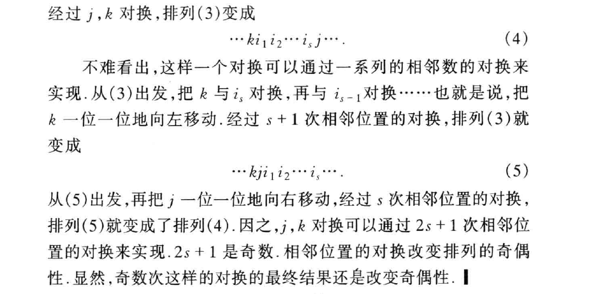

> 全部级排列中, 奇偶排列个数相等.
>
> 证明: 奇排列可以通过某两个位置对换来得到偶排列, 所以奇排列个数  偶排列个数, 反之同理.

+ 主对角线: 左上到右下.

+ 级行列式可以表成个元素乘积的代数和, 在前一个下标有自然排序的情况下, 符号为. 请注意是个元素的乘积.

  + 行列式中的项如果是(乘积): 

    那么符号为$(-1)^{\tau(i_1 \cdots i_n) + \tau(j_1 \cdots j_n)}$

    证明: 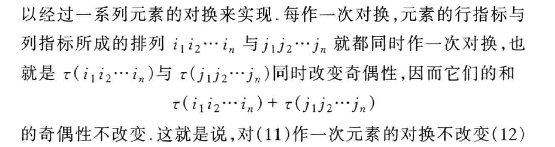

  + 

+ 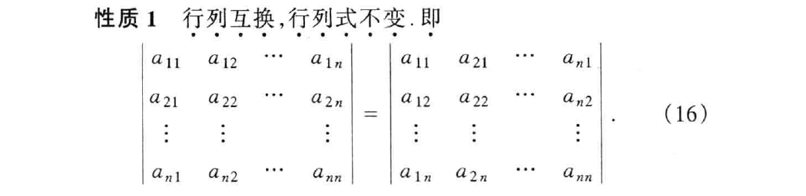

  由上行/列地位平等的性质.

  所以转置行列式 值不变.

+ 行列式交换行/列:

  注意上述性质, 之后前后下标同时互换时符号才不变, 当互换两行时:
  

  对于这一项来说, 符号是改变的, 实际上对于全体都是.

  

### § 4 级行列式的性质

+ 

  证明: 就是行列式定义, 展成一些个元素的乘积和之后, 把提出去.

  + 推论: 行列式中一行为零, 行列式为零.

  

+ 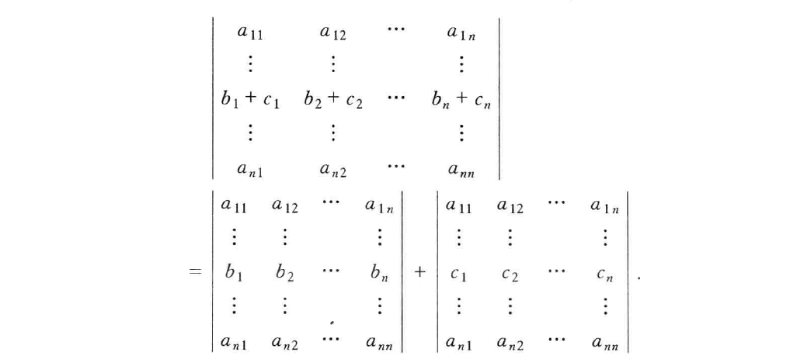

  证明: 同上用定义, 展开后对使用乘法分配率分出来.

  

+ 

   证明: 展开, 写出元素乘积的通项进行对比. 找出那些符号相反绝对值相同的项(可以两两相消).

  

+ 

  证明: 由上性质易证.

  

+ 

  

+ 

  证明: 通过行之间的变换 和 上述性质易证.

  

+  [例] 奇数阶反称行列式等于0.

  证明: 

  做转置, 提-1.

### § 5 行列式的计算

+ 数域上的矩阵: 一个矩阵的元素全是某一数域中的数时.

+ 数域上矩阵的初等行变换:
  + 数域中一个非零的数乘矩阵的某一行;
  + 矩阵某一行的 (中的一个数) 倍加到另一行.
  + 互换矩阵中两行的位置.
+ 初等行变换和列变换统称为 初等变换: 可以用来计算行列式, 注意计算时值可能是有影响的(比如交换两行要变号).

+ 阶梯形矩阵:

  

  + 一个矩阵经过一些列初等行变换总能变成阶梯形矩阵.

### § 6 行列式按一行(列)展开

+   余子式:

  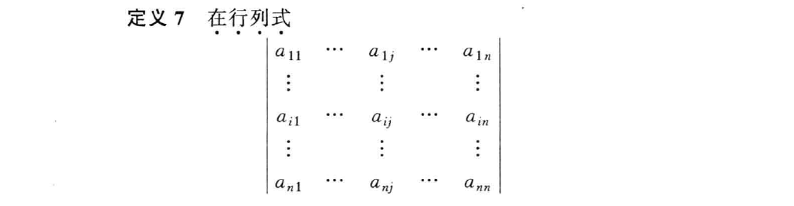

  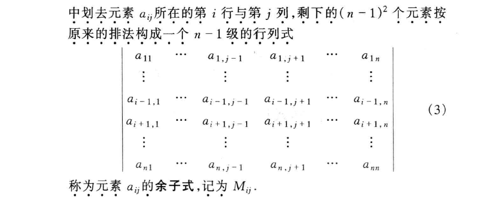

  eg:

  

  

+   代数余子式:

  

以上证明需要拆开来.

+ 行列式中一行的元素与另一行相应元素的代数余子式的乘积之和为零. 即:

  

  证明: 在3级行列式下有很好的几何意义.

  这在某一行/列只有一个非零元素的时候好用.

  

+  范德蒙德(Vandermonde)行列式:

  

  证明: 归纳法 + 初等变换 + 上述代数余子式展开.

+ 分块矩阵行列式:

  

  归纳法证明.

### § 7 克拉默法则

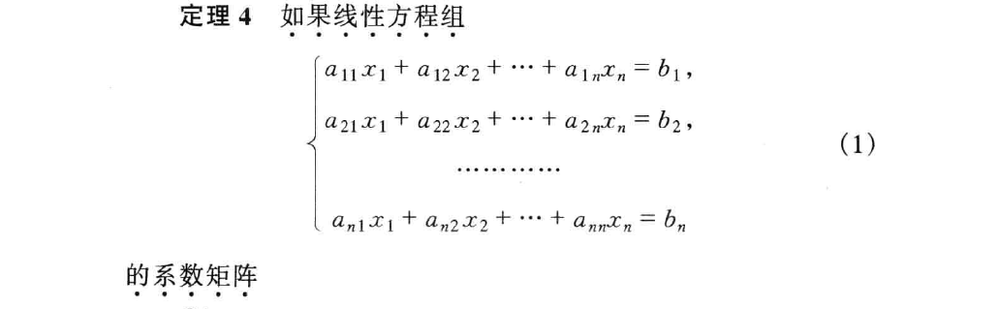

+ 方程组有解
+ 解唯一
+ 解可以由上式给出.

+ 增广矩阵的秩 是线性方程组化为阶梯形矩阵后留下的方程个数.

+ 齐次线性方程组: 常数项全为0. 我们此时关心非零解.

  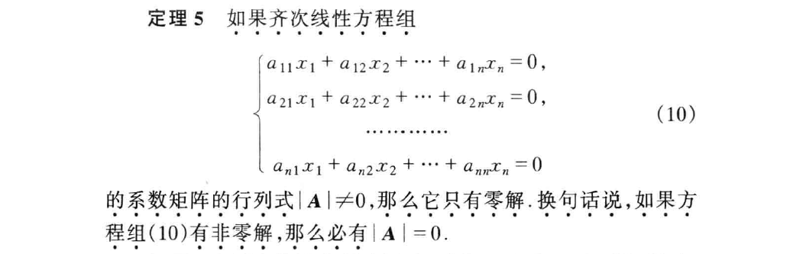

  应用克拉默法则, , 那么只有唯一解, 就是零解.

  注意这里可以用后面行秩  推得

克拉默法则给出了解与系数的明显关系.

### § 8 拉普拉斯(Laplace)定理  行列式的乘法规则

eg:

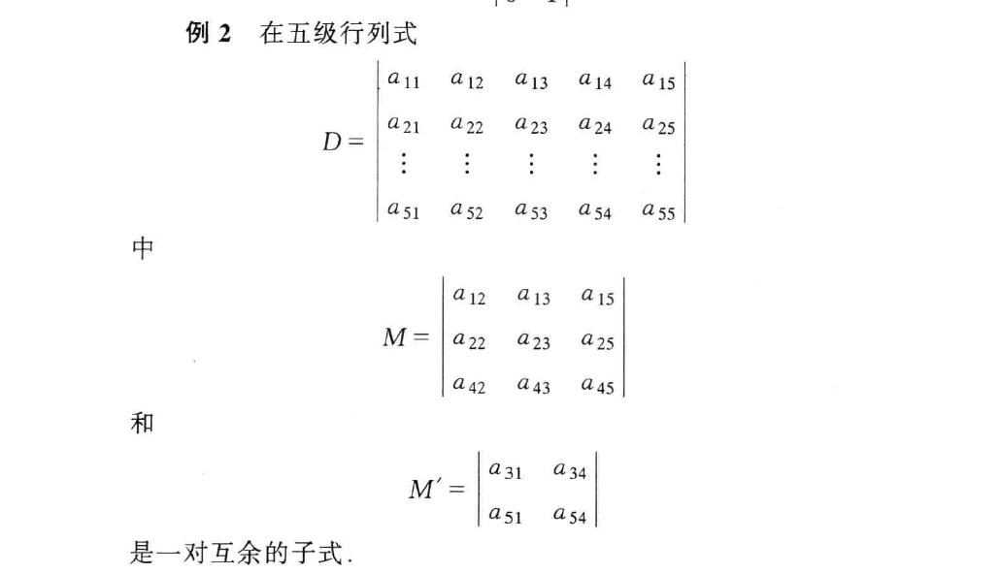

比如上面[例2]里面,  (注意是由原来的哪些行和列构成的) 的代数余子式 (注意这里是级子式的):

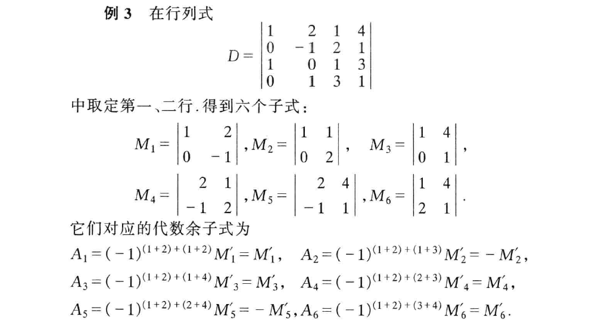
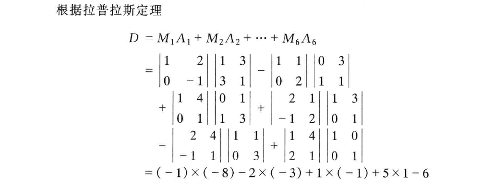

两个行列式的乘积等于另一个行列式: 行列式的乘法定理.

## 第三章 线性方程组

### § 1 消元法

+ 线性方程组的初等变换:
  1. 非零数乘某一方程
  2. 一个方程的倍数加到另一个方程
  3. 互换两个方程的位置
+ 初等变换总是把方程组变成同解的方程组. 一步一步做下去直到得到一个阶梯形方程组.

 讨论两种方程组情况:

1. 

   

2. 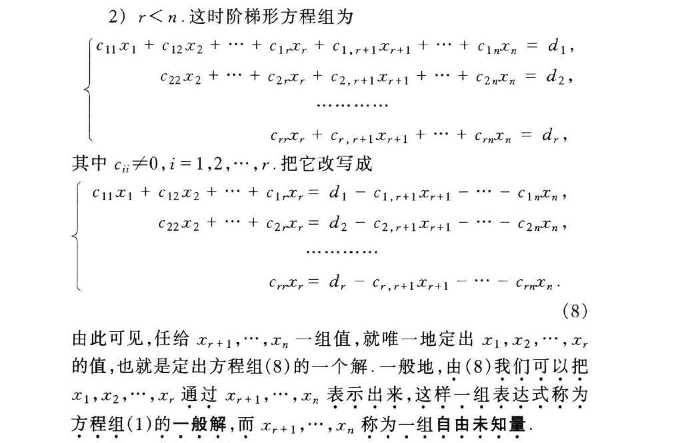

   一般解: 是通过$x_{r + 1}, \cdots , x_n$ (自由未知量) 表出的.

   有无穷多个解.

   

3. , 要不是无解, 要不就是有冗余的方程.

总结: 消元法 1. 初等变换 化为 阶梯形方程组, 2. 最后一个等式如果是零等于非零, 则无解, 否则按照上述两种情况讨论.

+  联合克拉默法则记忆: 齐次线性方程组:

  

  证明: 抓住.

### § 2 维向量空间

+ 维向量: , 其中称为向量的分量.
+ 向量的各种运算操作.

+ 数域上的 维向量空间: 以数域中的数作为分量的维向量的全体, 同时考虑到定义在它们上面的加法和数量乘法.

### § 3 线性相关性

+   可以经向量组  线性表出: 如果有数域中的数: , 使向量, 则向量称为向量组的一个线性组合.

+ 零向量是任一向量组的线性组合.

+ 两个向量组等价:

  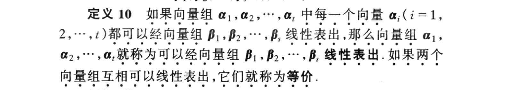

+ 向量组之间的等价有如下性质:

  + 自反性: 每一个向量组和其自身等价.
  + 对称性: 组A和组B等价, 那么组B也和组A等价.
  + 传递性: 

  注意线性表出的定义就很好理解.

+  向量组的线性相关:

  1. 如果向量组中有一个向量可以由其余的向量线性表出. ()

  + (此时不一定其余所有向量都可以由 其他向量 线性表出, 比如存在零向量时)

  

  2. 如果有数域中不全为零的数 使  成立. ()

     所以向量组的一部分线性相关, 那么这个向量组就线性相关.

  

  以上两个定义在时是一致的.

  时即  零向量.

  

+  向量组的线性无关:

  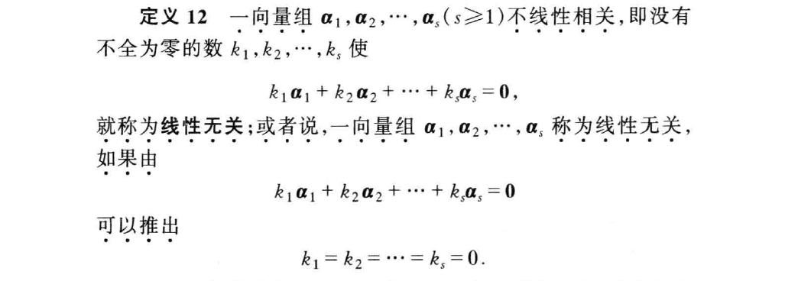

  类比上述部分向量组线性相关的结论:

  如果向量组线性无关, 那么它的任何一个非空部分组也线性无关.

+ 判断线性相关/无关:

  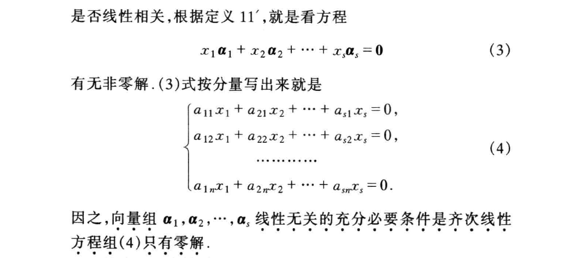

  拆开来去解系数.

+  重要: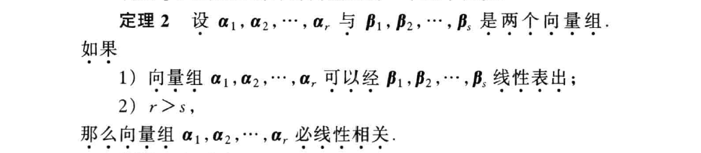

  证明:  线性相关, 即带系数相加等于0, 再套可以用表出.

  记忆: 被一个比自己弱小的(数量严格更少的)线性表出, 那么自己线性相关.

+ 

+ 

  证明: 因为可以被单位向量线性表出.

+ 

+ 一向量组的部分组 极大线性无关组: 如果这个部分组本身是线性无关的, 并且从这向量组中任意添加一个组内其他向量, 所得的部分组都线性相关. (有点像基的概念: 任意组内其他向量都可以被极大线性无关组表出, 所以有:
+ 任意一个极大线性无关组都与向量组本身等价.
+ 极大线性无关组不唯一.

+ 一向量组的极大线性无关组都含有相同个数的向量.
+ 向量组的秩: 向量组的极大线性无关组所含向量的个数.

+ 一向量组线性无关  秩与所含向量的个数相同.
+ 任一个线性无关的部分向量组都能扩充成一个极大线性无关组.
+ 全部由零向量组成的向量组没有极大线性无关组, 秩为零.

### § 4 矩阵的秩

+ 行秩: 矩阵的行向量组的秩.

+ 行秩和列秩相等. 这里证明没搞太懂, 似乎要用到上面向量组线性表出的重要定理, 加入列向量之后仍然线性相关.
+ 以后统称 矩阵的秩.

+ 矩阵的行列式为零  的秩小于, 注意从前往后推需要归纳法, 证明线性相关就是用 系数乘向量和 为0去证.

+ 级子式:

  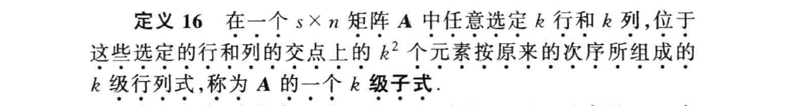

  

+ 矩阵的秩是 (的充要条件是) 矩阵中有一个级子式不为零, 同时所有的级子式全为零.

  证明: 

  + 必要性: 个行向量线性无关, 取出之后 这个矩阵秩为 (列秩为), 所以可以得到一个行列都为的行列式.
  + 充分性: 
    + 矩阵的秩 $< r$, 则$r$级子式为0.
    + 矩阵的秩 $> r$, 则由上存在 $r + 1$ 级子式不为0.

  

+ 最大的 不为零的级所在行列都是极大线性无关组.

+ 计算矩阵的秩:
  
  + 初等行变换 化成阶梯形

### § 5 线性方程组有解判别定理

+  线性方程组有解判别定理: 方程组有解 的充分必要条件为 它的系数矩阵与增广矩阵 有相同的秩.

  注意这里形式化的时候有一个转换:

  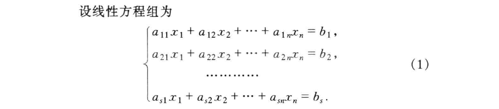

  

  证明:

  + 必要性: 看上面的(3), 说明向量组  可以被  表出, 所以有:
  + 充分性: 找极大线性无关组, 这个极大线性无关组放到含有  的组中也是一个极大线性无关组(因为  加到这个极大线性无关组里面不可能和他们线性无关, 不然秩就更大了), 所以可以被线性表出. 所以有解.

+ 本质就是出现阶梯形这样(如下)之后会无解:

  

+ 当增广矩阵的秩 等于 系数矩阵的秩加一时, 无解.

### § 6 线性方程组解的结构

+ 两个解的和, 一个解的倍数 也是方程组的解.

+  称为一个基础解系:

  方程组的任一个解都能表成的线性组合;

  线性无关. (保证没有多余的解)

+  齐次线性方程组有非零解时, 它有基础解系, 并且基础解系所含解的个数 等于 , 其中为系数矩阵的秩.

  (也是自由未知量的个数)

  证明: (找基础解析的方法)

  秩为  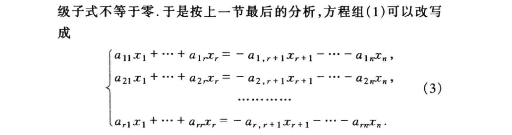

  1.  系数矩阵行列式不为零, 所以方程组只有零解, 所以不存在基础解系

  2.  

     先找到这个解: 自由未知量有 $n - r$ 个 那就用$n - r$个$n - r$维度的单位向量代自由未知量 $(x_{r + 1}, x_{r + 2}, \cdots , x_n)$ 的 $n - r$ 个解, 这样也就求出了方程组的$n - r$个解:

     

     再来证明上面的就是基础解析:

     1. 线性无关: 因为最后$n - r$个分量(单位向量) 所以带着系数乘积和等于零, 那么必须所有系数为零.
     2. 任一个解可以由 $\eta_1, \eta_2 \cdots , \eta_{n - r}$ 线性表出: 设任一个解, 靠解析的最后$n - r$个分量相同 $\Rightarrow$ 自由未知量相同 $\Rightarrow$ 这个任一个解可以被表出.

+ 任意一个线性无关的 与某一个基础解析等价的向量组 都是基础解系.

+ 导出组: 如下 (1) 是 (9) 的导出组

  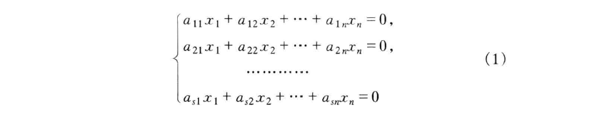

  

  + (9) 的两个解 之差 是导出组的解. (代入易证)
  + (9) 的一个解与它的导出组 (1) 的一个解之和 还是(9)的一个解. (同上代入易证)

+  是方程组(9)的一个特解, 那么(9)的任一解可以表成: , 其中是导出组(1)的一个解.

  方程组(9)的特解 + 导出组(1)的全部解 = 方程组(9)的全部解.

   任意解:
  

  
+ 方程组有解时, 解唯一  它的导出组只有零解.

## 第四章 矩阵

### § 1 ~ 2 矩阵基础

+ 秩()  秩() + 秩()

+ 矩阵乘法适合结合律, 不适合交换律: 注意一般不等于
+ : 单位矩阵.
+ 矩阵的数量乘法是对每个元素都乘这个数.

+ 转置相关: .

### § 3 矩阵乘积的行列式与秩

+ .
+  非退化的: .

+ , 则
  

  乘积的秩不超过各因子的秩.

  (注意类比.)

  推广到个也成立.

### § 4 矩阵的逆

+  是可逆的  .

+  伴随矩阵:

  
  

  上面是由代数余子式 行列式按一行展开的结论; 所以就求出了 的逆:
  

  

  
+ 

+ 

+ ,  且都可逆, 则:
  

  证明: 用矩阵乘积的秩不超过各因子的秩.

### § 5 矩阵的分块

+ 准对角矩阵:

  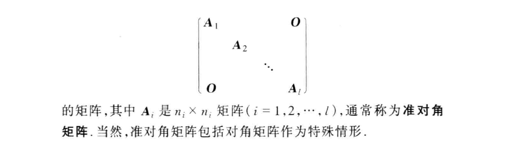

  

### § 6 初等矩阵

+  初等矩阵: 由单位矩阵  经过一次初等变换得到的矩阵称为初等矩阵.

  (有三类)

  + 初等矩阵都是可逆的, 它们的逆还是初等矩阵.

    

  + 引理: 对一个的矩阵作一初等行变换   左乘相应的的初等矩阵. 同理列变换等价于右乘.

+  和  等价, 如果 可以由  经过一系列初等变换得到.

  既然是等价关系, 就满足自反 对称 传递.

+  矩阵的标准形: 任意一个  的矩阵  都与形式为:

  

  的矩阵等价, 这是矩阵的标准形. 1的个数就是秩.

+ 

  等价于 矩阵等价的充要条件是存在可逆矩阵, 使

+  矩阵可逆充要条件:

  + 满秩

  + 能表成一些初等矩阵的乘积: 

    

  + 可逆矩阵总可以经过一系列初等行变换 化成单位矩阵.

  

+  求逆:

  +  太复杂.

  + 

    如果一系列初等行变换把 可逆矩阵$\boldsymbol A$化成了单位矩阵, 那么同样用这一系列初等行变换去化单位矩阵就得到了 $\boldsymbol A^{-1}$.

    所以:

    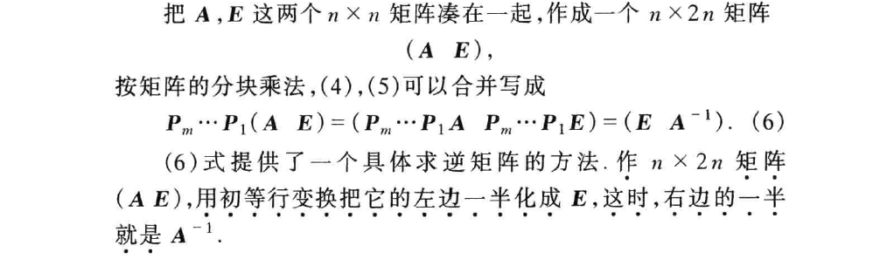

### § 7 分块乘法的初等变换及应用举例

## 第五章 二次型

### § 1 二次型基础

+ 定义:

  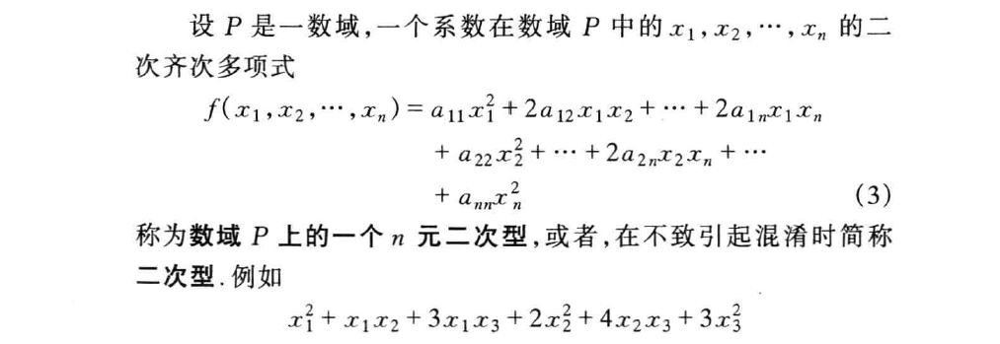

+ 线性替换:

  

  非退化的线性替换后仍然是二次型.

  线性替换矩阵表达:

  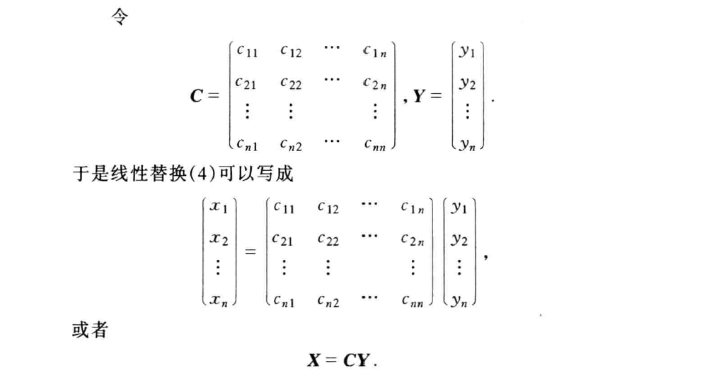

+ 二次型矩阵表达:

  

  

  

  

