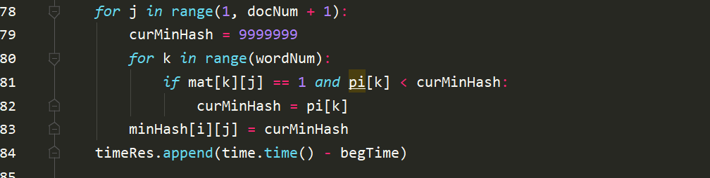
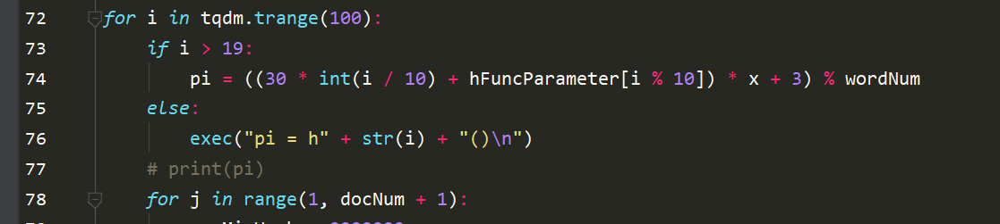
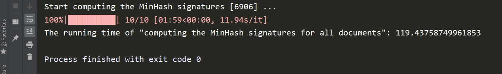
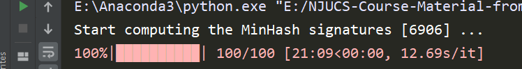
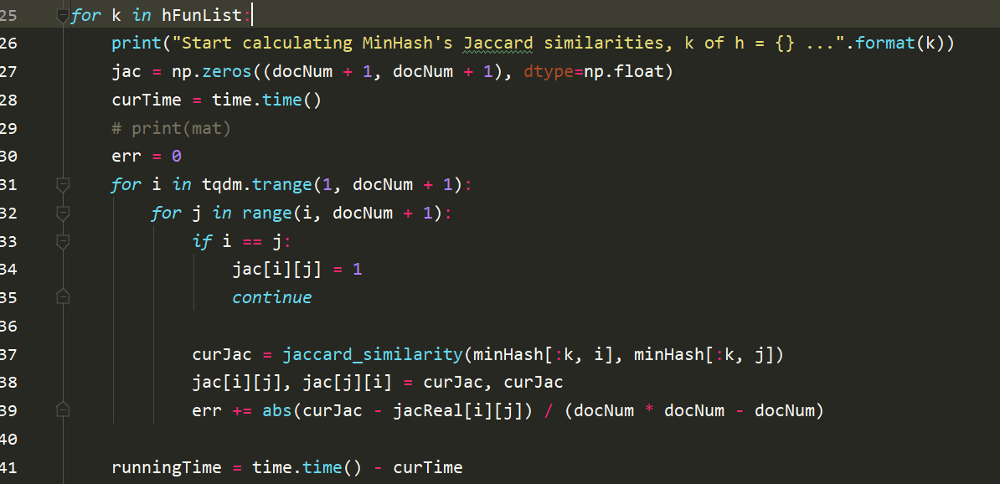
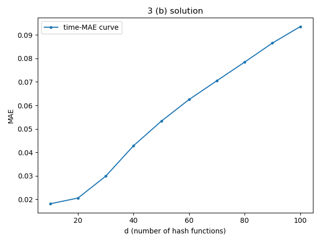
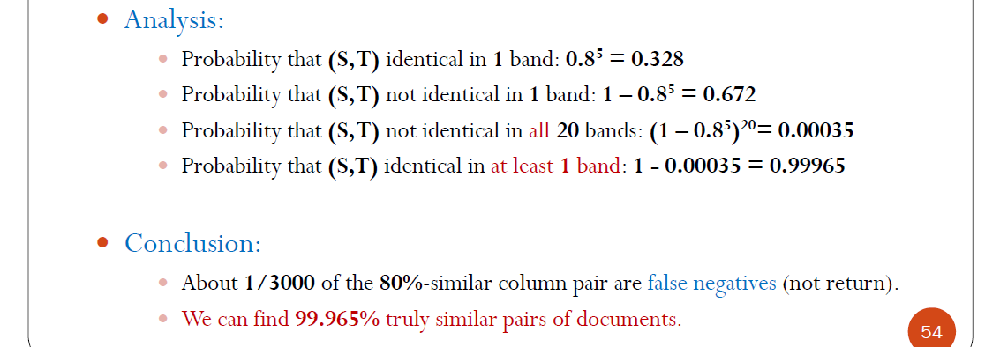

## Report

#### Task - 1: Execute bruteforce computation

读入数据后, 代码中`mat`矩阵中存储文档包含的单词, `jac`中存储所有document pair的jaccard相似度, 其中计算相似度代码如下:

```python
def jaccard_similarity(list1, list2):
    s1 = set(list1)
    s2 = set(list2)
    
    return len(s1.intersection(s2)) / len(s1.union(s2))
```

数据读取代码:

```python
with open(fileName, 'r') as f:
    lines = f.readlines()[3:]
    for line in lines:
        wordList = line.strip('\n').split()
        mat[int(wordList[1]) - 1][int(wordList[0])] = 1
```


以bruteforce的方式遍历所有document pair, 时间复杂度 $\mathcal{O}(n^2)$.

其计算结果被写入文件: `Jaccard-similarities.npy`

**数据集描述**: `docword.kos`: 文档数: 3430, 单词数: 6906, 总词量: 353160

##### (a) The running time of your bruteforce algorithm


共用时: `865.9344 s`

##### (b) The average Jaccard similarity of all pairs except identical pairs

由题意, 我将结果保存在`Jaccard-similarities.npy`文件内, **读取请执行Python代码**:

```python
with open('Jaccard-similarities.npy', 'rb') as f:
    jac = np.load(f)
```

---


#### Task - 2: Compute the MinHash signatures for all documents

首先根据上课所讲的计算MinHash Signature的方式, 对于某个排列$\pi$, 文档$S_i$的所有单词中在排列中第一个出现的下标作为当前排列的签名, 这也是MinHash最小哈希方式的体现, 即:
$$
h_{\pi}(S)= \min(\pi(S))
$$
代码实现方面我与PPT中One-pass MinHash signatures方式完全一致: 

这里依据上课所说, 我们使用 http://www.mmds.org/ 中所述的fast method to "simulate" this randomness using different hash functions: 

尽量保证的哈希函数的随机性: 

##### (a) The running time of this step





+ d = 10 个哈希函数$h(S)$, 共用时: `865.9344 s`
+ d = 100 个哈希函数$h(S)$, 共用时: `1269.3851` s

---


#### Task - 3: Measure the accuracy of MinHash estimators

使用Task-2的输出, 首先计算MinHash的Jarcard相似度: 

再根据MAE计算的公式, 在每个迭代步进行累加:
$$
M A E=\sum_{i, j=1, i \neq j}^{n} \frac{\left|J\left(d_{i}, d_{j}\right)-\hat{J}\left(d_{i}, d_{j}\right)\right|}{n^{2}-n}
$$
**画图的代码**请见: `Task-3-plot.py`


##### (a) The running time of estimating all pairs similarity based on Min-Hash with different values of d

运行截图: 


##### (b) The figure of MAEs with different values of d on x-axis and MAE values on y-axis



##### 


(加分项) 此外, 在测试环节我自己构造了一个较小的数据集 `myTestData.kos.txt`, 来源于Tutorial 1: Locality-sensitive Hashing中的第二题. 结果与Tutorial 2中答案一致. 可以保证正确性.


### Task - 4: Exploit LSH

#### (a) How to tune the parameter b (number of bands) and r (number of rows in one band) so that we achieve the false negatives of 60%-similar pairs at most 10%

首先将Signature Matrix分成一些bands, 每个bands包含一些rows, 然后把每个band哈希到一些bucket中: 

计算过程距离如下(与PPT完全一致):

+ 假设存在一个document pair相似度为80%, 对应的Signature Matrix分成20个bands, 每个bands有5行, 那么有: 
+ 以上分析将用于(a)中的计算.

又因为上述计算过程具有函数单调性, 如下图在每一个固定的$b$, $r$下: 

所以我们可以用**Binary Search**来找到满足题目要求的点

+ **Binary Search**:

  算法将在$x$坐标轴, 即document pair的相似度空间进行二分, 将$1-(1-t^r)^b$的计算结果: **上界下界中点** 与题目所需要的进行比较, 如果更大, 则将上下界中点赋值给下一轮迭代的下界.

  搜索部分算法可以减低到 $\mathcal{O}(log(n))$ 的时间复杂度. 其中$n$为相似度的值空间大小.

对$b, r$的搜索将采用网格搜索的方式, 每一对$b, r$对应了唯一一个满足题目条件的$J(S_1, S_2)$, 所以这种搜索方式是可以找到解的.

即有:
$$
1 - (1 - 0.6^r)^b = 1-10\%
$$
又 $r\cdot b = 100$, 我们可以得到解:
$$
b = 20, r = 5 \Rightarrow 0.19809754616177833
$$

$$
b = 25, r = 4 \Rightarrow 0.03111516145458214
$$


#### (b) The space usage affected by these parameters

由上分析我们知道, LSH算法的space usage与分成$b$个bands, 所映射到的哈希表的数量密切相关, 不妨设哈希表有$n$个entries, 哈希表数为$L$(与$b, r$的选择密切相关), 则空间复杂度为 $\mathcal{O}(nL)$

在上述计算过程中, 空间复杂度为 $\mathcal{O}(\max \{docNum, wordsNum\}^2)$


#### (a) The false candidate ratio / (b) The probability that a dissimilar pair with Jaccard <= 0.3 is a candidate pair

如果两个document的bands中, 至少有一个share了同一个bucket, 那这两个document就是candidate pair, 也就是很有可能是相似的.

对于每一个固定的$b, r$, 一个pair是candidate pair的概率为$1 - (1 - t^r)^b$, 其中$t$为相似度.

我们使用 $b = 20, r = 5$.


得到(a)题结果为0.0004409, (b)题结果为0.002629.