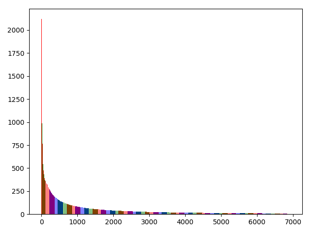
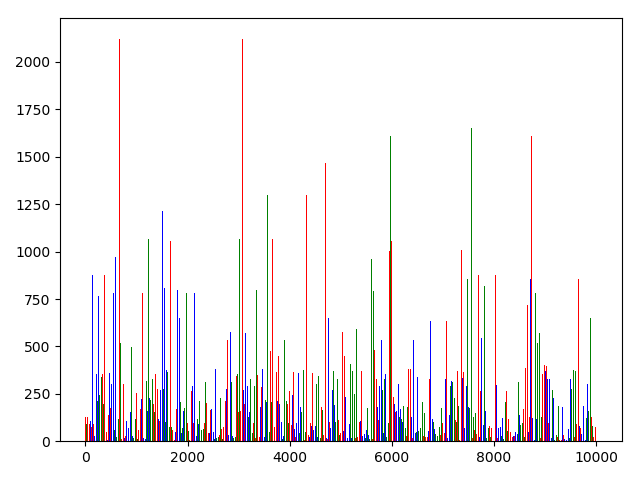
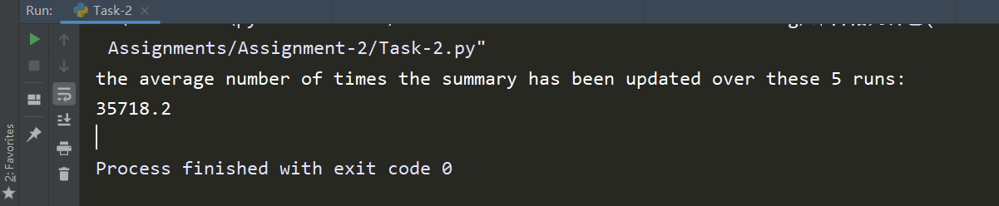
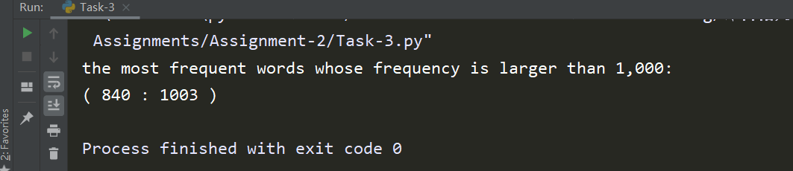
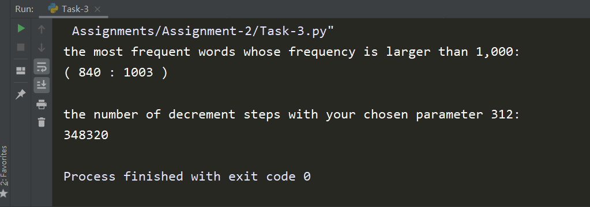
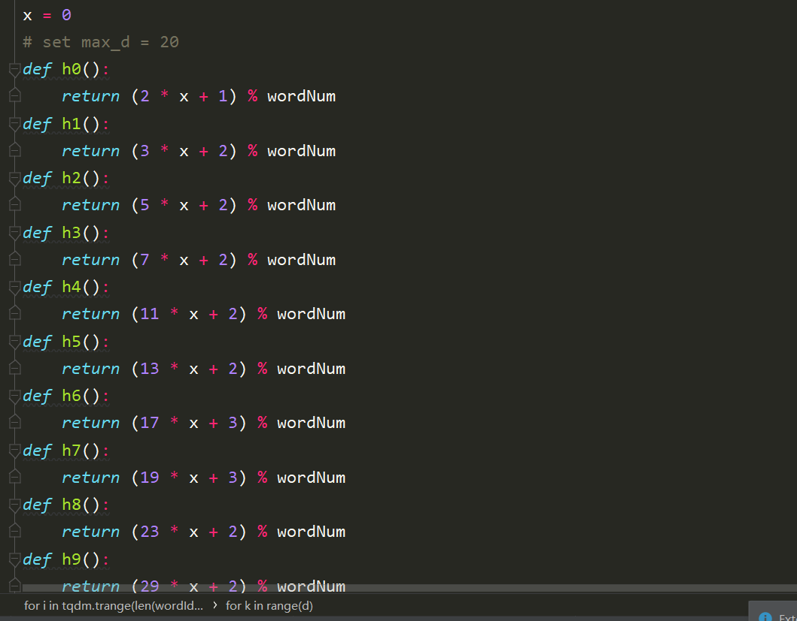
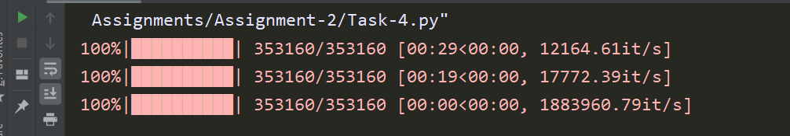

## Report

[TOC]

#### Task - 1: Execute bruteforce computation

读入数据后, **用字典计算词频即可, 代码如下**:

```python
with open(fileName, 'r') as f:
    lines = f.readlines()[3:]
    for line in lines:
        wordList = line.strip('\n').split()
        wordId, docId = int(wordList[1]) - 1, int(wordList[0])
        # dictionary for counting word frequency:
        countDict[wordId] = countDict[wordId] + 1 if wordId in countDict else 1

# sorted by word frequency:
countSortList = sorted(countDict.items(), key=lambda x: x[1], reverse=True)
```


以bruteforce的方式遍历所有document pair, 时间复杂度 $\mathcal{O}(n^2)$.

其计算结果被写入文件: `Sorted-Word-Frequency.npy`

**数据集描述**: `docword.kos`: 文档数: 3430, 单词数: 6906, 总词量: 353160

##### (a) The running time of your bruteforce algorithm


平均词频: `51.1381`

##### (b) 图像:



其中词频从大到小排列.


#### Task - 2: Reservoir Summary

实现Reservoir Sampling函数, 由PPT中讲述, 我们有:

```python
def selectKItems(stream, k):
    i, n = 0, len(stream)
    reservoir = [0] * k
    for i in range(k):
        reservoir[i] = stream[i]

    while (i < n):
        j = random.randrange(i + 1)
        if (j < k):
            reservoir[j] = stream[i]
        i += 1

    return reservoir
```

如上代码, 先取前 $k$ 个元素, 然后在每一个 $0 \rightarrow i$ 中取随机数, 当该随机数 $< k$ 时, 将 $i$ 与 这个随机数对应的元素互换. 可以证明每个元素被选取的概率是一致的.

##### (a) Estimate the frequency vector from our Reservoir Summary, and plot this estimate vector to see the approximation skewness



`S = 10000` 时, 用Reservoir Sampling的方法从353160个pair中抽取的词的词频分布结果如上, 看得出来足够随机.

##### (b) Run your Reservoir Sampling 5 times and report the average number of times the summary has been updated over these 5 runs (5 pts).

从 353160 中抽取 10000:



平均更新次数: `35718.2`


---


#### Task - 3: Misra-Gries Summary

由PPT中说明以及例子, Misra-Gries Summary算法的代码如下:

```python
def MisraGriesSummary(stream, k):
    A = {}
    for i in stream:
        if i in A.keys():
            A[i] += 1
        elif len(A) < k - 1:
            A[i] = 1
        else:
            for j in list(A.keys()):
                A[j] -= 1
                if A[j] == 0:
                    del A[j]
    return A
```

##### (a)

采用二分法对全空间进行搜索, 得到`the size of summary = 312`时, 我们可以find the most frequent words whose frequency is larger than 1,000:



##### (b)



stream的大小为: `353160`,

the number of decrement steps with your chosen parameter 312: `348320`.

#### Task - 4: CountMin Sketch (15 pts):

##### (a)

选择 `d = 9`:

compute the positions for each element in stream && Construct the CountMin Sketch:

```python
for i in tqdm.trange(len(wordIdList)):
    for k in range(d):
        x = wordIdList[i]
        # First we compute the positions for each element in stream:
        exec("hList[" + str(k) + "].append(h" + str(k) + "())\n")
        # Construct the CountMin Sketch:
        cur = hList[k][len(hList[k]) - 1]
        hDict[k][cur] = hDict[k][cur] + 1 if cur in hDict[k].keys() else 1
```

非常多的hash函数选择: 

并且通过 `exec("hList[" + str(k) + "].append(h" + str(k) + "())\n")` 代码, 我可以灵活地调整hash函数的个数(也就是`d`的数量).

##### (b)

