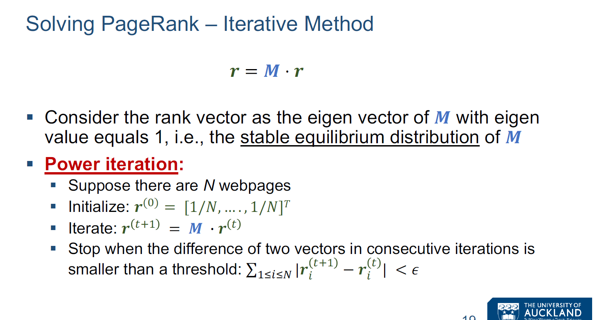
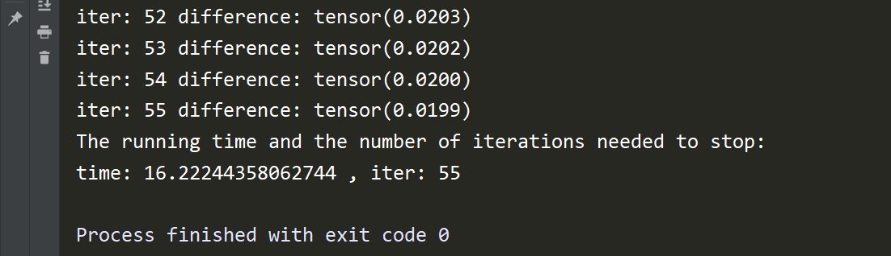
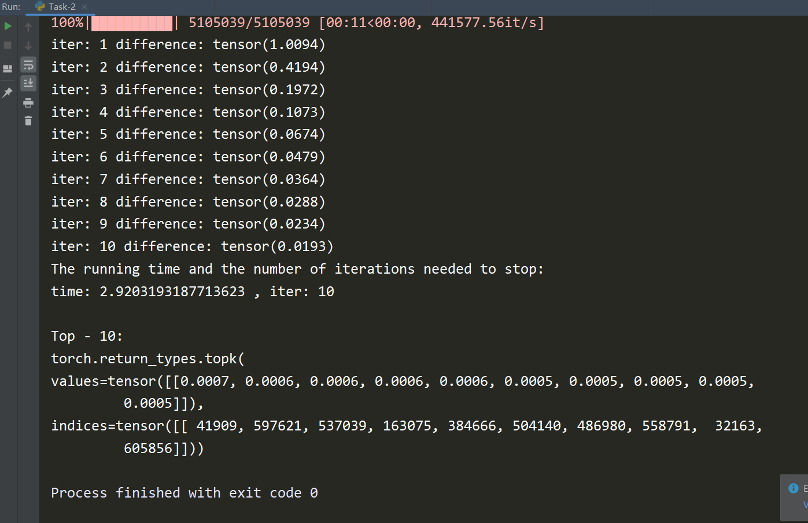
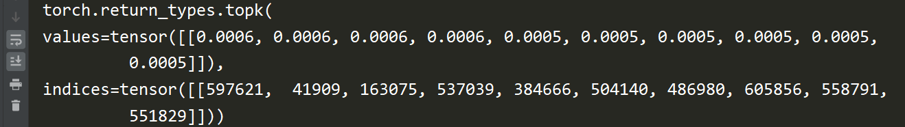

## Report

[TOC]

#### Task - 1:



按照PageRank迭代方法实现代码. 其中循环内迭代方式如上, 按部就班即可.

```python
spar = torch.sparse.FloatTensor(idx.t(), val, torch.Size([N, N]))
rt = torch.ones((N, 1)) / N
epsilon, err = 0.02, 99
iter = 1
while err > epsilon:
    befRt = rt.clone().detach()
    rt = torch.sparse.mm(spar, rt)
    err = torch.sum(torch.abs(torch.sub(befRt, rt)))
    print("iter:", iter, "difference:", err)
    iter += 1
```

请注意这里的邻接矩阵非常大, 一般的存储方式存不下, 我使用了PyTorch框架下的 sparse tensor 存储(与PPT内原理一致), 来实现该任务的内容. 这里 邻接矩阵的构造需要遵循 PyTorch框架 相应接口函数, 比较复杂, 具体请看代码.

##### 运行截图:




时间 `16.2224 s`, 迭代次数: `55`.

Top - 10: 

如上, 红线为结点ID. 实现代码如下:

```python
print(torch.topk(rt.t(), 10))
```


#### Task - 2

##### (1), (2)

时间 `2.9203 s`, 迭代次数: `10`.

##### 运行截图:



##### (3)

the number of iterations needed to stop:

| $\beta$: 1 | 0.9  | 0.8  | 0.7  | 0.6  | 0.5  |
| ---------- | ---- | ---- | ---- | ---- | ---- |
| 55         | 10   | 7    | 5    | 5    | 4    |


#### Task - 3

##### (1)

The leaked PageRank score:

| $\beta$: 1         | 0.9                | 0.8                | 0.7                 | 0.6                 | 0.5                 |
| ------------------ | ------------------ | ------------------ | ------------------- | ------------------- | ------------------- |
| 0.8004124164581299 | 0.3602239489555359 | 0.2638355493545532 | 0.20252364873886108 | 0.16083478927612305 | 0.12409347295761108 |

##### (2)

$\beta = 0.9$ 时, The leaked PageRank score 在每个迭代步时:

iter: 1 difference: tensor(1.0094)
0.17378276586532593
iter: 2 difference: tensor(0.4194)
0.23841136693954468
iter: 3 difference: tensor(0.1972)
0.27060163021087646
iter: 4 difference: tensor(0.1073)
0.29257869720458984
iter: 5 difference: tensor(0.0674)
0.3103472590446472
iter: 6 difference: tensor(0.0479)
0.3244209289550781
iter: 7 difference: tensor(0.0364)
0.33611583709716797
iter: 8 difference: tensor(0.0288)
0.3456370234489441
iter: 9 difference: tensor(0.0234)
0.3536241054534912
iter: 10 difference: tensor(0.0193)
0.3602239489555359

##### (3)

在(b)题中, $\beta = 0.9$ 的每个循环迭代步内, the leaked PageRank score 单调上升. 在(a)题中, 随着 $\beta$ 的下降, the leaked PageRank score 单调下降. 这和the number of iterations needed to stop的变化趋势是一致的.


#### Task - 4

##### (1)

```python

with open(fileName, 'r') as f:
    lines = f.readlines()[4:]
    for i in tqdm.trange(len(lines)):
        tmpSplit = lines[i].split('\t')
        u = int(tmpSplit[0])
        mapNum[u] = 1 if u not in mapNum.keys() else mapNum[u] + 1

with open(fileName, 'r') as f:
    lines = f.readlines()[4:]
    for i in tqdm.trange(len(lines)):
        tmpSplit = lines[i].split('\t')
        u = int(tmpSplit[0])
        if mapNum[u] == 1:
            for i in range(N):
                idxTmp.append([i, u])
            mapNum[u] = N
        else:
            idxTmp.append([int(tmpSplit[1]), u])
```

如上代码, 位于:

```python
        if mapNum[u] == 1:
            for i in range(N):
                idxTmp.append([i, u])
            mapNum[u] = N
```

做了: Adjust the graph and link the dead ends to all other nodes with equal prob. Let the new transition matrix be $M'$.

Iteration: 9

