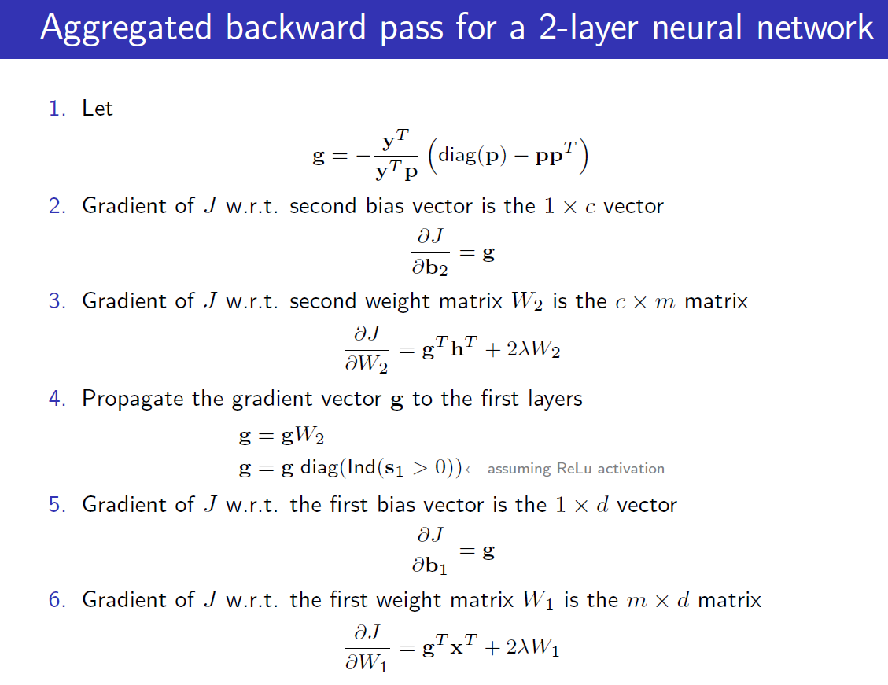
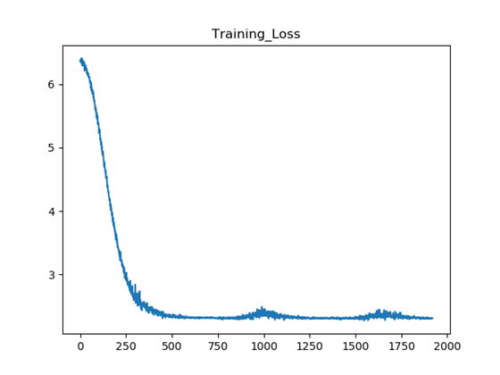

## 2. A brief pdf report with the following content:

##### i) State how you checked your analytic gradient computations and whether you think that your gradient computations were bug free.

Give evidence for these conclusions.

+ 解: 我的梯度实现遵循每一步的正确求解梯度过程: 

  在代码中的实现与上图手写的求解梯度过程可以一一对应, 请注意下面代码中的注释说明了这一点:

  ```python
  def backward(self, X_, y_, outputs_, loss_):
      N, hdim = X_.shape[1], self.W2.shape[1]
      b1Grad, b2Grad, W1Grad, W2Grad = np.zeros((hdim, 1)), np.zeros((self.C, 1)), \
                                       np.zeros((hdim, self.D)), np.zeros((self.C, hdim))
      for i in range(N):
          X, y, p, h = X_[:, i], y_[:, i], outputs_[:, i], self.h[:, i]
          X, y, p, h = \
              np.expand_dims(X, axis=1), np.expand_dims(y, axis=1), np.expand_dims(p, axis=1), np.expand_dims(h, axis=1)
          pDiag = np.multiply(np.eye(p.shape[0]), p)
          # g: (1, C)
          # 这里对应第一步 g 的求解:
          g = -((y.T / (y.T @ p)) @ (pDiag - p @ p.T))
          # 这里对应第二步 \partial b 的求解:
          b2Grad += g.T
          # W2Grad: (C, hdim)
          # 这里对应第三步 \partial W_2 的求解:
          W2Grad += (g.T @ h.T)
          if (self.args.leaky_ReLU):
              h = np.where(h > 0, 1, 0.01)
          else:
              h = np.where(h > 0, 1, 0)
          # self.W2: (C, hdim)
          # g: (1, hdim)
          # 这里对应新的 g (更新步) 的求解:
          g = (g @ self.W2) @ np.multiply(np.eye(h.shape[0]), h)
          # 这里对应 \partial b_1 的求解:
          b1Grad += g.T
          # 这里对应 W_1 的求解:
          # W1Grad: (hdim, features)
          W1Grad += (g.T @ X.T)
  
      W1Grad, W2Grad = \
          2 * self.args.Lambda * self.W1 + W1Grad / N, 2 * self.args.Lambda * self.W2 + W2Grad / N
      b1Grad, b2Grad = \
          b1Grad / N, b2Grad / N
  
      # 更新 momentum 和对应的梯度:
      self.W1_momentum = self.W1_momentum * self.args.rho + self.eta * W1Grad
      self.W2_momentum = self.W2_momentum * self.args.rho + self.eta * W2Grad
      self.b1_momentum = self.b1_momentum * self.args.rho + self.eta * b1Grad
      self.b2_momentum = self.b2_momentum * self.args.rho + self.eta * b2Grad
  
      self.W1 -= self.W1_momentum
      self.b1 -= self.b1_momentum
      self.W2 -= self.W2_momentum
      self.b2 -= self.b2_momentum
  ```

  在检查梯度计算的过程中, 我保证每一步实现的方法(使用 `@` 算子)与PPT中手写求解的过程一一对应, 保证每一层的计算结果都是正确的, 这样就可以保证梯度的计算是正确的.

  在实现代码的过程中也遇到了一些问题: 比如因为 `*` 与 `@` 算子混淆导致的维度出错, 不过很快被我发现并改正了.

  

##### ii) The curves for the training and validation loss/cost when using the cyclical learning rates with the default values, that is replicate figures 3 and 4. Also comment on the curves.



可以发现Training Loss整体是明显的下降趋势, 因为这里只训练了5个epoch, 对超参数的搜索也有限, 否则Training loss还能降到更低.


##### iii) State the range of the values you searched for lambda, the number of cycles used for training during the coarse search and the hyper-parameter settings for the 3 best performing networks you trained.

##### iv) State the range of the values you searched for lambda, the number of cycles used for training during the ne search, and the hyper-parameter settings for the 3 best performing networks you trained.

在这里我设置了`decay_eta`参数对$\eta$进行搜索, `Lambda`的值也被设置成命令行参数方便调整. 训练epoch为6.

###### Coarse Search:

$$
\eta = 0.01, 0.02, 0.03, 0.05, 0.1, 0.2, 0.5, 0.75;
$$

$$
\lambda = 0, 0.001, 0.005, 0.01, 0.25, 0.5, 0.75, 1
$$

$$
8 \times 8 = 64
$$

如上, 初始值有64种组合.

其中最优组合为:
$$
\eta = 0.02, \lambda = 0.01
$$
其中训练集上准确率为0.4803


##### v) For your best found lambda setting (according to performance on the validation set), train the network on all the training data (all the batch data), except for 1000 examples in a validation set, for $\sim$ 3 cycles. Plot the training and validation loss plots and then report the learnt network's performance on the test data.

