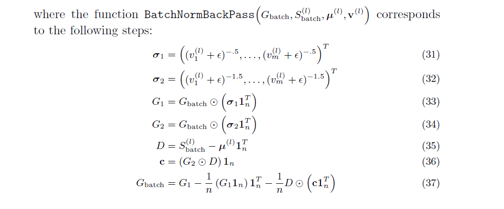
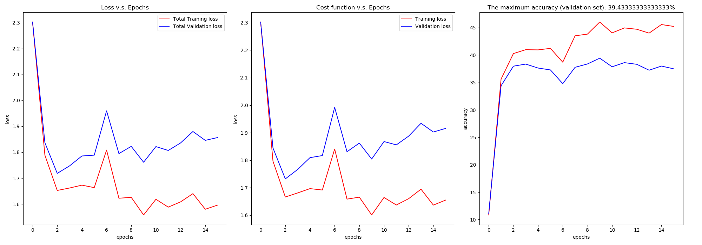
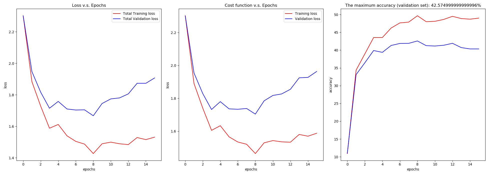
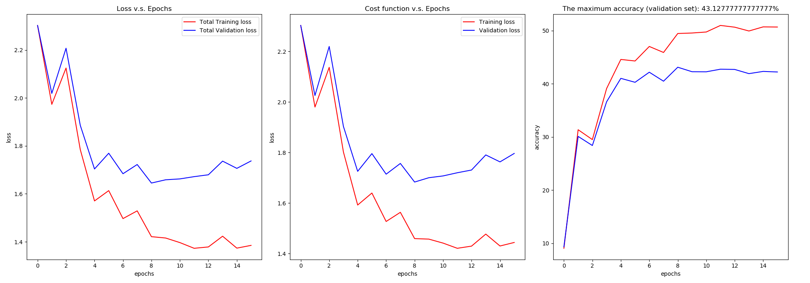
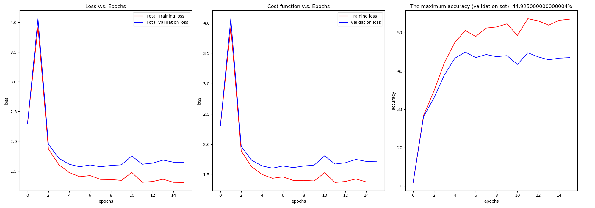

## Report

##### i) State how you checked your analytic gradient computations and whether you think that your gradient computations are bug free for your k-layer network with batch normalization.

+ 解: 由神经网络的前向传播过程, 先手写梯度下降法反向传播中的梯度形式:
  $$
  \begin{aligned}
  \mathbf{s}^{(l)}=&W_{l} \mathbf{x}^{(l-1)}+\mathbf{b}_{l} \\
  \hat{\mathbf{s}}^{(l)}=&\text{BatchNormalize }\left(\mathbf{s}^{(l)}, \boldsymbol{\mu}^{(l)}, \mathbf{v}^{(l)}\right) \\
  \tilde{\mathbf{s}}^{(l)}=&\gamma_{l} \odot \hat{\mathbf{s}}^{(l)}+\boldsymbol{\beta}_{l} \\
  \mathbf{x}^{(l)}=&\max \left(0, \tilde{\mathbf{s}}^{(l)}\right) \\
  \mathbf{s}=&W_{k} \mathbf{x}^{(k-1)}+\mathbf{b}_{k} & \\
  \mathbf{p}=&\operatorname{softmax}(\mathbf{s}) &
  \end{aligned}
  $$
  where:
  $$
  \text { BatchNormalize }\left(\mathbf{s}^{(l)}, \boldsymbol{\mu}^{(l)}, \mathbf{v}^{(l)}\right)=\left(\operatorname{diag}\left(\mathbf{v}^{(l)}+\epsilon\right)\right)^{-\frac{1}{2}}\left(\mathbf{s}^{(l)}-\boldsymbol{\mu}^{(l)}\right)
  $$
  该任务中定义的 带正则项的 交叉熵损失函数为:
  $$
  J(\mathcal{B}, \lambda, \boldsymbol{\Theta})=\frac{1}{n} \sum_{i=1}^{n} l_{\text {cross }}\left(\mathbf{x}_{i}, y_{i}, \mathbf{\Theta}\right)+\lambda \sum_{i=1}^{k}\left\|W_{i}\right\|^{2}
  $$
  这里喂给网络训练的数据都是由PyTorch规范的分batch形式. 数据第一维度为batch下标.

  此外在`Assignment3.pdf`第4页中详述了求导过程, 这里不再赘述, 有些要注意的容易犯错的点为:

  + 层与层之间: 每一层的梯度传递是基本一致的, 因为所有参数整理成了一个矩阵.

    每个iteration里第一次计算梯度时候, 还有网络的输出层(最后一层)计算梯度是略有不同的(考虑一些初始值).

    单独对每个特征进行normalizaiton, 让每个特征都有均值为0, 方差为1的分布就OK. 层与层之间的梯度更新不是整体的.

  + 对于一个特定的层: `the scale and offset parameters` 和 cost function 的`bias vector` 求梯度过程是基本一致的.

  + batch normalize 的梯度过程较为复杂, 具体见下图: 

    代码实现如下:

    ```python
    def batch_norm_back_pass(g, s, mu, var):
        s_mu = s - mu
    
        grad_var = - 1 / 2 * (g * (var ** (-3 / 2)) * s_mu).sum(axis=1)
        grad_mu = - (g * (var ** (-1 / 2))).sum(axis=1)
    
        grad_var = np.expand_dims(grad_var, 1)
        grad_mu = np.expand_dims(grad_mu, 1)
        grad_s = g * (var ** (-1 / 2)) + (2 / s.shape[1]) * grad_var * s_mu + grad_mu / s.shape[1]
        return grad_s
    ```

    

+ 前向传播代码:

  ```python
  def scores(X, W, b):
      return np.dot(W, X) + b
  
  s = scores(h_ls[-1], W[i], b[i])
  mu = s.mean(axis=1)
  mu = np.expand_dims(mu, axis=1)
  var = s.var(axis=1)
  var = np.expand_dims(var, axis=1)
  
  s_norm = (s - mu) / np.sqrt(var)
  h = activation_func(s_norm)
  ```

+ 反向传播代码:

  其中 $l < k - 1$.

  ```python
  g = batch_norm_back_pass(g, scores[i], mu[i], var[i])
  grad_W[i] = np.dot(g, h[i].T) / x.shape[1]
  grad_b[i] = g.sum() / x.shape[1]
  
  g = np.dot(g.T, W[i])
  s_1 = np.copy(h[i])
  if mode == 'ReLU':
      ind = 1 * (s_1 > 0)
  elif mode == 'LeakyReLU':
      ind = (1 * (s_1 > 0) + 0.01 * (s_1 < 0))
      g = np.multiply(g.T, ind)
  ```

  对比`Assignment3.pdf`第4页中手写求梯度过程, 可以发现代码的实现是正确的.


+ 检查梯度求解的正确性:

  我实现了函数 `check_grad`, 详细逻辑为:

  + 矩阵相乘形式的梯度, 与 每个元素分别求得的梯度 进行比较.

    其中每个元素每个元素的梯度求解过程为:

    ```python
    for lay in range(GDparams.num_lay):
        grad_W_num = np.zeros_like(np.copy(W[lay]))
        for i in range(W[lay].shape[0]):
            for j in range(W[lay].shape[1]):
                W_try = np.copy(W)
                W_try[lay][i][j] -= h
                c1 = compute_cost(X, Y, W_try, b, GDparams.lamda)[0]
                W_try[lay][i][j] += h
                W_try = np.copy(W)
                W_try[lay][i][j] += h
                # ......
        grad_W_num_ls.append(grad_W_num)
    ```

    如上, 在检查梯度时程序运行非常慢, 但是可以保证每个参数按照梯度方向走.

  + 利用按照每个元素计算得到的梯度, 将其与训练代码中的矩阵计算梯度进行比较, 要求其相差的值小于 $\epsilon$(一个小量).

  这样即验证了梯度求解是正确的.

+ 预测阶段: 所有参数的取值是固定的, 采用训练收敛最后几批次 mini-batch 的 $\mu$ 和 $\sigma$ 的期望, 作为预测阶段的 $\mu$ 和 $\sigma$.


##### ii) Include graphs of the evolution of the loss function when you train the 3-layer network with and without batch normalization with the given default parameter setting.






##### iii) Include graphs of the evolution of the loss function when you train the 9-layer network with and without batch normalization with the given default parameter setting.




##### iv) State the range of the values you searched for lambda when you tried to optimize the performance of the 3-layer network trained with batch normalization, and the lambda settings for your best performing 3-layer network. Also state the test accuracy achieved by this network.

+ 解: 我使用组合遍历的方法对参数空间进行搜索, 使用单隐含层(总共三层)网络, 与上一次Assignment一致, 搜索 $\lambda$ 的范围为:
  $$
  \lambda = 0, 0.001, 0.005, 0.01, 0.25, 0.5, 0.75, 1
  $$
  

  其中 $\lambda = 0.001$


##### v) Include the loss plots for the training with Batch Norm Vs no Batch Norm for the experiment related to Sensitivity to initialization and comment on your experimental findings.

+ 解:

  Batch normalization是训练深度神经网络时将每个mini-batch的输入normalization到layer, 让其稳定学习过程, 大大减少了训练深度网络所需的训练时间.

  我们假设training set和test set是 i.i.d, 从而在test set上有很好的效果, 实际会出现Internal Covariate Shift问题. Batch Normalization的出发点即为这个. 但是BN效果和初始化是密切相关的.

  我考虑的初始化方法如下:

  1. **random initialization**

     ```python
     np.random.randn(inputNum, outputNum) * 0.01
     ```

     这样初始化权重的均值是0, 方差是0.01, 但随着层数的增加, 输出值迅速向0靠拢, 因为back propogation时gradient越来越小, 参数更新困难.

  2. **He initialization**

     ```python
     np.random.randn(inputNum, outputNum) / np.sqrt(inputNum/2)
     ```

     He initialization是Xavier Initialization的变种: 在ReLU中假定每一层有一半的神经元被激活, 另一半为0. 所以要保持variance不变只需要在Xavier的基础上再除以2.

