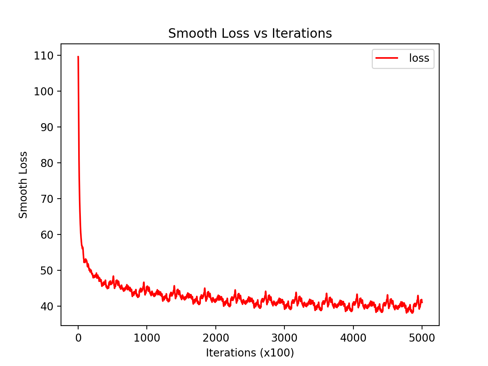
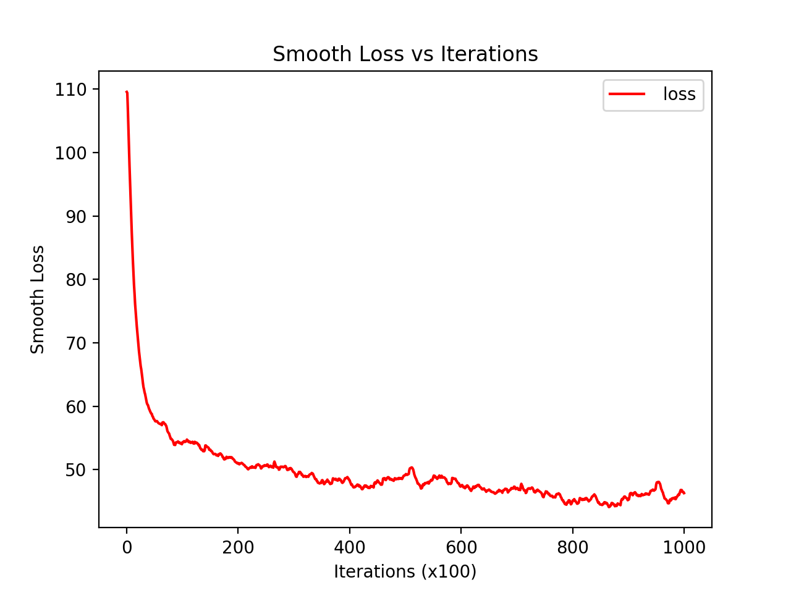

## Report

#### i) State how you checked your analytic gradient computations and whether you think that your gradient computations are bug free for your RNN.

+ 解:

  首先我们构建RNN的数学表达形式, 其中输入 $x \in \mathbb{R}^d$, 隐含层维度为 $m$, 输出层结点数(类别数)为 $K$, 我们有 前向传播过程为:
  $$
  \begin{aligned}
  \mathbf{a}_{t} &=W \mathbf{h}_{t-1}+U \mathbf{x}_{t}+\mathbf{b} \\
  \mathbf{h}_{t} &=\tanh \left(\mathbf{a}_{t}\right) \\
  \mathbf{o}_{t} &=V \mathbf{h}_{t}+\mathbf{c} \\
  \mathbf{p}_{t} &=\operatorname{SoftMax}\left(\mathbf{o}_{t}\right)
  \end{aligned}
  $$
  其中 $\mathbf{x}_t$ 为第 $t$ 个时间步的输入. 按照上面的前向传播数学表达, 代码实现为:

  ```python
  for t in range(len(X_in)):
      x_ti = np.expand_dims(X_hot[:, t], axis=1)
      x[t] = np.copy(x_ti)
      a = np.dot(W, h_store[t - 1]) + np.dot(U, x[t]) + b
      h_store[t] = np.tanh(a)
      out[t] = np.dot(V, h_store[t]) + c
      softmax[t] = np.exp(out[t]) / np.sum(np.exp(out[t]))
  
      y_ti = np.expand_dims(Y_hot[:, t], axis=1)
      y[t] = np.copy(y_ti)
      loss += -np.log(np.dot(y[t].T, softmax[t]))[0][0]
  ```

  请注意RNN中每一次的输入与上一层时间步的输出有关, 这体现在隐含层的输入中:

  ```python
  a = np.dot(W, h_store[t - 1]) + np.dot(U, x[t]) + b
  h_store[t] = np.tanh(a)
  ```

  最后损失函数接到交叉熵:
  $$
  L\left(\mathrm{x}_{1: \tau}, \mathrm{y}_{1: \tau}, \Theta\right)=\sum_{t=1}^{\tau} l_{t}=-\sum_{t=1}^{\tau} \log \left(\mathrm{y}_{t}^{T} \mathrm{p}_{t}\right)
  $$
  在PPT内有直观详细的例子: 

  

  + 反向传播过程 Back-prop for a vanilla RNN (详细请见 PPT `Lecture9.pdf`):
    $$
    \frac{\partial L}{\partial V}=\sum_{t=1}^{\tau} \mathbf{g}_{t}^{T} \mathbf{h}_{t}^{T} \\
    \frac{\partial L}{\partial \mathbf{h}_{\tau}}=\frac{\partial L}{\partial \mathbf{o}_{\tau}} V \\
    \frac{\partial L}{\partial \mathbf{h}_{t}}=\frac{\partial L}{\partial \mathbf{o}_{t}} V+\frac{\partial L}{\partial \mathbf{a}_{t+1}} W \\
    \frac{\partial L}{\partial \mathbf{a}_{t}}=\frac{\partial L}{\partial \mathbf{h}_{t}} \operatorname{diag}\left(1-\tanh ^{2}\left(\mathbf{a}_{t}\right)\right) \\
    \frac{\partial L}{\partial W}=\sum_{t=1}^{\tau} \mathbf{g}_{t}^{T} \mathbf{h}_{t-1}^{T} \\
    \frac{\partial L}{\partial U}=\sum_{t=1}^{\tau} \mathbf{g}_{t}^{T} \mathbf{x}_{t}^{T}
    $$
    由上述结果, 在每个迭代内计算梯度的代码实现为:

    ```python
    for t in reversed(range(len(X_in))):
        grad_o = softmax[t]
        grad_o[Y_out[t]] -= 1
    
        # hidden -> output (weight and bias)
        grad_V += np.dot(grad_o, h_store[t].T)
        grad_c += grad_o
    
        grad_h = np.dot(V.T, grad_o) + np.dot(W.T, grad_a)
        grad_a = grad_h * (1 - (h_store[t] ** 2))
    
        # hidden -> hidden (weight and bias)
        grad_W += np.dot(grad_a, h_store[t - 1].T)
        grad_b += grad_a
    
        # input -> hidden (weight)
        grad_U += np.dot(grad_a, x[t].T)
    ```

    代码实现与数学推导的结果是一一对应的, 这可以证明梯度的求解是正确的.

    

  + 同时我还使用了element级别的求解梯度, 并将结果与上述比较, 以证明梯度求解的正确性.

    例如对于 $U$ 的计算为:

    ```python
    for i in range(U.shape[0]):
        for j in range(U.shape[1]):
            U_try = np.copy(U)
            U_try[i, j] -= h
            weights_try = (b, c, U_try, W, V)
            c1 = self.RNN.compute_loss(X_in, Y_out, X_hot, Y_hot, hprev, U, W, V, b, c)[5]
            U_try = np.copy(U)
            U_try[i, j] += h
            weights_try = (b, c, U_try, W, V)
            c2 = self.RNN.compute_loss(X_in, Y_out, X_hot, Y_hot, hprev, U, W, V, b, c)[5]
            grad_U_num[i, j] = (c2 - c1) / (2 * h)
    ```

    对于 $V$ 的计算为:

    ```python
    for i in range(V.shape[0]):
        for j in range(V.shape[1]):
            V_try = np.copy(V)
            V_try[i, j] -= h
            weights_try = (b, c, U, W, V_try)
            c1 = self.RNN.compute_loss(X_in, Y_out, X_hot, Y_hot, hprev, U, W, V, b, c)[5]
            V_try = np.copy(V)
            V_try[i, j] += h
            weights_try = (b, c, U, W, V_try)
            c2 = self.RNN.compute_loss(X_in, Y_out, X_hot, Y_hot, hprev, U, W, V, b, c)[5]
            grad_V_num[i, j] = (c2 - c1) / (2 * h);
    
    ```

    

#### ii) Include a graph of the smooth loss function for a longish training run (at least 2 epochs).

+ 解:

  500 000 个iteration:

  详细分析前100 000个iteration: 


#### iii) Show the evolution of the text synthesized by your RNN during training by including a sample of synthesized text (200 characters long) before the first and before every 10,000th update steps when you train for 100,000 update steps.

+ 解:

##### Goblet:

  `1 iteration, loss = 89.10008475048072`:

  ```
  ,KwHuapaJ6,bxh)71ITgDB6a'K0j7IZm/xpQ"M7P/x•Aj^iyas;PV4Q/j
gt.j/Jx)aH9pvA)s}_3yLF?HTox:q-WgaBPIv"pN	4Lo"oqW!}C}NJdX;?YZ)i6Z(MUdklCüAR;mJ_tZJ'4CX3ui3L0js7Gpt9CU)!x
  RbUXpQPdVzbHt0kD2ixKQ,JCt?B•.m)Vh
ev
  ```

  `10 000 iteration, loss = 37.836761648863344`: 

  ```
lfcell, -ed then the wingodde groumed qumus the sperind to the giched who nimuser in sIotr warry car ppies.  "Yhe depprent stofn turmingereds sIop larg rravedtwumr tur at in the said the plious and si
  ```

  `20 000 iteration, loss = 33.20336693275177`:

  ```
or in the gues fade frullicge iternione, I harch rose the Krot hit'fled. The freghar to seid, wnaid thit her him herl.
  Fnt Hermioned a but suille. Crown the keadlogeore tane therplousougareed at miogh
  ```

  `100 000 iteration, loss = 30.941354829206706`:

```
  st's 'teving thes,'s don's gath in when.  Ayis somess, I all lest to sho right lon, but Chout!"
  . goingling you?" sowied ss itpenting the wine we darks. "AIt lou!"
  Harry ceveting mistine.
```

  

##### Trump:

  `1 iteration, loss = 100.90444758331577`:

  ```
F1🇸⬇W😜👢●€)Mé”😱Tá😑👿🏫«💁🏢☑🇮b🙌😝😴🙌$👎✨✌.|💰🤖🇱👗🐘《👔0N👢☝K(👍€🔅nĺ🚨❌´X💞ñ😒‎💥―מOr🍻′😢❌gk❌👿🏽✌
  😅💥🏼☞4`😩👌jq❤↔
  ```

`10 000 iteration, loss = 44.29141982835848`: 

```
  ecoud fore the our ofttone in To0le nebed. fronpmirgredsl?-Ml He thent) http://t.dhet. Swamp is e.fpeat. junt do. In repealld hind ton orse
```

`20 000 iteration, loss = 40.70595130139549`:

  ```
  eekot!   Nadh muie non is verpira,, bee ruth Brear t.ay You nove I inn ane whire a toust for somes thath Amsonat±@reAmbrial thump  Thofe  In
  ```

  `100 000 iteration, loss = 40.184938658121965`:

  ```
  Engronim: Odebampry rap sf in TrimT +od one love brew you for ay cryarm and you optred NY#makn7aldMnefthimG tome but wonf #Himprynow forc t
  ```


#### iv) A passage of length 1000 characters synthesized from your best model (the one that achieved the lowest loss).

+ 解:

  $m = 100, \eta = .05$
  `smooth loss = 39.316939712621945`

```
Oh thent? stight you wourse the on Hagron. Itsore fanecn was hear was at prilly Rot pacce of cop belound gotter. Thissus," said Hall. It, he have fich the; I'm the tapt the horguble with sure at stos, Harry the viff, moobed thice ger thich herss mumend I pook dofe him araunden what's not uppont himdhanferudesweff to were too off was come kacang the fat be sour-bothil. Mang seathines... now reet the was be to moll? Ho him ugwe wake upple? The ither would to sever will amound his blaoned off bat masor My, Crol it had don-olle."
Harry as tref and ho cort had the at enty corting Horbent perell.. Harry, but muth sumby ulor tible his out vooned fro" was gourctor widem, waich fook seipped that evep tertata as Hagrid.
"What arout not to a ray it, geads. Chat him wood novely mether eorrut me watiss thit proorty. wood and fewerbown alaparmesild allic eare roffe upigel. "He had Grapice, and is, patred bobecat the wastly of the out and for tavarte, Harry folled. I'vary everiow o cow, bu
```


#### bonus

+ 区别:
  1. 首先数据的读入以及预处理肯定是不同的, 一个从`txt`文件读入, 一个从`json`文件读入, 按照GitHub上相关指示即可.
  2. 生成文本的长度不一样.
  3. 在`Trump`中特别地对`±`进行了处理.