# Report

### 综述 - 项目主要内容与目标

实现"我爱记单词"系统, 它是一款帮助大家记忆英文单词的软件, 它具有单词库导入, 学习计划设置, 单词学习, 单词复习功能, 还具有非常动态C-UI(Console User Interface) 控制台用户交互界面, 合适的功能设计以及友好的交互方式.

### 实现细节

#### 类间关系

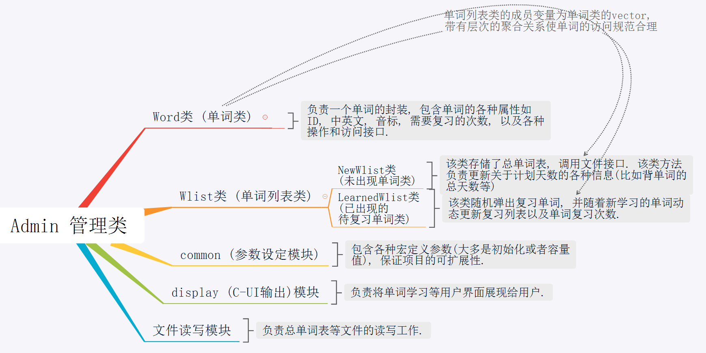

#### 相关类的设计

##### Word类 (单词类)

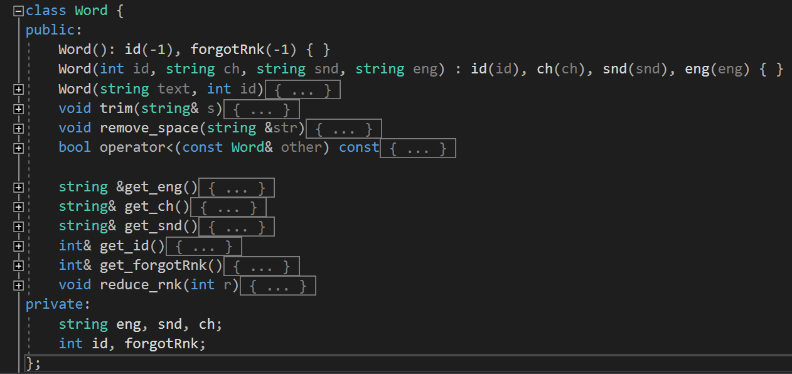

负责一个单词的封装, 包含单词的各种属性如ID, 中英文, 音标, 需要复习的次数, 以及各种操作和访问接口.

##### Wlist类 (单词列表类)

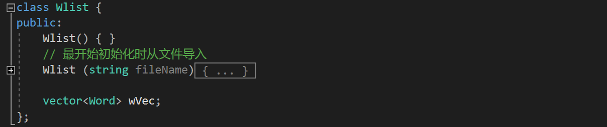 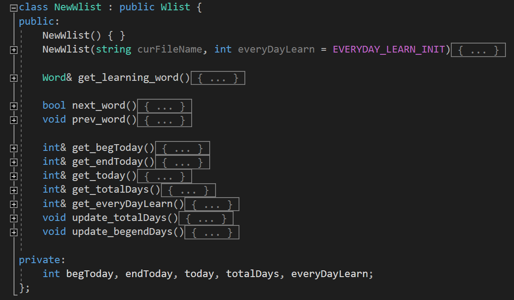 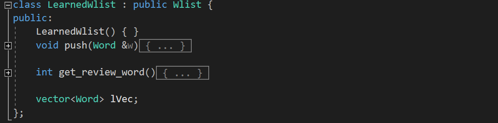

+ `Wlist`: 作为父类, 共享了子类都需要的方法和数据结构, 比如调用文件模块从文件中读入并初始化相应的数据结构. `wVec` 是存储 `Word` 类型的数据结构, 包含了相应的所有单词.
+ `NewWlist`: 该类存储了总单词表, 调用文件接口. 该类方法负责更新关于计划天数的各种信息(比如背单词的总天数等).
+ `LearnedWlist`: 该类随机弹出复习单词, 并随着新学习的单词动态更新复习列表以及单词复习次数.

`Wlist`类的成员变量为`Word`类的vector, 带有层次的聚合关系使单词的访问规范合理.

##### 项目规范性 - 良好的宏定义

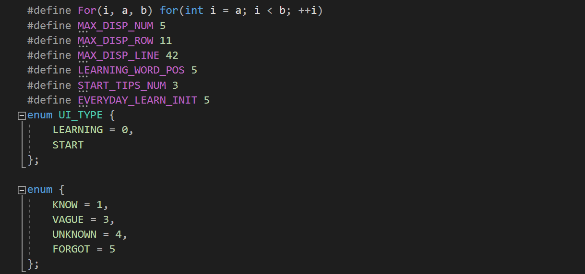

common 模块, 包含各种宏定义参数(大多是初始化或者容量值), 保证项目的可扩展性.

#### 设计思路/实现过程

首先对于总单词表, 我们需要保证程序中有一个不会改变的总单词表(因为程序运行不可能因为用户操作导致数据(内部的总单词表)丢失), 并且该模式需要统筹管理其他需要的信息, `NewWlist`负责该功能.

接下来即是动态变化的复习词列表, 我们注意到这两个类有相同之处, 所以我们使用继承方式管理类之间的关系, 得到了 `LearnedWlist`.

为了具有良好的面向对象程序设计方式, 对于一个单词的不同属性以及操作, 我们使用`Word`类管理/封装所有方法.

最后也是最重要的`Admin`类将调度整个程序的运行, 调用我们如上所述的下层接口, 协调整个程序的运行.

### 功能展示

:warning: **请注意: 复现代码请将控制台调整为 代码页 `65001`UTF-8 编码下, 否则可能出现乱码!**

#### 开始界面:

(上下键选择模式, 回车选择)

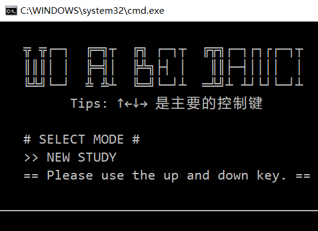

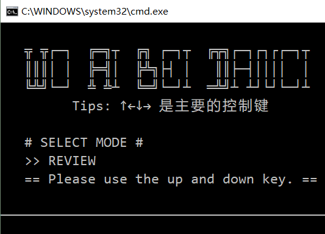

#### NEW STUDY 界面:

在10s后自动跳转.

该界面按`h`可选择隐藏中文模式, 按回车直接进入显示中文的模式.

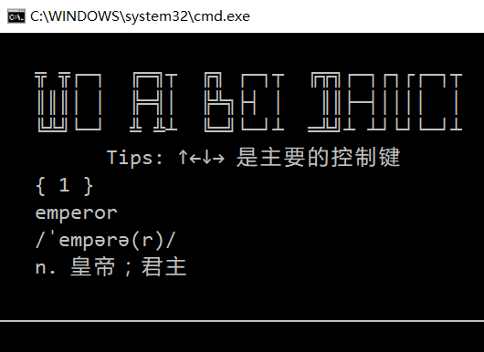

**此时上下左右键分别标记着: (忘记, 不认识, 模糊, 之前学过)**

**按不同的键将影响之后的复习次数.** 该功能模仿"墨墨背单词"软件.

该界面按`ESC`可以退出, **没关系, 程序会保存此时的学习进度, 并动态更新今日剩余复习信息.**

#### REVIEW 界面

**此时右键和下键分别标记着: (认识, 忘记)**

**按不同的键将影响之后的复习次数.** 该功能模仿"墨墨背单词"软件.

#### SET PLAN 界面

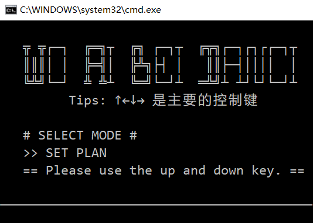

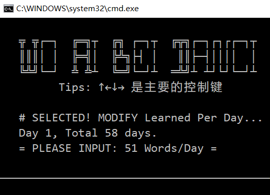

此时**左右键**可以改变上图中 `Words/Day` 的数值, 相应的 Total Days 动态改变.

#### 第二天

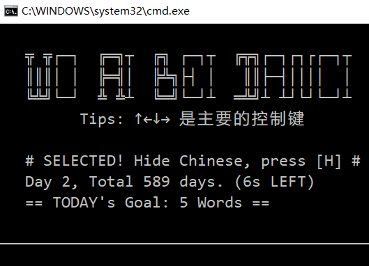

