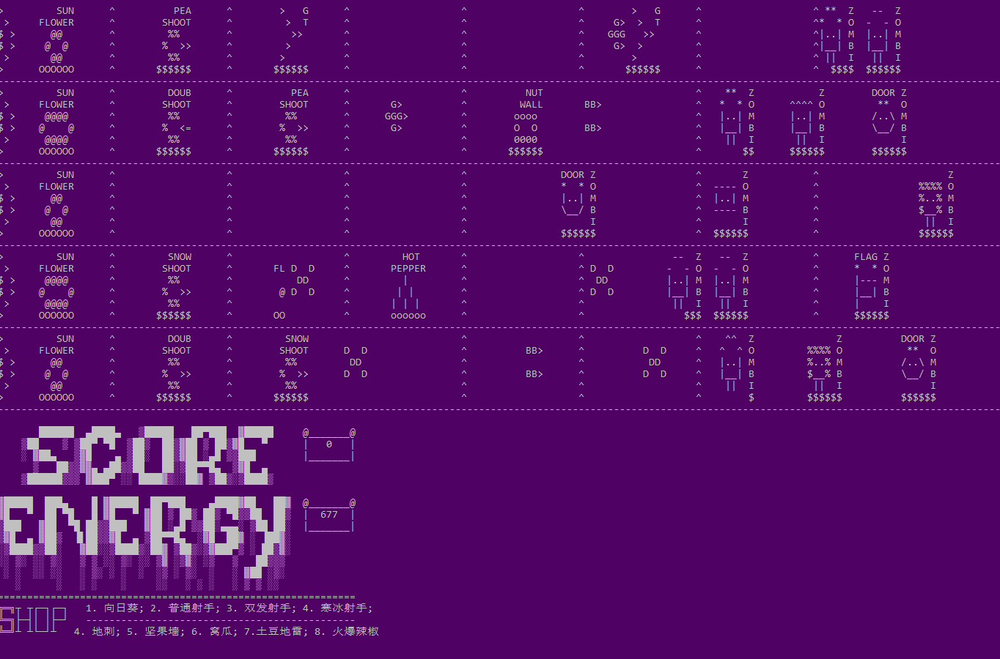
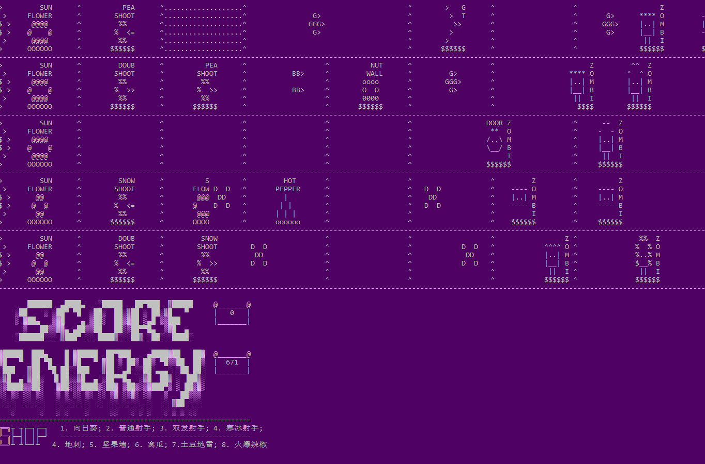
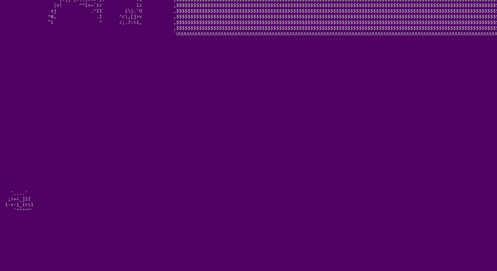
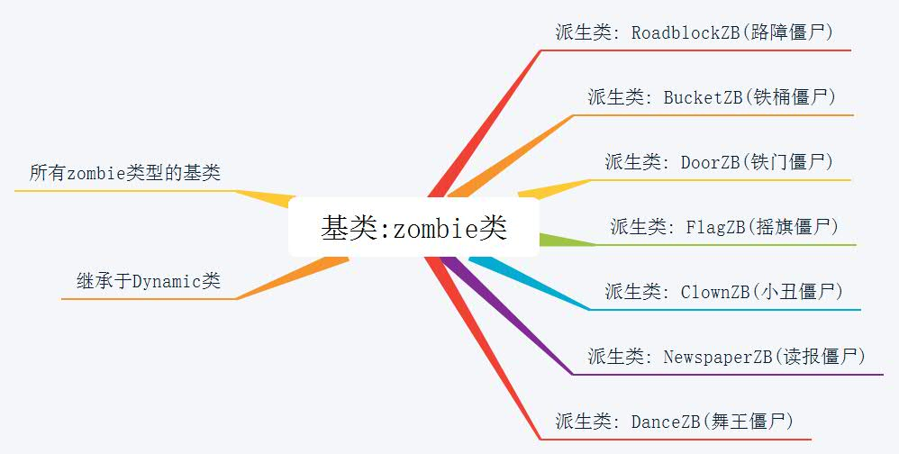
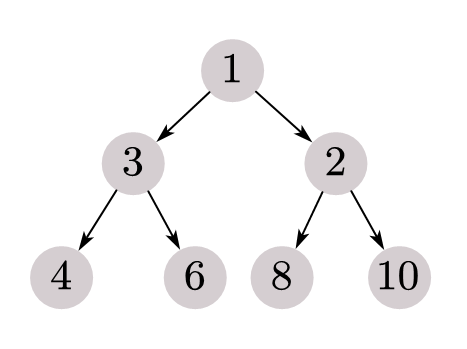
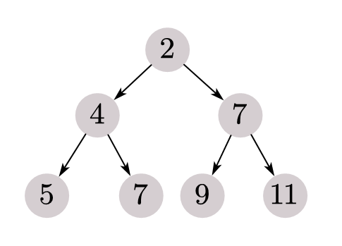
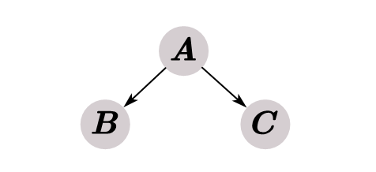

[TOC]


### 项目主要内容与目标

模仿设计并实现基于面向对象思想的一个简单版控制台植物大战僵尸, 植物设计包含向日葵, 普通豌豆射手, 双发豌豆射手, 寒冰豌豆射手, 地刺, 窝瓜, 土豆地雷, 火爆辣椒. 僵尸设计包含普通僵尸, 路障僵尸, 铁桶僵尸, 铁门僵尸, 摇旗僵尸, 橄榄僵尸, 小丑僵尸, 读报僵尸, 撑杆僵尸, 舞王僵尸. 还具有非常动态UI界面和僵尸或植物的形象, 友好的用户交互界面.

#### 真实动感的交互界面

---

以下的`gif`动画都是游戏**控制台界面**的输出.

我使用了`OpenCV`对制作的特制的视频进行解析, 每一个像素点灰度值一一映射到特定的字符中, 制作出了真实动感的用户交互界面:

**开始界面**:

骚气的南大紫作为游戏背景, 加上动感的植物和`START`按钮 :blush: *任意键开始*


僵尸来了! *按数字键* (在视图下方有`SHOP`显示) 或者 *按`b`进入商店用方向键选择*, 这里展示选择后的种植过程:



*按c铲除植物*, 铲除过程:



游戏中还有很多动感彩蛋, 下面举几个例子:




游戏进行时也非常有吸引力 :sweat_smile:

动感zombie, peashooter和sunflower, 实时显示的血量条, 让用户有更好的代入体验


一不小心挂了, 在碰到植物路线基地时还有**地块的反色效果**(碰到火爆辣椒也会), 下面是死亡回放:


`OpenCV`代码见附件, 以下是部分代码:

```python
class CharFrame:
    ascii_char = "$@B%8&WM#*oahkbdpqwmZO0QLCJUYXzcvunxrjft/\|()1{}[]?-_+~<>i!lI;:,\"^`'. "

    # 像素映射到字符
    def pixelToChar(self, luminance):
        return self.ascii_char[int(luminance/256*len(self.ascii_char))]
 
    # 将普通帧转为 ASCII 字符帧
    def convert(self, img, limitSize=-1, fill=False, wrap=False):
        if limitSize != -1 and (img.shape[0] > limitSize[1] or img.shape[1] > limitSize[0]):
            img = cv2.resize(img, limitSize, interpolation=cv2.INTER_AREA)
        ascii_frame = ''
        blank = ''
        if fill:
            blank += ' '*(limitSize[0]-img.shape[1])
        if wrap:
            blank += '\n'
        for i in range(img.shape[0]):
            for j in range(img.shape[1]):
                ascii_frame += self.pixelToChar(img[i,j])
            ascii_frame += blank
        return ascii_frame
```


### 当然少不了背景音乐  :grin:

游戏还有背景音乐支持

(因为现在音乐版权原因, 所以类别比较单一, 但是我有想过设计一些针对特定场景比较好玩的)


##### UI部分亮点总结:

---

1. 动态的切换动画, 除了上面的开始, 新纪录, 商店界面, 还有**`GAME OVER`, 暂停的动画界面.**
2. 动态的**生物形象**, 没有拘泥于基本要求中简易的 *僵尸* 两个字等作为用户所感受到的, 而是采用了丰富的跳动的植物和僵尸形象.
3. 动态的**血量条**显示, 血厚不厚, 还有多久gg一目了然.
4. 动态的**子弹**设计, 不同子弹生动形象表达了它的作用.
5. 富有美感的UI设计, 比如上面图中的 `ENERGY`, `SCORE`设计, **`SHOP`提供两种方式**, 兼顾便利性与美感.


### 项目整体架构

#### 源代码文件结构

---

```
E:.
│  admin.cpp
│  admin.h
│  common.h
│  linemap.cpp
│  linemap.h
│  main.cpp
│  peashooter.cpp
│  peashooter.h
│  Project4.vcxproj
│  Project4.vcxproj.filters
│  Project4.vcxproj.user
│  sunflower.cpp
│  sunflower.h
│  testDoubleBuffer.cpp
│  txt2video.cpp
│  video.cpp
│  video.h
│  zombie.cpp
│  zombie.h
│
├─Debug
│  │  admin.obj
│  │  linemap.obj
│  │  main.obj
│  │  peashooter.obj
│  │  Project4.log
│  │  sunflower.obj
│  │  testDoubleBuffer.obj
│  │  txt2video.obj
│  │  vc142.idb
│  │  vc142.pdb
│  │  video.obj
│  │  zombie.obj
│
└─VideoData
        end.txt
        inShop.txt
        newRecord.txt
        pause.txt
        shop.txt
        shopMain1.txt
        shopMain2.txt
        start.txt
        your.txt
```


#### 类间关系

---

**整体来看:**


`zombie`类继承结构:



`peashooter`类继承结构:


在数据封装方面, 各生物属性通过函数访问, 限制操作. 每个生物对自己的属性形成绑定; 因为游戏中行之间非常类似, 所以独立定义`Admin`类成员`linemap`类型, 使不同行的数据的共同性得到更大利用.

在类间继承关系上, 我最大程度考虑的利用多态进行代码复用, 在各个生物的 `getHurt()`(获取攻击力), `getMe()`(获取UI动态展示形态), `getLive()`(获取生命力)等共通的属性函数采用了纯虚函数或者虚函数实现. 顶层调用采用指针类型`vector`并将其指向动态对象, 来实现动态绑定. 考虑细粒度地分为zombie类与peashooter类分别继承, 顶层调用不必知道具体是哪一种类型的zombie或者peashooter, 给程序拓展和设计带来方便.

```c++
class obj {
public:
	vector<zombie*> mZom;
	vector<sunflower*> mSun;
	vector<peashooter*> mPea;
    
    // ...
    // 如上每一个生物的子类在创建时不需要知道具体是哪一类的, 许多函数被声明为虚函数, 也是动态绑定
```


#### 泛型编程

> 模板是泛型编程的基础，泛型编程即以一种独立于任何特定类型的方式编写代码。

```c++
template <class T>
class CommonBullet {
private:
	vector<T> elems;

public:
    T* getMe(T const&);
    T& getLastElem();
    T getHurt();
    // ...
}
```

这里使用类模板, 不同**子弹的操作大同小异**, 但是在动感界面中, 不同子弹长得不一样, 就是数据类型不一样(自定义的), 所以这里使用泛型模板来实现会更简单.


### 设计思路与实现过程

---

#### 如何呈现更好的动态效果?

在高效的更新界面方法之下, 每次更新后刷新界面, 类似于视频一帧一帧刷新过程. 但是当数据量非常大时，特别是本项目采用了控制台`180x50`全屏显示, 刷新界面可能须要几秒钟甚至更长的时间，并且会出现闪烁现象，为了解决这些问题。采用双缓冲技术:

> 双缓冲即在内存中创建一个与屏幕画图区域一致的对象，先将图形绘制到内存中的这个对象上，再一次性将这个对象上的图形复制到屏幕上，在“别的地方”绘制好，然后再直接搬过来, 这样能大大加快画图的速度。双缓冲技术中，内存就充当了“别的地方”。双缓冲技术分为五步：
>
> 1. 在内存中申请缓冲区，创建兼容内存；
>
> 2. 创建位图，并将位图与缓冲区内存相关联起来；
> 
> 3. 在兼容内存里绘制；
> 
> 4. 将绘制好的位图拷贝到当前设备；
> 
> 5. 释放兼容内存。


#### 如何更快的刷新地图生物?

---

主要是子弹和僵尸的关系:

因为子弹只在同一行飞行并打中此行的僵尸, 所以不妨对其中一行进行讨论, 具体的更新过程可简化为如下伪代码:

不妨设子弹个数为$n$, 僵尸个数为$m$:

*伪代码如下:*

1. 需要对子弹和僵尸的位置进行某种"排序"
2. 取冲在最前面的子弹, 如果它超过了冲在最前面的僵尸, 则冲在最前面的僵尸掉血或被技能限定(如血掉光则删除此僵尸); 否则结束更新.
3. 删除该子弹并转2, 直到子弹位置覆盖的区间和僵尸位置覆盖的区间没有交集.

2, 3步骤为取最前面的子弹判断.. 这部分无优化空间, 时间复杂度为$O(max\{n, m\})$.

*所以优化部分*在第1步, 如何快速得到子弹位置和僵尸位置的排序? 并且每次的更新过程中, *每个子弹的位置都会变, 每个僵尸的位置都会变,* 这里本项目维护两个堆, 子弹大根堆和僵尸小根堆, 进行细粒度更新.

注意这里的难点就是子弹和僵尸有快有慢, 如何在堆中维护那些破坏排序(堆)性质的, 超越其他子弹的子弹?

为什么选择堆呢, 首先堆的构建与更新单个元素分别是$O(n)$和$O(logn)$, 也就是说最坏情况也就$O(n + nlogn)$完成整个更新, **但是实际上由堆的偏序特性, 单个元素的超越(比如子弹1超越了子弹2和子弹3)可能并不影响堆结构:**

以本项目的二叉堆为例:



假设上图是7个子弹的当前位置, 本项目对每个子弹以及它在堆内元素建立了一个索引, 现在更新各个子弹的位置, **其中除了原来位置为2的子弹在时钟周期内飞行了6个单位距离, 其他子弹都只飞行1个单位距离, 更新后如下:**



虽然原来在位置2的子弹超越了三个子弹, **但是堆结构并没有被破坏**


我尝试用平摊分析算期望的方法计算每一次更新后堆变化的复杂度, 但是由于子弹飞行差异是无限区间, 并不好分析离散情况的位置差异.

对于二叉树的一部分$A, B, C$ 代表子弹位置值, 可以推导出如下公式:


$$
E(x) = \frac{sup+(2sup-1)|A'-B'| - |A'-B'|^2}{sup^2}
$$
其中$A'$表示$A$的更新增量. 这里前提是A的增量减B或C的增量的上界是$sup$.


以小根堆为例, 每次更新后从上往下扫描堆的每个元素, 如果出现元素大于子节点(一定概率出现), 则`siftDown()`直到保持堆结构, 这是一个局部更新的过程, 时间复杂度估计比$O(n)$小一个级别.

每次更新完两个堆之后, 出堆顶判断, 如果满足子弹打到了僵尸, 调整堆$O(logn)$, 由此往复完成更新.


#### 更加简洁的执行总过程?

---

总过程思路和结构可以很简练, 在一个时钟周期内不断交互更新, 伪代码如下:


```c++
 // 时钟周期
while(clock) {
	与用户交互..
    根据交互和时间流逝等更新地图..
    刷新界面..
}
```

但是在地图更新, 动态显示有很多细节需要注意, 在其中也有很多难点.

### 如何验收实验

---

能现场展示最好啦

如果可执行文件运行出现问题, 可以联系我 `qq: 645064582`, `Tel: 18051988316`.


### 总结 :1st_place_medal:

---

很开心做这次实验, 在有限的字符界面资源下努力设计出好看的效果, 在那么多生物的情况下努力实现宏观上的并行.

这次实验用了大概:six::zero:小时, 很努力改进每一个不太好的地方.


谢谢助教哥的检查~ :slightly_smiling_face: